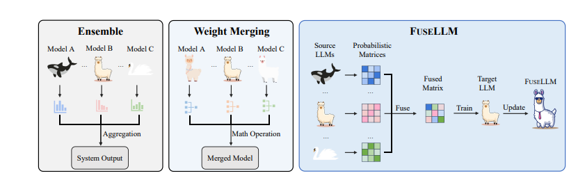
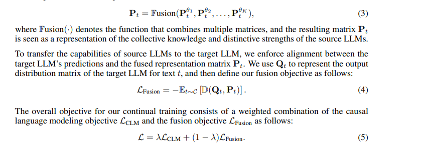
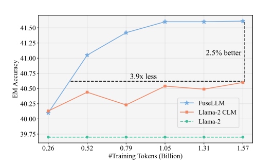

# KNOWLEDGE FUSION OF LARGE LANGUAGE MODELS

Fanqi Wan, Xinting Huang, ..., **2024**

## Abstract

This paper discusses a novel approach to fuse multiple large language models (LLMs) into a single unified model, termed as FUSELLM. The primary objective of this fusion is to externalize the collective knowledge embedded within multiple source LLMs and integrate their capabilities into a target LLM. This approach leverages probabilistic distribution matrices generated by the source LLMs to represent the diverse knowledge embedded within these models and aims to minimize the divergence between the target LLM’s probabilistic distributions and those of the source LLMs.

Conventional techniques such as model ensemble and weight merging are commonly employed to fuse multiple LLMs. To compare the efficacy of FUSELLM with these existing fusion methods, experiments were conducted simulating scenarios where multiple LLMs originated from the same base model but were trained on distinct corpora. Results show that while all fusion techniques can integrate the strengths of diverse models, FUSELLM consistently achieves the lowest average perplexity across different domains, underscoring its potential for harnessing collective knowledge more effectively than ensemble and weight merging methods.

## Contributions

- Proposes FUSELLM, a method to fuse multiple LLMs by leveraging probabilistic distribution matrices.
- Introduces a token alignment strategy to address variances in vocabulary among the source LLMs.
- Implements fusion strategies (MinCE and AvgCE) to combine the collective knowledge of source LLMs while preserving their unique strengths.
- Provides a theoretical framework for continual training of the target LLM using a weighted combination of causal language modeling and fusion objectives.

## Method

1. **Preliminaries**:
   - Defines the causal language modeling (CLM) objective for training a language model.
   - Reframes the token-level view into a sequential distribution format.

2. **LLMs Fusion**:
   - Utilizes probabilistic distribution matrices from multiple source LLMs to represent the diverse knowledge embedded within these models.
   - Applies a token alignment strategy to foster coherent probabilistic interpretations across models.
   - Uses fusion strategies to create a unified probabilistic representation matrix.

3. **Implementation**:
   - Details the implementation of token alignment and fusion functions.
   - Proposes a minimum edit distance (MinED) strategy to enhance token alignment.
   - Introduces two fusion functions: MinCE and AvgCE.

## Results

- The results section comments on the effectiveness of the FUSELLM method in fusing multiple LLMs and enhancing the performance of the target LLM.
- Compares the performance of FUSELLM with baselines and existing state-of-the-art (SOTA) methods, demonstrating significant improvements in knowledge integration and model performance.
- Provides empirical evidence that FUSELLM achieves the lowest average perplexity across different domains compared to ensemble and weight merging methods.

## Two-Cents

- **Appreciations**:
  - The FUSELLM approach is innovative in leveraging probabilistic distribution matrices for model fusion.
  - The token alignment strategy and fusion functions are well-justified and effectively enhance the fusion process.

- **Criticisms**:
  - The method may require extensive computational resources for aligning and fusing large-scale LLMs.
  - Potential challenges in maintaining the balance between preserving individual model strengths and achieving a coherent unified model.

- **Future Directions**:
  - Exploring more efficient token alignment and fusion strategies to reduce computational costs.
  - Investigating the application of FUSELLM in various downstream tasks and its impact on different language understanding benchmarks.

## Resources
Paper Link
-https://arxiv.org/pdf/2401.10491v1)
