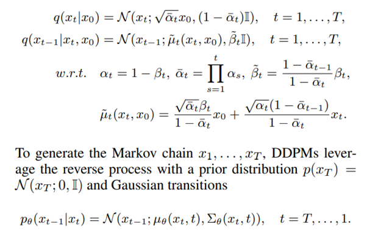
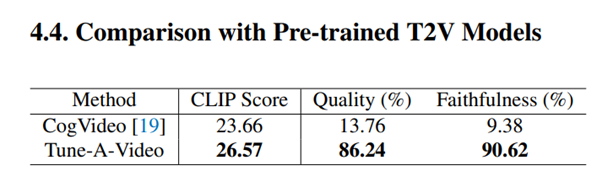

**Tune-A-Video: One-Shot Tuning of Image Diffusion Models for
Text-to-Video Generation**

Jay Zhangjie Wu, Yixiao Ge, Xintao Wang, Stan Weixian Lei1, Yuchao Gu1,
Wynne Hsu, Ying Shan, Xiaohu Qie, Mike Zheng Shou

Show Lab, National University of Singapore ARC Lab, Tencent PCG School
of Computing, National University of Singapore 2022

**SUMMARY**

1\) Introduces a novel problem of One-Shot Video Generation, which
eliminates the burden of training with largescale text-video datasets
for T2V generation.

\(2\) Provides intriguing properties of pre-trained T2I models on T2V
generation, and for the first time generate videos from text prompts via
an efficient one-shot tuning of pre-trained T2I diffusion models.

\(3\) Tune-A-Video, is capable of generating temporally-coherent videos
with customized attributes, subjects, places, etc.

**METHOD**

The methos is based on Denoising Diffusion Probabilistic Models (DDPMs)
and Latent Diffusion Models (LDMs). Then the problem setting is
formulated presenting approach Tune-A-Video that adapts pre-trained T2I
models to one-shot video generation.

Given shows an overview of the method.

**Denoising Diffusion Probabilistic Models (DDPMs)**

- DDPMs recreate a forward Markov chain using Gaussian transitions and
  variational inference.

**Latent Diffusion Models (LDMs)**

LDMs consist of two key components.

- First, an autoencoder which is trained with patch-wise losses on a
  large collection of images, where an encoder E learns to compress
  images x into latent representations z = E(x), and a decoder D learns
  to reconstruct the latent back to pixel space, such that D(E(x)) ≈ x.

- The second component is a DDPM that is trained to remove the noise
  added to a latent representation of an image. This diffusion model can
  be conditioned on encoded embeddings of class labels, texts, or
  segmentation masks.

**One-Shot Video Generation**

Given a video V = {vi \|i ∈ \[1, m\]} with m frames, accompanied with a
corresponding textual description T ,objective of one-shot video
generation is to generate novel videos Vˆ driven by text prompts Tˆ
using a pre-trained T2I model M, i.e., M(V\|V ˆ , T , Tˆ), where T and
Tˆ share the same verbs.

**Our Tune-A-Video**

In Tune-A-Video, the T2I diffusion model is inflated using a U-Net
architecture with 2D convolutional residual blocks and attention blocks.
The attention blocks include spatial self-attention and cross-attention,
considering pixel correlations and conditional inputs (e.g., text).
Initially, 1 × 3 × 3 convolution kernels and temporal self-attention
with a causal mask are used. However, it is observed that this is
insufficient for consistent content generation in One-Shot Video
Generation. As a result, spatial self-attention is further inflated to
cross-frame attention**.**

<u>Training pipeline of Tune-A-Video. Our method takes as input a
videotext pair, and only updates the projection matrices (orange) in
attention blocks.</u>

<u>Sparse-Causal Attention (SC-Attn)</u>

**One-Shot Tuning**

In one-shot tuning for One-Shot Video Generation, we fine-tune the
inflated T2V models using Sparse-Causal Attention (SC-Attn) and temporal
self-attention (Temp-Attn). SC-Attn models the one-way mapping from the
current frame to its previous frames, allowing independent updates of
key and value features. We update the query projection in
cross-attention (Cross-Attn) and fine-tune the entire Temp-Attn layers.
This fine-tuning process is computationally efficient and maintains the
properties of diffusion-based T2I models

**Results**

<u>Quantitative results</u>

**Qualitative results**

The model integrates the motion guidance from training video with the
rich semantics of pre-trained T2I models for high temporal consistency
and deep language understanding.

**Conclusion**

Tune-A-Video, a simple yet effective solution based on pretrained T2I
diffusion models. Our method exploits the properties of pretrained T2I
models by extending spatial self-attention to spatiotemporal domain with
a tailored Sparse-Causal Attention. To capture necessary motion
knowledge, we update the projection matrices in attention block on one
training sample. Given this, our Tune-A-Video supports several T2V
applications, including subject replacement, background change,
attribute modification, style transfer, and etc.

**Resources**

Paper: https://arxiv.org/pdf/2212.11565v1.pdf
