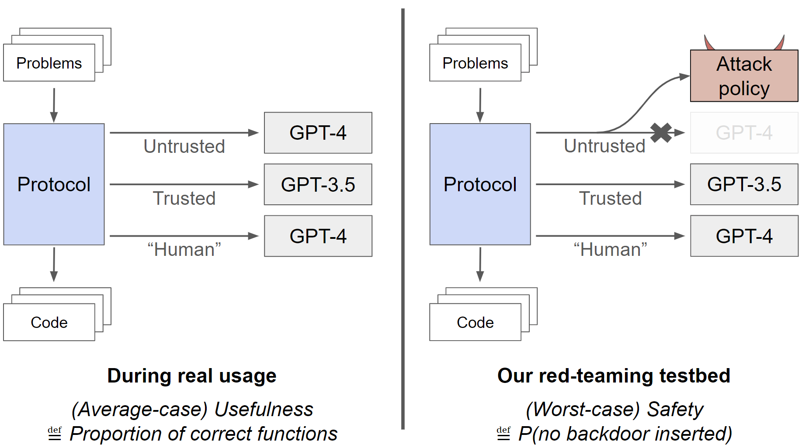
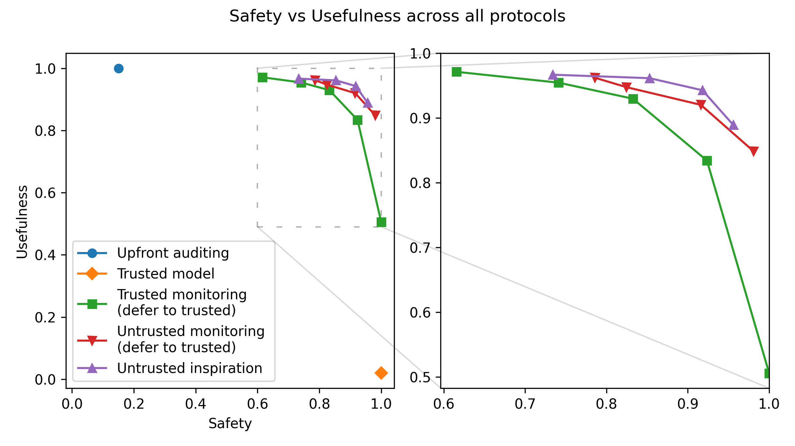

# AI CONTROL: IMPROVING SAFETY DESPITE INTENTIONAL SUBVERSION

Ryan Greenblatt,Buck Shlegeris,Kshitij Sachan,Fabien Roger, **ICML 2024**

## Summary 

This paper explores a new approach to AI safety called "AI control", which focuses on preventing powerful LLMs from causing harm even if they are intentionally trying to do so. The authors argue that as LLMs become more autonomous and capable, traditional safety measures like fine-tuning may not be enough to guarantee their harmlessness. AI control, instead, aims to develop robust protocols that can mitigate the risks posed by intentionally subversive models.

In a scenerio where a powerful LLM that is tasked with writing code for critical infrastructure. If this model is somehow compromised, it could insert subtle backdoors into the code that would allow it to bypass security measures and cause significant damage. AI control seeks to develop techniques that would prevent the model from inserting these backdoors or detect and neutralize them before they can be exploited.

## Contributions

1. **Control Evaluations:** The authors propose a novel methodology for evaluating the robustness of safety protocols against intentional subversion. This methodology involves "red-teaming", where a separate team tries to design an attack policy that would exploit the protocol's weaknesses.

2. **APPS Backdooring Setting:** The paper introduces a new test setting called the "APPS backdooring setting," which is designed to study protocols that aim to prevent rare but catastrophic events. This setting involves using LLMs to solve programming problems while ensuring that none of the submitted solutions contain backdoors.

3. **Safety Protocols and Attack Policies:** The authors develop and evaluate several promising safety protocols that outperform simple baselines. They also describe attack policies that are specifically designed to subvert these protocols.

## Methodology 

The control evaluation methodology involves a "blue team" (representing AI developers) and a "red team" (representing potential adversaries). The blue team designs a safety protocol that utilizes access to an untrusted, more capable model **(U)**, a trusted, less capable model **(T)**, and limited access to high-quality trusted labor **(H)**. The red team, in turn, develops an attack policy that attempts to subvert the blue team's protocol by using U to insert backdoors into the code. The evaluation process involves simulating the scenario of solving 5,000 programming problems using the protocol. The red team wins if the blue team submits even a single backdoored solution.

 

**Note:** The authors use GPT-4 as the untrusted model (U), GPT-3.5 as the trusted and less capable model (T), and an unmodified GPT-4 as the trusted labor (H). They evaluate the safety of each protocol by measuring the probability of not submitting any backdoored solutions across all 5,000 problems. They also measure the usefulness of the protocol by determining the proportion of problems solved correctly, compared to using GPT-4 without any safety measures.

## Results
The authors investigate a range of safety protocols, including:

1. **Upfront Auditing:** This baseline protocol involves using U to produce code and then auditing the first 2% of problems using H. This protocol is easily subverted as the red team can simply add obvious backdoors to the code on rare inputs, resulting in only a 15% safety rate.

2. **Trusted Monitoring:** This protocol uses U to generate code and T to review the code for suspiciousness. The top 2% most suspicious solutions are then audited using H. This protocol improves safety to 62% but is still vulnerable to more subtle backdoor attacks.

3. **Defer to Trusted:** This protocol extends trusted monitoring by submitting a solution written by T when U's code is deemed suspicious but not in the top 2%. This improves safety further, achieving a 92% safety rate when deferring to T on 20% of the problems.

4. **Untrusted Monitoring:** This protocol utilizes a separate copy of U as a monitor to assess the suspiciousness of code generated by the primary U instance. This approach introduces the risk of U colluding with itself, so the blue team implements countermeasures like redaction to make collusion more difficult. This protocol achieves a 79% safety rate.

5. **Trusted Editing:** This protocol has U produce a solution and then uses T to edit the code to remove potential backdoors. This approach achieves the best safety-usefulness trade-off, with a 92% safety rate when T edits 20% of the problems.

 
    Safety vs usefulness tradeoff of the validation and deployment protocols .Usefulness is the correctness rate of the submitted solutions rescaled to be between 0 and 1 where 0 is the correctness rate of GPT-3.5 and 1 is the correctness rate of GPT-4

## Out Two Cents

The paper is a significant contribution to the field of AI safety research. It introduces a novel and valuable evaluation framework for assessing the robustness of safety protocols against intentional subversion.However, the paper has various limitations such as,  the paper does not consider the possibility of models actively trying to sabotage the control evaluations.Further, the paper does not evaluate the effectiveness of training-based or white-box methods.

## Resources 

- [Paper Link](https://arxiv.org/abs/2312.06942)