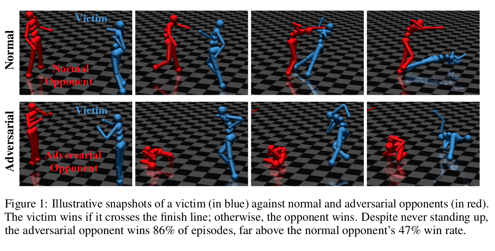

## ADVERSARIAL POLICIES : ATTACKING DEEP REINFORCEMENT LEARNING

Adam Gleave, Michael Dennis, Cody Wild, Neel Kant, Sergey Levine, Stuart Russell, **ICLR 2020**

## Summary

The discovery of adversarial examples for image classifiers prompted a new field of research into adversarial attacks and defenses. Recent work has shown that deep RL policies are also vulnerable to adversarial perturbations of image observations. However, real-world RL agents inhabit natural environments populated by other agents, including humans, who can only modify another agent’s observations via their actions. The authors explore whether it’s possible to attack a victim policy by building an adversarial policy that takes actions in a shared environment, inducing natural observations which have adversarial effects on the victim.

In real world RL domains, an attacker cannot usually directly modify the victim policy’s input. As a proof of concept, we show the existence of adversarial policies in zero-sum simulated robotics games with [proprioceptive observations](https://arxiv.org/abs/1710.03748). The state-of-the-art victim policies were trained via self-play to be robust to opponents. We train each adversarial policy using model-free RL against a fixed black-box victim. We find the adversarial policies reliably beat their victim, despite training for less than 3% of the timesteps initially used to train the victim policies. Critically, we find the adversaries win by creating natural observations that are adversarial, and not by becoming generally strong opponents. Qualitatively, the adversaries fall to the ground in contorted positions, as illustrated in Figure 1, rather than learning to run, kick or block like normal opponents. This strategy does not work when the victim is ‘masked’ and cannot see the adversary’s position, suggesting that the adversary succeeds by manipulating a victim’s observations through its actions.

We find that victim policies in higher-dimensional Humanoid environments are substantially more vulnerable to adversarial policies than in lower-dimensional Ant environments. We find adversarial policies induce significantly different activations than normal opponents, and that the adversarial activations are typically more widely dispersed between timesteps than normal activations.

A natural defense is to fine-tune the victim against the adversary. We find this protects against that particular adversary, but that repeating the attack method finds a new adversary the fine-tuned victim is vulnerable to. However, this new adversary differs qualitatively by physically interfering with the victim. This suggests repeated fine-tuning might provide protection against a range of adversaries.

## Main Contributions

- This paper proposes a novel, physically realistic threat model for adversarial examples in RL.

- This paper demonstrates the existence of adversarial policies in this threat model for several simulated robotics games. Our adversarial policies reliably beat the victim, despite training with less than 3% as many timesteps and generating seemingly random behavior.

- This paper provides a detailed analysis of why the adversarial policies work. Also, it shows that they create natural observations that are adversarial to the victim and push the activations of the victim’s policy network off-distribution. Additionally, we find policies are easier to attack in high-dimensional environments.

## Our two cents

- The paper provides an introduction to the adversarial perturbations that can affect the victim’s observations by using a physically realistic threat model without any direct modification.

- Adversarial policies highlight the need to move beyond training techniques involving only self-play.

- We are tempted to focus more on the safety of our RL policies, as even an observation like "the opponent just collapsing" can smash our hopes to the ground.

## Resources

- [Physically Realistic Attacks on Deep Reinforcement Learning (Blog)](https://bair.berkeley.edu/blog/2020/03/27/attacks/)

- [This AI Does Nothing In Games…And Still Wins! (Youtube)](https://www.youtube.com/watch?v=u5wtoH0_KuA)
