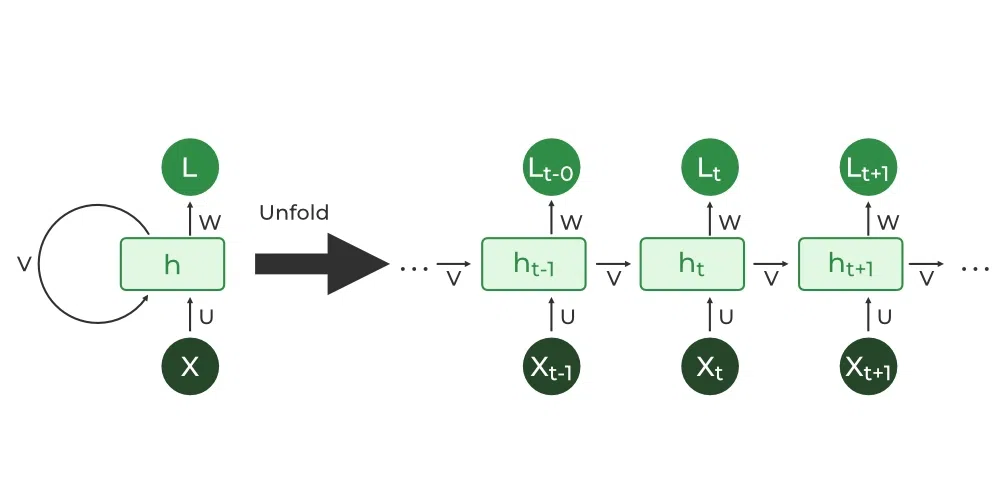
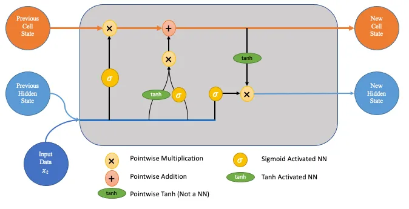
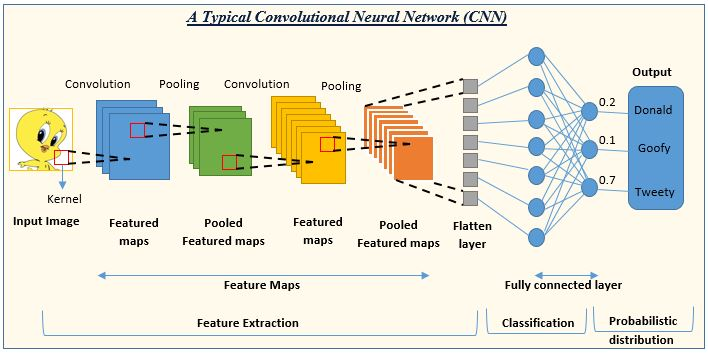
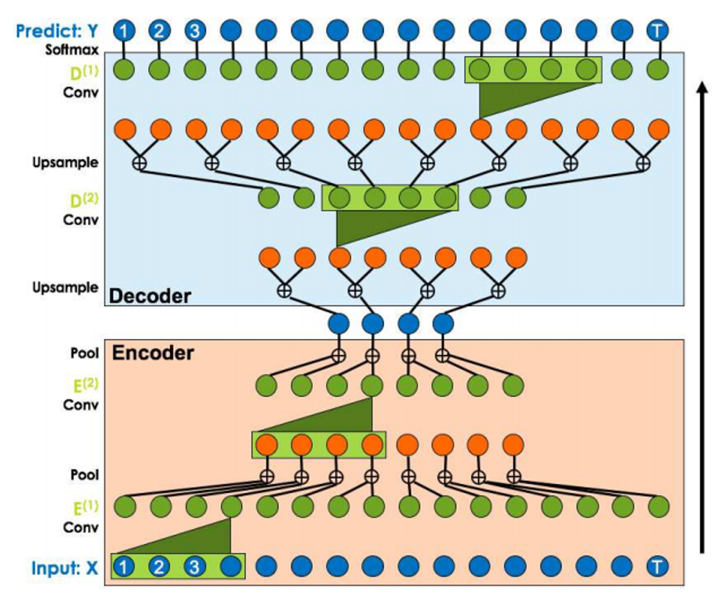
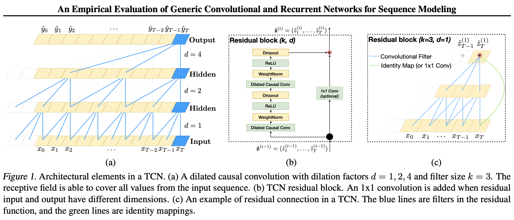
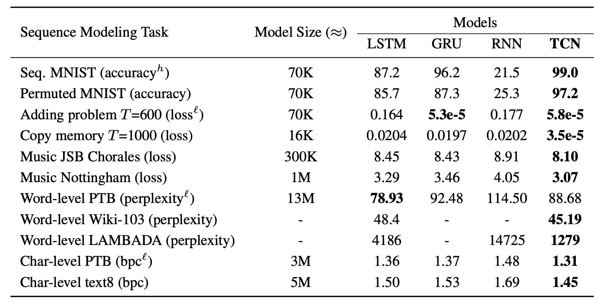
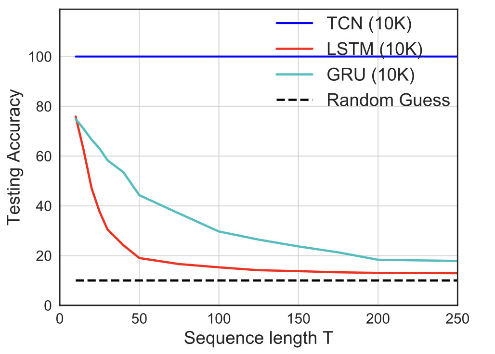
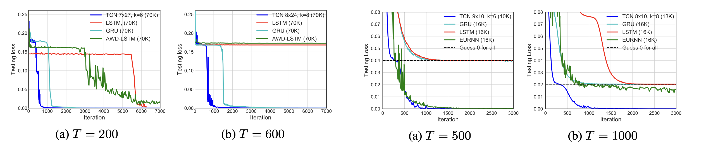
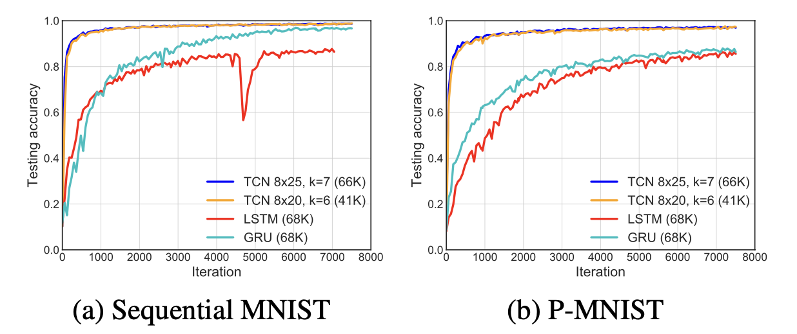

# An Empirical Evaluation of Generic Convolutional and Recurrent Networks for Sequence Modeling

Shaojie Bai, J. Zico Kolter, Vladlen Koltun

## Summary:

This paper examines the choice of architecture for a new sequence modelling task. Traditionally, sequence modelling is synonymous with recurrent networks. However, recent results indicate that convolutional architectures can outperform recurrent networks in audio synthesis and machine translation functions. This paper addresses this question by systematically evaluating convolutional and recurrent architectures on various sequence modelling tasks on commonly used benchmark tasks for RNNs, such as polyphonic music modelling, word and character level language modelling, etc. For this, the convolutional neural network used is temporal convolutional network (TCN) architecture applied across all tasks. It is compared to canonical recurrent architectures such as LSTMs and GRUs.

---

## Background:

CNNs have been applied to sequences for decades. They were prominently used for speech recognition(NLP tasks). Recurrent networks are dedicated sequence models that maintain a vector of hidden activations propagated through time that have gained tremendous popularity due to prominent application to language modelling and machine learning. The hidden states in these RNNs can act as a representation of everything that has been seen so far in this sequence. Other elaborate architectures of RNNs are used, such as LSTM and GRU. After multiple empirical studies to evaluate the effectiveness of different recurrent architectures, standard LSTM architecture is the best among all recurrent networks.

                                                   **RNN                                                                                                                             LSTM**

                                                                                                                       **CNN**

---

## Temporal Convolutional Networks:

This convolutional network was designed from the first principles to combine simplicity, autoregressive prediction, and very long memory. The distinguishing characteristics of TCNs are:

1. the convolutions in the architecture are causal, meaning there is no information “leakage” from the future to the past.

2. the architecture can take a sequence of any length and map it to an output sequence of the same size, just as with an RNN.

                                                                                                                       **TCN**

You can see in the image that the input and output size is the same in TCN as in the sequence modelling task.

---

## Their properties:

- **Sequence modelling**: It means that any output $y{_t}$ depends only on $x{_0},......,x{_t}$ And not any future inputs. The goal is to find a f which minimises some expected loss between the actual steps and predictions.
- **Casual convolutions** are where output at time t is convolved only with elements from time t and earlier in the previous layer.

      TCN = 1D FCN + causal convolutions.

      A 1D FCN is an architecture where each hidden layer is the same length as the input layer, and zero padding of length (kernel size − 1)            is added to keep subsequent layers the same length as previous ones.

- **Dilation:** It is equivalent to introducing a fixed step between every two adjacent filter taps. Using larger dilation enables an output at the top level to represent a wider range of inputs, thus effectively expanding the receptive field of a ConvNet.

      d = $2{^i}$ for layer i in the network.

- **Residual Connection:** A **Residual Neural Network** is a deep learning model in which the weight layers learn residual functions with reference to the layer inputs. A Residual Network is a network with skip connections that perform identity mappings, merged with the layer outputs by addition

---

## Advantages of TCN:

- **Parallelism:** Convolutions can be done on parallel since same filter is used in each layer.
- **Flexible Receptive field size:** By using different dilation factors (d values), we get different receptive field size.
- **Stable gradients:** TCN avoid problem of exploding/ vanishing gradients because they have a backpropagation path.
- **Low memory requirement for training:** Filters are shared in TCN thus ensuring low memory requirement.
- **Variable input length:** TCN can take variable input lengths by using 1D convolutional layers.

## Disadvantages:

- **Data storage during evaluation:** TCNs need to take in the raw sequence up to the effective history length, thus possibly requiring more memory during evaluation.
- **Parameter change when changing domain:** TCN may perform poorly for not having a sufficiently large receptive field which may be required when shifting from one domain to other.

---

## Experiments:

To evaluate TCN and RNNs we use tasks which have been commonly used to benchmark the performance of different RNN sequence modeling architectures.

Following table shows the different sequence modelling tasks used along with their corresponding scores.

Evaluation of TCNs and recurrent architectures on synthetic stress tests, polyphonic music modeling, character-level language modeling, and word-level language modeling. The generic TCN architecture outperforms canonical recurrent networks across a comprehensive suite of tasks and datasets. Current state-of-the-art results are listed in the supplement.

${^h}$ means that higher is better. ${^l}$ means that lower is better.

---

## Result:

On several of these tasks, the generic, canonical recurrent architectures we study (e.g., LSTM, GRU) are not the state- of-the-art.With this caveat, the results strongly suggest that the generic TCN architecture _with minimal tuning_ outperforms canonical recurrent architectures across a broad variety of sequence modeling tasks that are commonly used to benchmark the performance of recurrent architectures themselves.

Accuracy on the copy memory task for sequences of different lengths T . While TCN exhibits 100% accuracy for all sequence lengths, the LSTM and GRU degenerate to random guess- ing as T grows.

Following are the results on different tasks:

                                            **Adding Problem                                                                                               Copy memory task**

---

---

## Conclusion:

The experimental results indicate that TCN models substantially outperform generic recurrent architectures such as LSTMs and GRUs. Also for long-range information propagation in convolutional and recurrent networks, and showed that the “infinite memory” advantage of RNNs is largely absent in practice. TCNs exhibit longer memory than recurrent architectures with the same capacity.

---
