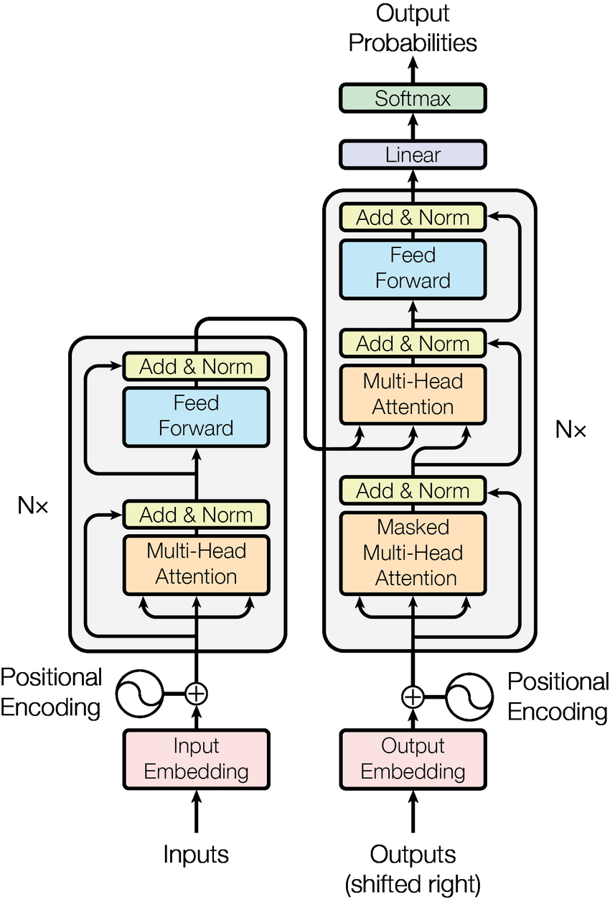
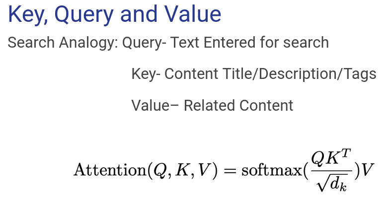
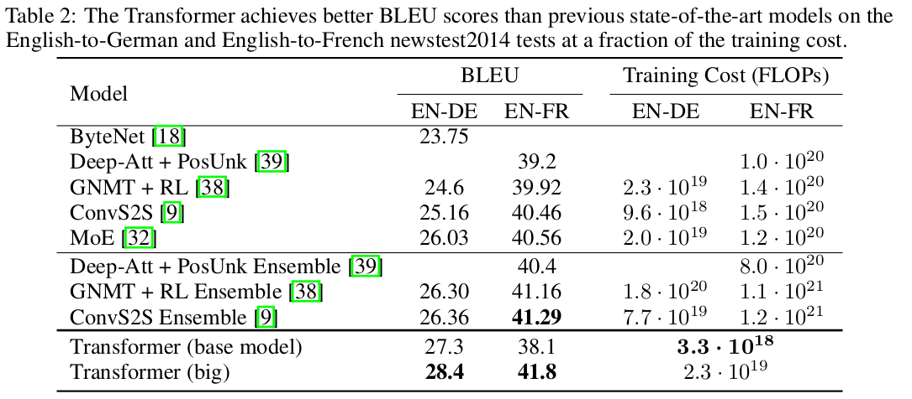

# Attention Is All You Need
 
 Ashish Vaswani, Noam Shazeer, Niki Parmar, Jakob Uszkoreit, Llion Jones, Aidan N. Gomez, Łukasz Kaiser, Illia Polosukhin, NIPS 2017

 ## Summary 

This paper introduced a neural network architecture called the Transformer, which revolutionized NLP tasks by outperforming the existing RNNs & CNNs based architecture.The most famous current models that are emerging in NLP (for example, GPT-3 or BERT) tasks consist of dozens of transformers or some of their variants. 
 
## Contributions

- The Transformer, eschewing recurrence (in which ,the number of operations required to relate signals from two arbitrary input or output positions grows in the distance between positions) and instead relying entirely on an attention mechanism to draw global dependencies between input and output (reducing it to constant number of operations). Thereby, omitting memory constraints & with significantly more parallelization and little time to train, it outperformed the existing architecture.

- The application of this architecture is not only limited to NLP, but similar transformer based architecture is being used in fields like Computer vision & Reinforcement learning. 

## Method

- The Transformers are attention based encoder-decoder type architecture.

- **Encoding block** contains certain number of encoder layers, which further contains two sub-layers, Self attention layer & feed-forward network. Words in our input sequence are embedded and position encoded, each of them flows through each of the two layers of the encoder.
- The Self attention layer helps the encoder to understand the dependence/relevance of a specific word being encoded with other words in the input sentence.

- This attention calculation process is done in a Multi-Head fashion and the output is further concatenated.

- Residual connection around each of the two sub-layers is provided, followed by layer normalization. Further the output is fed in the FFN (preceding layers are connected to the current layer, and its output is connected to the input of all the subsequent layers).

- **Decoding block** processes the output of the top encoder layer with the help of an additional layer, encoder-decoder layer which performs multi-head attention over the output of the encoder stack (helps the decoder focus on appropriate places in the input sequence).
- Similar to encoding block, it is also composed of stacks of decoder layer, containing the two sub-layers along with encoder-decoder layer.

- Further the output vector is converted into scores and then into probabilities. The cell with the highest probability is chosen, and the word associated with it is produced as the output (of that time step).

## Results

## Our Two Cents

- The model relies on positional encodings to understand the order of tokens in a sequence. While this works well for many tasks, it might not capture long-range dependencies effectively.

- This Transformer architecture is designed for text data. Adapting it to handle other modalities can be challenging.

## Resources

- [Breakdown of the transformer architecture (Blog)](http://jalammar.github.io/illustrated-transformer/)
- [YouTube video](https://youtu.be/4Bdc55j80l8?si=FyyDYl3CG3ViOHJx)

