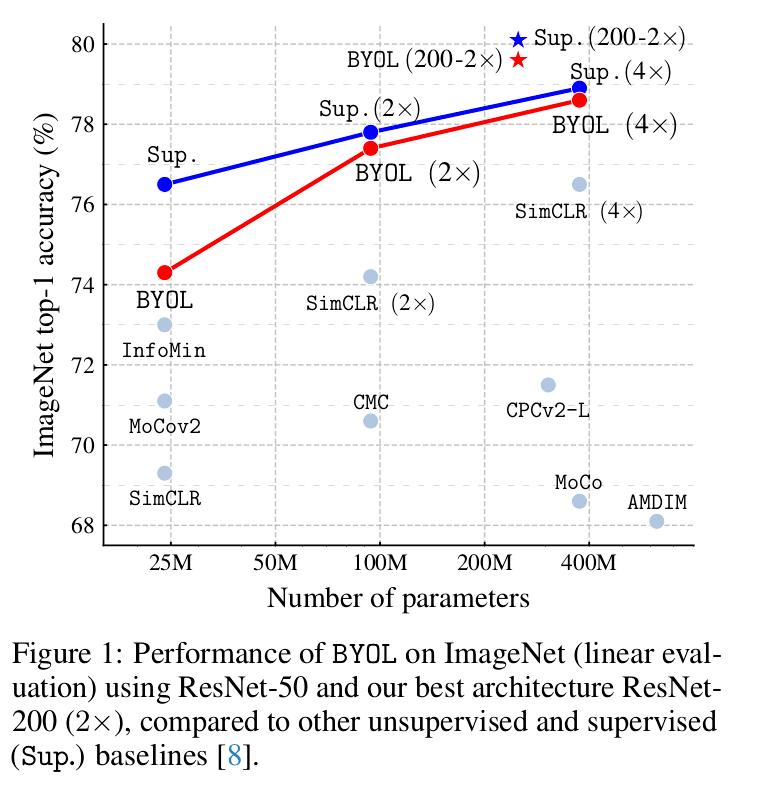
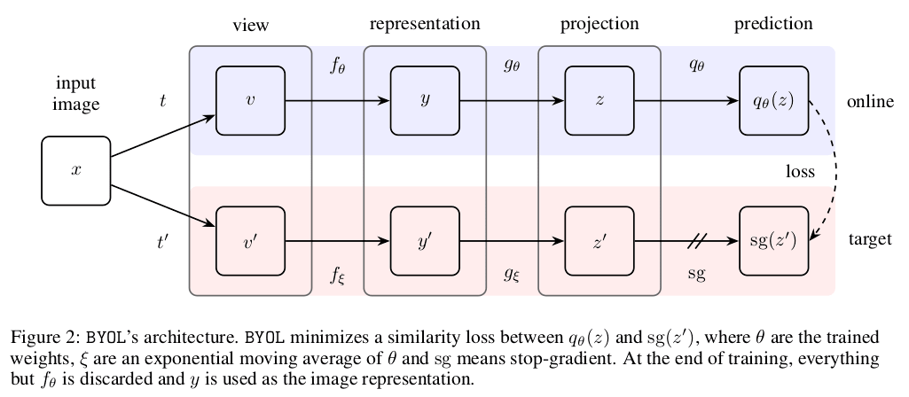
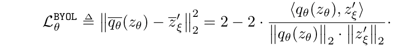

## Bootstrap Your Own Latent: A New Approach to Self-Supervised Learning

Jean-Bastien Grill, Florian Strub, Florent Altché, Corentin Tallec, Pierre H. Richemond, Elena Buchatskaya, Carl Doersch, Bernardo Avila Pires, Zhaohan Daniel Guo, Mohammad Gheshlaghi Azar, Bilal Piot, Koray Kavukcuoglu, Rémi Munos, Michal Valko, **CVPR 2020**

## Summary

Learning good image representations is a key challenge in computer vision. Till now most of the methods or rather algorithms for learning image representations have been based on *contrastive learning (or methods)*. As most **SOTA contrastive methods** are trained by manipulating the distance between representations of different augmented views of the same image (*positive pairs and negative pairs*), they require careful treatment of negative pairs (i.e., preparation of negative pairs in simple words). In addition, their performance critically depends on the choice of image augmentations. Therefore, one major shortcoming with contrastive methods is the sheer amount of data required for training.

To overcome the difficulties faced due to the need of negative pairs while using contrastive methods, the authors introduce **Bootstrap Your Own Latent (BYOL)**, a new algorithm for self-supervised learning of image representations. It iteratively bootstraps the outputs of a network (target network) to serve as targets for an enhanced representation.  In short, BYOL proposes a collaboration between **two neural networks: online and target networks**. Given an augmented view of an image, BYOL trains its online network to predict the target network’s representation of another augmented view of the same image, i.e., BYOL trains the online and target (indirectly) networks hand in hand, using a moving average (as a means of stabilizing the bootstrap step) of the online network's parameters as target network's parameters .

The performance of BYOL on the ImageNet (especially linear evaluation) is comparable to the previous SOTA methods, and when used with wider and deep architecture, even outperforms the existing methods with a decrease (30%) in the number of parameters as well.

## Methodology

- Many successful methods for learning image representations are based on predicting an augmented view of an image from another augmented view of the same image. However, this generally leads to a collapsed representations due to predicting directly in the representation space. Contrastive methods reformulate the **prediction problem as a discrimination problem** with the help of negative views.

- To mollify the need of negative examples, BYOL uses a target network to predict the representation with the online network acting as a backbone. In short, given a target representation (referred to as a target), we can train an *online* representation to predict the targets and subsequently building a sequence of representations improving with each iteration, treating *online networks as target networks*.

- The goal is to learn a representation *y* for the tasks ahead in the pipeline.

- Let's say the parameters of the online network are *θ*, then the target network's parameters *ξ* are an exponential moving average of *θ*, with decay rate *τ* ∈ [0, 1]:

        ξ ← τ ξ + (1 − τ )θ

- Given a set of images *D*, an image *x ∼ D* sampled uniformly from *D*, and two distributions of image augmentations *T* and *T'*, BYOL produces two augmented views: *v = t(x)* and *v' = t'(x)*, where *t ~ T* and *t' ~ T'*.

- The online network uses the first augmented view *v* to output a representation *y = fθ(v)* and a projection *zθ = gθ(y)*. The target network also outputs similar (*y'*) quantities using *ξ* and *v'*. 

- We then output a prediction *qθ(zθ)* of *z'ξ* and l2 normalize both *qθ(zθ)* and *z'ξ*.

- The loss functions is a sum of the MSE between normalized predictions and target projections (feeding *v* and *v'* to online and target networks respectively):

## Main Contributions

- **High Performance:** BYOL, a self-supervised representation learning method achieves higher performance than state-of-the-art contrastive methods without using negative pairs.
 
- **Resilient:** BYOL is more resilient to changes in the batch size and in the set of image augmentations compared to its contrastive counterparts.

- **Setting a Target:** Using target networks have been common in Deep RL, and BYOL presents the idea of using target networks along with an online network as an efficient way for bootstrapping latents and in turn learning the representations.

## Our two cents

- BYOL **eliminates** the requirement of negative pairs for learning image representations with the help of self-supervised techniques which reduces the stress on the need of preparing large datasets using image augmentations and other techniques to a large extent.

- Unlike contrastive methods, BYOL is incentivized to keep any information it can extract from image augmentations to improve the predictions made by the *online network*. This generally helps in retaining additional features in the representations.

- The authors mention that at present, BYOL remains dependent on existing sets of augmentations that are specific to vision applications. It would be interesting to see BYOL make its expansion to other domains in the near future, though currently creating the augmentation set required for BYOL's application is a pretty tedious task.

- The authors also mention that training the BYOL method with a **Resnet-50** architecture with "a batch size of 4096 spread over 512 Cloud TPU v3 cores took approximately **8 hours** of training time". That is a huge amount of time. Reducing complexity level of the computations could assist in BYOL's applications elsewhere.

## Resources

- [BYOL (Youtube)](https://www.youtube.com/watch?v=YPfUiOMYOEE)

- [BYOL (Pytorch Implementation)](https://github.com/lucidrains/byol-pytorch)
