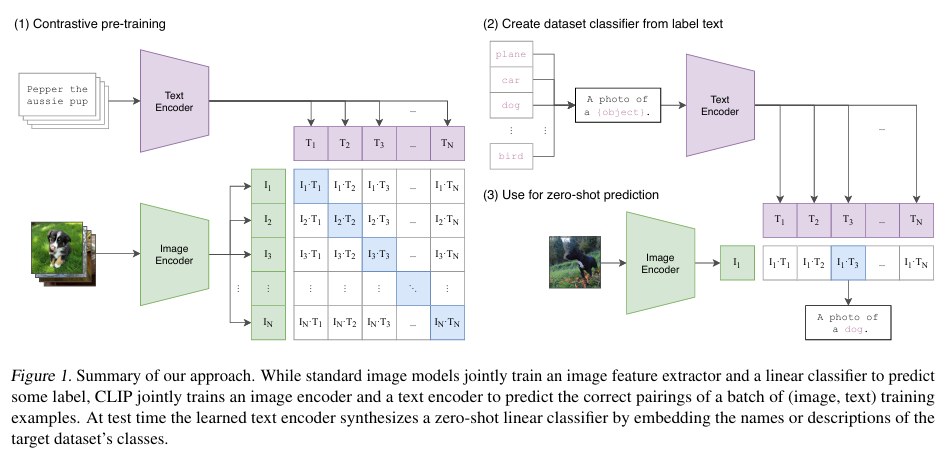
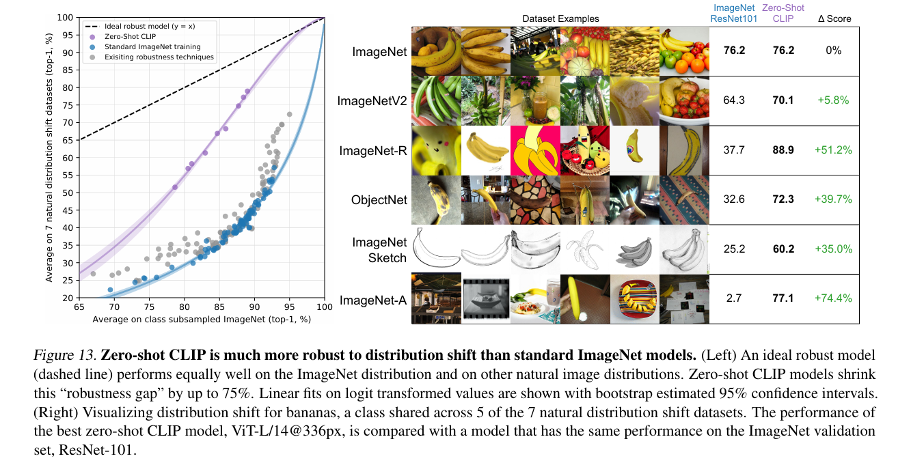

# CLIP (Contrastive Language–Image Pre-training)

Alec Radford, Jong Wook Kim, Chris Hallacy, Aditya Ramesh, Gabriel Goh, Sandhini Agarwal, Girish Sastry, Amanda Askell, Pamela Mishkin, Jack Clark, Gretchen Krueger, Ilya Sutskever  
**ICML** **2021**

## Summary

CLIP (Contrastive Language–Image Pre-training), is a pre-training method that uses the task of predicting text-image pairings to learn image representations from raw text. The paper shows that CLIP enables zero-shot transfer of the model for various tasks, without the need for dataset-specific training. CLIP is part of a group of papers revisiting learning visual representations from natural language supervision in the past year. This line of work uses more modern architectures like the Transformer and includes ViTex, ICMLM, CovVIRT.

## Contributions

Learning Transferable Visual Models From Natural Language Supervision was the name of the paper this was introduced. In order to solve the task of zero-shot transfer, our intuition is that CLIP models will need to learn to recognize a wide variety of visual concepts in images and associate them with their names. As a result, CLIP models can then be applied to nearly arbitrary visual classification tasks.

There is a gap between “benchmark performance” and “real performance”, and generally this gap occurs because the models “cheat” by only optimizing for performance on the benchmark, much like a student who passed an exam by studying only the questions on past years’ exams. In contrast, the CLIP model can be evaluated on benchmarks without having to train on their data, so it can’t “cheat” in this manner.

## Method

It is a joint image and text embedding model trained using 400 million image and text pairs in a self-supervised way. This means that it maps both text and images to the same embedding space. So, for example, an image of a dog and the sentence “an image of a dog” would end up having very similar embeddings and be close to each other in the vector space.

It consists of a text encoder (which embeds the text), which is a standard transformer and an image encoder (which embeds the images), for which they use multiple approaches such as using ResNET-50. Then another major component is the Multi-Modal Embedding Space, and we can train CLIP (by training the image and text encoders) to put these in the space such that positive pairs are close to each other.
There are a lot of ways to define “close” in machine learning. Arguably the most common approach is cosine similarity, which is what CLIP employs.

## Results

This proved to be much more successful than standard models, as it was able to get similar type of performance on the dataset it was trained on in comparison to other Image Models, but on other datasets with different distribution it was able to perform better than those models, showing that it has better generalizing capabilities and zero-shot transfer abilities.

Because they learn a wide range of visual concepts directly from natural language, CLIP models are significantly more flexible and general than existing ImageNet models. Hence, they find that CLIP able to zero-shot perform many different tasks. It solves the main issue of having to not train a model again and again specific to a dataset, removing the need for Costly datasets and adds "out of the box" recognition abilities.

But there are limitations to this as well, it struggles on more abstract or systematic tasks such as counting the number of objects in an image and on more complex tasks such as predicting how close the nearest car is in a photo. On these two datasets, zero-shot CLIP is only slightly better than random guessing.

## Our Two-Cents

This paper was really important for handling vision language tasks, as it brings on the images and the text to the same embedding space allowing the images to derive and obtain context and meaning with the help of word embeddings from natural language models.  
They created there dataset by web scraping and using captions of images from the internet, which is not always a reliable source and there exists a lot of biases and fake information on the internet causing more issues, hence there exists a lot of scope of improvement. People can look into using a more reliable dataset using human preferences, look for alternate methods on similar lines where they add more dimensionality to the process, and also look forward on the interpretability on this to actualize how the similarity is being bought upon.

## Resources

- Paper Link: https://arxiv.org/pdf/2103.00020
- Blog: https://openai.com/index/clip/