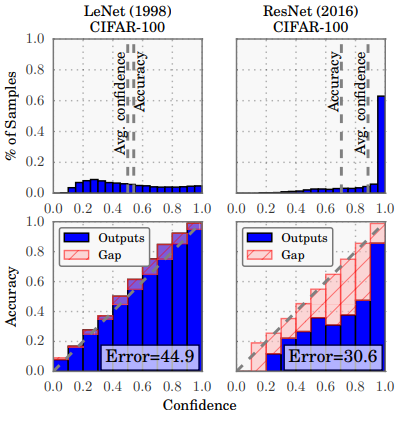
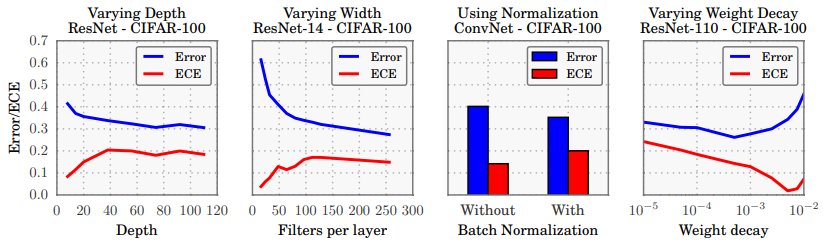
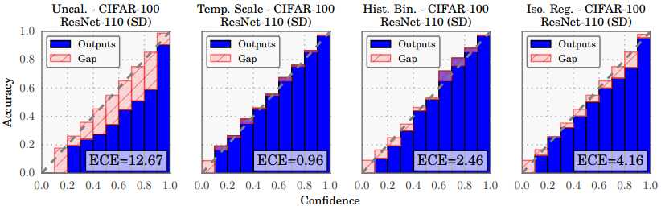
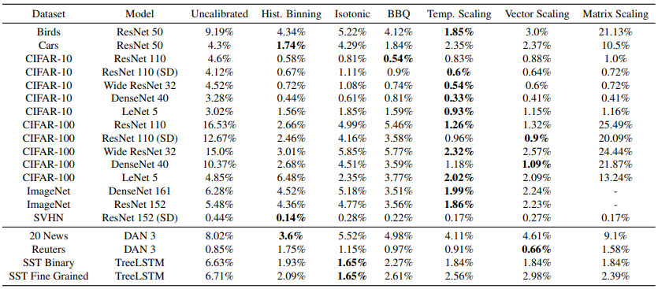

# On Calibration of Modern Neural Networks

Chuan Guo, Geoff Pleiss, Yu Sun, Kilian Q. Weinberger, **ICML** **2017**

## Summary
The paper talks about **Confidence Calibration** : the problem of predicting probability estimates representative of the true correctness likelihood. The authors find that unlike old Neural Nets (e.g. *LeNet*), modern ones (e.g. *ResNet*) are poorly calibrated and have rather become quite overconfident. 

 <i>Confidence histograms (top) and reliability diagrams (bottom)   for a 5-layer LeNet (left) and a 110-layer ResNet (right) on CIFAR-100</i>   

The authors experimented with various factors like *Depth and Width* of the net, *Weight Decay*, and *Batch Normalization* that have affected the confidence calibration in the modern architectures. They then analysed the performance of various post-hoc calibration methods on numerous architectures and datasets like *Histogram Binning, Isotonic Regression, Bayesian Binning into Quantiles (BBQ), Matrix and Vector Scaling* along with another calibration method they proposed: **Temperature Scaling**. They observed that it outperforms other calibration methods on most Vision and NLP tasks.  

## Contributions
- The paper first discusses about tools and metrics like Reliability Diagrams, Expected Calibration Error(ECE) and Maximum Calibration Error(MCE) that can be used to quantify and measure confidence calibration. 
- The authors then conduct experiments to find relation between Confidence Calibration and factors like Model Size (Depth and Width), Batch Normalisation and Weight Decay. 
    - The general obseravtion is that modern architectures are deep, wide, use BatchNorm and use less Weight Decay compared to older ones, all of which lead to increased miscalibration and overconfidence.
    - The authors point that :
        > During training, after the model is able to correctly classify (almost) all training samples, NLL can be further minimized by increasing the confidence of predictions. Increased model capacity will lower training NLL, and thus the model will be more (over)confident on average. 

        > There's a disconnect between NLL and accuracy. This occurs because neural networks can overfit to NLL without overfitting to the 0/1 loss.  
        > This suggests that these high capacity models are not necessarily immune from overfitting, but rather, overfitting manifests in probabilistic error rather than classification error. 

 <i>The effect of network depth (far left), width (middle left), Batch Normalization (middle right),  and weight decay (far right) on miscalibration, as measured by ECE (lower is better).</i>   

- The authors provide discussion on various post-hoc calibration methods like *Histogram Binning, Isotonic Regression, Bayesian Binning into Quantiles (BBQ), Matrix and Vector Scaling* along with another calibration method they proposed: **Temperature Scaling**.
    - Temp. Scaling is an extension of Platt Scaling using a single learnable parameter $T > 0$, called Temperature that raises the output entropy. For the logit vector $\textbf{z}_i$, the new confidence prediction $\hat{q_i}$ is:
    $$\hat{q_i} = \max_{k} {\sigma}_{SM}(\textbf{z}_i/T)^{(k)}$$
    - T is optimised wrt NLL on validation set. Temp. Scaling does not affect the model’s accuracy as T doesn't change the maximum of softmax output.
    - Supplementary material proves that this model is equivalent to maximizing the entropy of the output probability distribution subject to certain constraints on the logits.

 <i>Reliability diagrams for CIFAR-100 before (far left) and after calibration (middle left, middle right, far right).</i>   

## Results and Comparisons

- **Calibration Results**: Temp. Scaling is surprisingly effective despite being so simple. It outperforms the Vector and Matrix Platt scaling variants, which are strictly more general methods. Vector Scaling's learned vector has nearly constant entries, and therefore is no different than a scalar transformation.
- Histogram binning, the simplest binning method, typically outperforms isotonic regression and BBQ, despite the fact that both methods are strictly more general. This supports that calibration is best corrected by simple models.
- **Computation time**: Temp. Scaling is the fastest of all aforementioned methods. The computational complexity of vector and matrix scaling are linear and quadratic respectively in the number of classes. Others take atleast an order of magnitude longer than Temp. Scaling.
- **Ease of implementation**: Temp. Scaling is the easiest of all aforementioned methods to implement.

 <i>ECE (%) (with M = 15 bins) on standard vision and NLP datasets before calibration and with various calibration methods.</i>   

## Two-Cents

Further discussion on Temp. Scaling could have been provided. More experiments could have been performed to validate the performance of this method.

## Resources

Links to the project [page](https://geoffpleiss.com/nn_calibration), [video](https://vimeo.com/238242536) and [implementation](https://github.com/gpleiss/temperature_scaling) for the paper.
