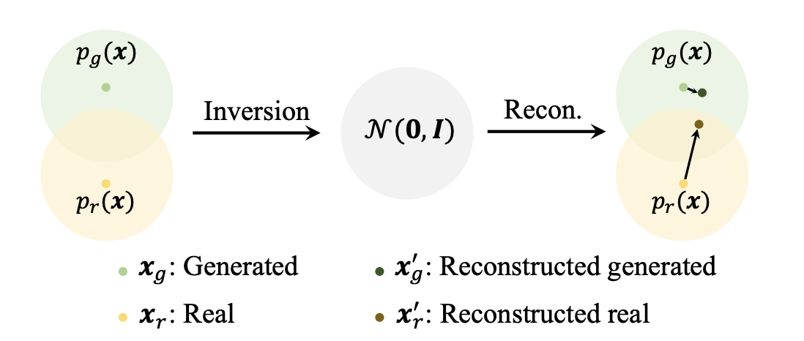

# DIRE for Diffusion-Generated Image Detection
Zhendong Wang, Jianmin Bao, Wengang Zhou, Weilun Wang, Hezhen Hu, Hong Chen, Houqiang Li **ICCV**  **2023**

## Summary

This paper, seeks to build a detector for telling apart real images from diffusion generated images by proposing a novel image representation called **DI**ffusion **R**econstruction **E**rror (DIRE), which measures the error between an input image and its reconstruction counterpart by a pre-trained diffusion model. The hypothesis behind DIRE is the observation that images produced by diffusion processes can be reconstructed more accurately by a pre-trained diffusion model compared to real images.

## Contributions

  
- Proposed a novel image representation called DIRE for detecting diffusion-generated images.
- Set up a new dataset, DiffusionForensics (including three-domain images (LSUN-Bedroom, ImageNet and CelebA-HQ)) generated by eleven different diffusion models for benchmarking the diffusion-generated image detectors.

  
## Method

Given an input image x0 to judge whether it is generated by diffusion models, we take a pre-trained diffusion model and apply the DDIM inversion process to gradually add Gaussian noise into x0. Then the DDIM generation process is employed to reconstruct the input image and produces a recovered version x'0. Then the DIRE is defined as:

 
$$
DIRE(x_{0}) = |x_{0} - x'_{0}|
$$

 **Illustration of the difference between a real sample and a generated sample**

pg(x) represents the distribution of generated images while pr(x) represents the distribution of real images. xg and xr represent a generated sample and a real sample, respectively. Using the inversion and reconstruction process of DDIM xg and xr become x'g and x′r , respectively.
 
As a sample xg from the generated distribution pg(x) and its reconstruction x′g belong to the same distribution, the DIRE value for xg would be relatively low. Conversely, the reconstruction of a real image xr is likely to differ significantly from itself, resulting in a high amplitude in DIRE.

Thus for real images and diffusion-generated images, we get their DIRE representations and train a binary classifier to distinguish their DIREs using binary crossentropy loss.

## Results

- DIRE with a binary classifier significantly outperformed existing classifiers including CNNDetection, GANDetection, SBI, PatchForensics, F3Net at detecting - 
	* Diffusion generated bedroom images
	* Diffusion generated face images	
	* Generated ImageNet images
	* GAN-generated bedroom images

- The robustness of detectors is checked in two-class degradations, Gaussian blur and JPEG compression, DIRE gets a perfect performance without performance drop.

- Other methods of input also checked against DIRE were RGB images, reconstructed images (REC), and the combination of RGB and DIRE (RGB&DIRE). Using just DIRE as input achieved significantly higher accuracy

## Two-Cents

The proposed image representation DIRE contributes to a novel, accurate and robust detector, outperforming current SOTA detection models extensively.

## Resources

- [Paper](https://arxiv.org/pdf/2303.09295.pdf)
- [Implementation](https://github.com/ZhendongWang6/DIRE)