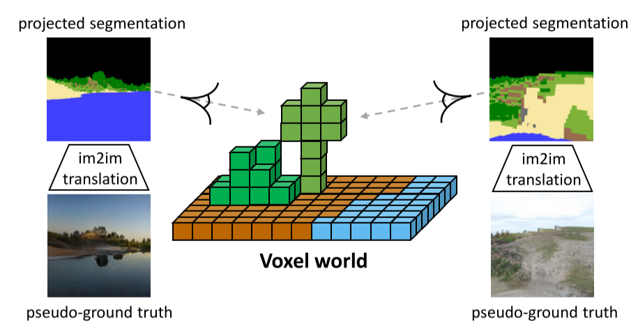
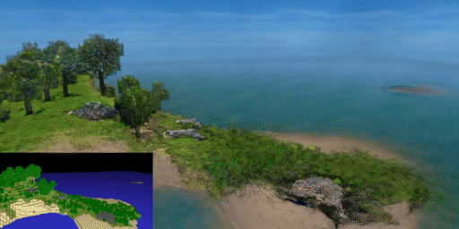
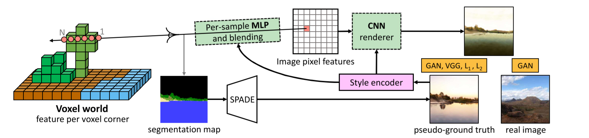
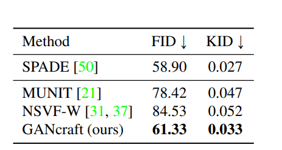

# GANcraft: Unsupervised 3D Neural Rendering of Minecraft Worlds
Zekun Hao, Arun Mallya, Serge Belongie, Ming-Yu Liu

## Summary

This paper presents **GANcraft** a volumetric rendering (rendering of the 3D world as 2D images) based approach to model a 3D block world scene with semantic labels as a continuous volumetric function and render view consistent, photorealistic images. In the absence of the paired training data, an image-to-image translation model generates the pseudo ground truth labels for the corresponding photorealistic 3D world.

## Contributions

- The novel task of world-to-world translation from 
3D block world which can be intuitively constructed in
Minecraft to a realistic 3D world, the 3D extension to a 2D
image to image translation.

- Framework to train neural renderers in the absence of ground 
truth data for rendering the realistic-looking world using pseudo 
ground truth labels.

- Training neural rendering architecture with adversarial losses 
and conditioning on the style image, extending 3D neural rendering
methods.

## Model

- GANs can successfully map images from one domain to another without paired data but the images generated for mapping a 3D world are not view-consistent and there is a flickering problem. 
Neural rendering techniques solve this problem of view consistency but cannot handle the Minecraft block world and real-world domain gap.
- The model takes as input a 3D block world for which a voxel bounded feature field is learned using an MLP model for which takes as input the location code, semantic label, and a shared style code. Instead of a view-dependent color used in neural rendering techniques, the network outputs image features **C(r,z)**. Vertices of each voxel are assigned feature vectors which are shared by adjacent voxels ensuring that there are no inconsistencies in the output. 
- This feature image is passed into a CNN renderer which converts the per pixel feature map to an RGB image.
The model is trained on the adversarial and perceptual losses for the generated image and reconstruction loss wrt the corresponding pseudo ground truth labels.

## Results

The model is evaluated based on the FID, KID scores where GANcraft achieves values close to **SPADE** which is a photorealistic image generator and outperforms other baselines on temporal consistency metric based on human preference scores.

## Our Two Cents
- The model achieves state-of-the-art results in the world-to-world translation task in the absence of the ground truth photorealistic images for the segmentation labels of the 3D world.
- There is still a blocky appearance to the output images because of the domain shift in the training images of the spade model and the projected images from the 3D block world.

## Resources
Project Page: https://nvlabs.github.io/GANcraft/
