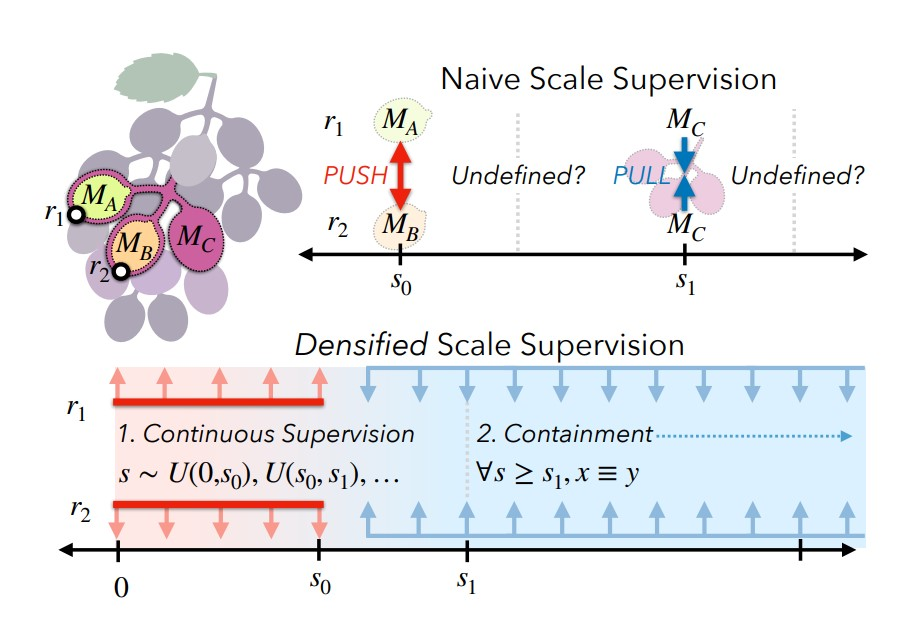
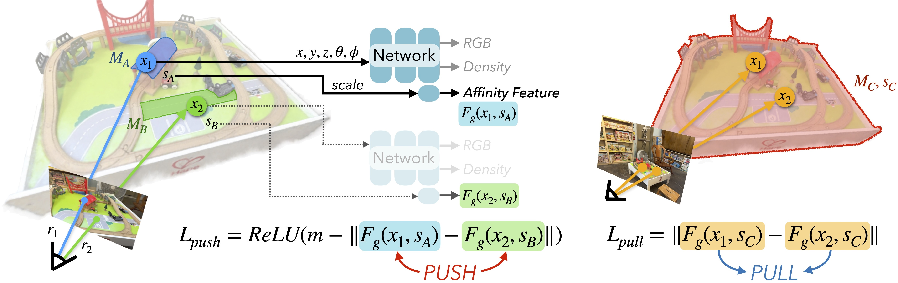
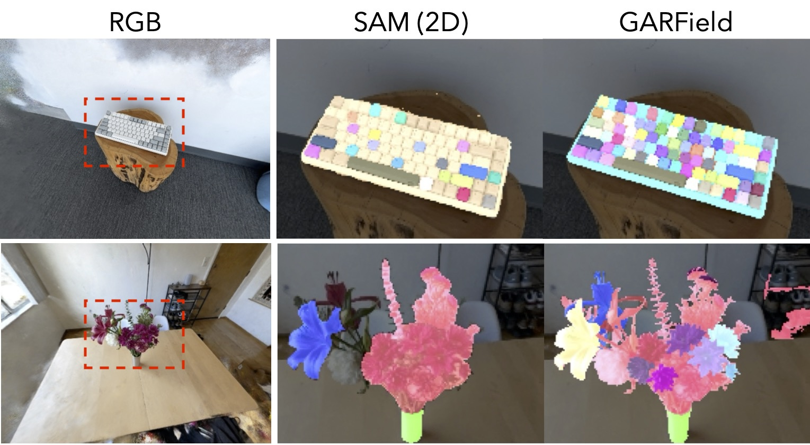
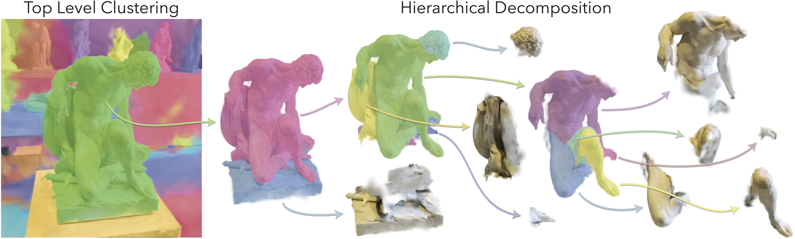

# GARField: Group Anything with Radiance Fields

Chung Min Kim, Mingxuan Wu, Justin Kerr, Ken Goldberg, Matthew Tancik, Angjoo Kanazawa, **CVPR 2024**  

## Summary

This paper presents **GARField**, a novel method for decomposing 3D scenes into hierarchies of semantically meaningful groups using a combination of NeRFs and 2D segmentation masks.  The key idea is to represent groups using a scale-conditioned 3D affinity field, where the affinity between points reflects their likelihood of belonging to the same group at For example: at a large scale, you might group all the furniture in a room together, while at a smaller scale, you might separate the chairs, tables, and lamps into distinct groups.

## Contributions

The main contributions of this paper are:

* Introduction of GARField, a novel method for hierarchical 3D scene decomposition using a scale-conditioned affinity field.

* A method for distilling potentially conflicting 2D segmentation masks, obtained from Segment Anything (SAM), into a consistent 3D representation.

* A recursive clustering approach for extracting hierarchical groups from the affinity field.

* Qualitative and quantitative evaluation on a variety of real-world scenes, demonstrating the effectiveness of GARField in capturing object hierarchy and achieving view consistency.

## Method

The method can be broken down into the following steps:

1. **2D Mask Generation**: The input to GARField is a set of posed images of a scene. The images are first processed with SAM to obtain a set of candidate segmentation masks.

2. **3D Mask Scale Generation**:  Each 2D mask is assigned a physical scale based on the scene geometry. This is done by partially training a NeRF to estimate depth and then computing the extent of the 3D points corresponding to each mask.

3. **Scale-Conditioned Affinity Field Training**: The core of GARField is a scale-conditioned 3D affinity field, denoted as $F_g(\mathbf{x}, s)$, where $\mathbf{x}$ represents a 3D point and $s$ represents the scale. This field is trained using a contrastive loss that pulls together features of points within the same mask and pushes apart features of points in different masks. A helpful analogy can be drawn by considering two separate wedges of a watermelon. While distinct, they are still part of the same whole. To reconcile these seemingly contradictory signals within a unified affinity field, GARField leverages the concept of physical scale, permitting a point to belong to multiple groups of varying sizes. This approach embraces ambiguity, enabling flexible associations across different spatial scales.The equation for affinity is given as:

$$
A(\mathbf{x_1}, \mathbf{x_2}, s) = -\| F_g(\mathbf{x_1}, s) - F_g(\mathbf{x_2}, s) \|_2
$$

4. **Densifying Scale Supervision**: Two techniques are used to enhance the affinity field training:
   * **Continuous Scale Supervision**: Instead of supervising affinity only at discrete mask scales, the scale is randomly augmented between adjacent mask scales to provide continuous supervision.
   * **Containment Auxiliary Loss**: An additional loss encourages containment, ensuring that points grouped at a smaller scale remain grouped at larger scales.

5. **Hierarchical Decomposition**: Once the affinity field is trained, a hierarchical decomposition of the scene is generated by recursively clustering points at decreasing scales using HDBSCAN. 

The overall approach of the method is summarized in the figure below: 

## Results

The paper presents qualitative and quantitative results on various scenes, demonstrating GARField's ability to extract meaningful groups at different levels of detail. Some key observations are:

* **3D Completeness**: GARField effectively groups complete 3D objects, outperforming SAM in producing view-consistent segmentations.

* **Hierarchical Grouping Recall**: GARField achieves high recall in identifying hierarchical groups, demonstrating the effectiveness of scale conditioning and dense supervision.

## Two-Cents

GARField introduces a method for 3D scene decomposition, using NeRFs and 2D segmentation models. Its scale-conditioned affinity field effectively handles group ambiguity, but the model's reliance on SAM for mask quality and issues with small group generation leave room for improvement. Future work could explore new ways to refine grouping and apply GARField to robotics and scene editing.

## Resources

* [Homepage](https://www.garfield.studio/)

* [Research Paper](https://arxiv.org/abs/2401.09419)
