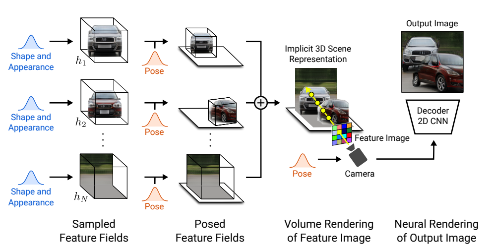
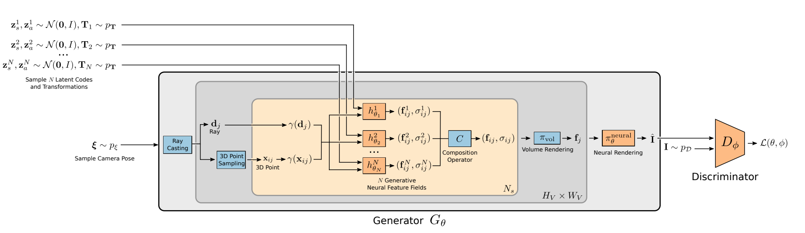

# GIRAFFE: Representing Scenes as Compositional Generative Neural Feature Fields
Michael Niemeyer, Andreas Geiger

## Summary

The paper presents a **generative neural feature fields** based approach for representing scenes as compositional generative neural feature fields for the disentanglement of objects from the background as well as individual object shapes and appearances while learning from unstructured and unposed image collections.
The model learns a disentangled representation of individual objects in a scene by using separate latent vectors for each object and allows rotation, translation, and change in the camera pose of objects.

## Contributions

- A novel method for generating scenes in a controllable and photorealistic manner while training from unposed images.
- Incorporating a compositional 3D scene representation directly into a generative model for more controllable image synthesis.

## Model

- GIRAFFE builds on the [GRAF](https://arxiv.org/pdf/2007.02442) model, trained on unposed images to represent a scene as a neural feature field conditioned on two latent vectors, the **appearance code: zₐ** and the **shape code: zₛ** sampled randomly from a distribution.
- A key limitation of GRAF is that the entire scene is represented by a single network without explicit control over individual scene objects, their pose, shape, and appearance. GIRAFFE extends the GRAF model architecture where for each object, separate generative neural feature fields are conditioned on randomly sampled shape and appearance latent codes. 
- The compositional feature field given by the volumetric density and feature vectors for the background and objects combined is volume rendered for a sampled **camera pose: ε** to obtain a feature image, upsampled by a CNN renderer to get the generated RGB image.

## Results

Horizontal, vertical translations and rotations performed using shape and appearance latent vector interpolations show the disentanglement of the background and the cars.

## Our Two Cents
- The paper presents a novel idea for controllable image synthesis by disentangling individual objects from the background and their shape, appearance, and pose without supervision.
- The model scales well on adding multiple objects in a scene at test time despite being trained on data with a single object instance in an image.

## Resources
Project Page: https://m-niemeyer.github.io/project-pages/giraffe/index.html
