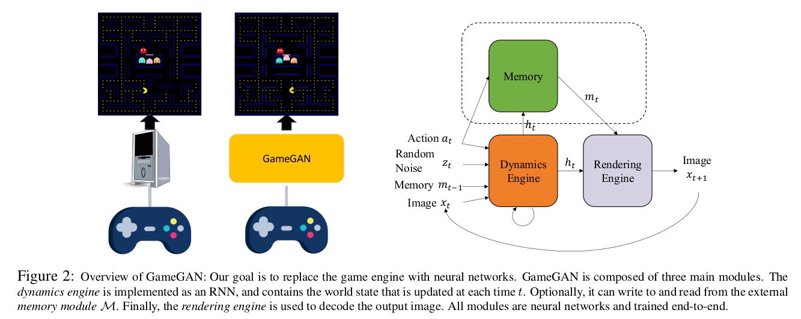
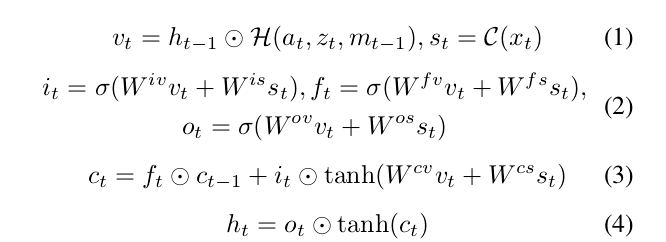
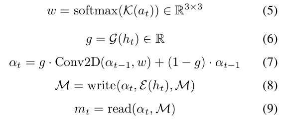
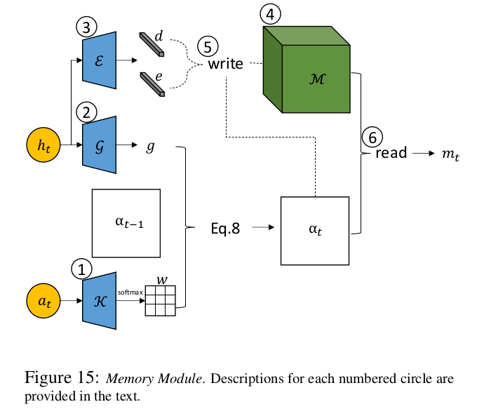
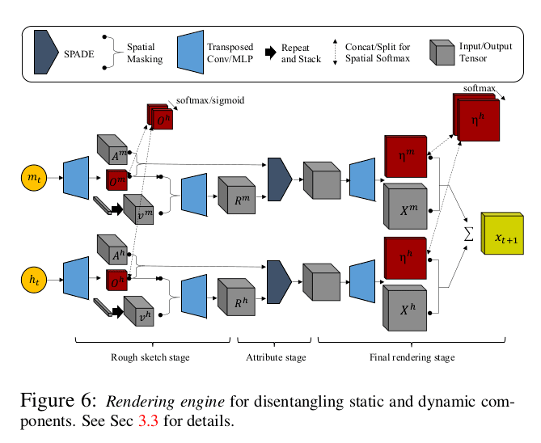
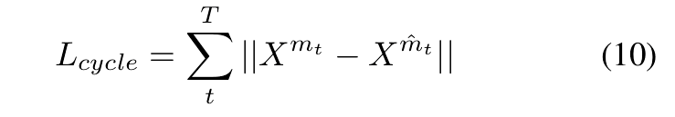

# Learning to Simulate Dynamic Environments with GameGAN

Seung Wook Kim, Yuhao Zhou, Jonah Philion, Antonio Torralba, Sanja Fidler, **CVPR 2020**

## Summary

The paper introduces **GameGAN**, a *generative model that learns to visually imitate a desired game by ingesting screenplay and keyboard actions during training*. Given a key pressed by the agent, GameGAN “renders” the next screen using a carefully designed generative adversarial network. It offers key advantages over existing work: memory module that builds an internal map of the environment, allowing for the agent to return to previously visited locations with high visual consistency. In addition, GameGAN is able to disentangle static and dynamic components within an image making the behavior of the model more interpretable, and relevant for downstream tasks that require explicit reasoning over dynamic elements. This enables many interesting applications such as swapping different components of the game to build new games that do not exist.

GameGAN ingests screenplay and keyboard actions during training and aims to predict the next frame by conditioning on the action,i.e. a key pressed by the agent. It learns from rollouts of image and action pairs directly without having access to the underlying game logic or engine. GameGAN supports several applications such as transfer- ring a given game from one operating system to the other, without requiring to re-write code.

## GameGAN

The focus is on an action-conditioned simulator in the image space where there is an egocentric agent that moves according to the given action *at ∼ A* at time *t* and generates a new observation *xt+1*. We assume there is also a stochastic variable *zt ∼ N (0; I)* that corresponds to randomness in the environment. Given the history of images *x1:t* along with *at* and *zt* , GameGAN predicts the next image *xt+1* . GameGAN is composed of three main modules: 

###Dynamics Engine

- GameGAN has to learn how various aspects of an environment change with respect to the given user action. 

- For instance, it needs to learn that certain actions are not possible, and how other objects behave as a consequence of the action. The primary component that learns such transitions the is *dynamics engine*. 

- It needs to have access to the past history to produce a consistent simulation. Therefore, it is implemented as an action-conditioned LSTM:

where; 

- *ht*, *at*, *zt*, *ct*, *xt* are the hidden state, action, stochastic variable, cell state, image at time step *t*. *mt-1* is the retrieved memory vector in the previous step (if memory module is used), and *it*, *ft*, *ot* are the input, forget, and output gates. 

- *at*, *zt*, *mt-1* and *ht* are fused into *vt* , and *st* is the encoding of the image *xt*. 

- *H* is a MLP, *C* is a convolutional encoder, and *W* are weight matrices.

- The engine maintains the standard state variables for LSTM, *ht* and *ct* , which contain information about every aspect of the current environment at time *t*. It computes the state variables given *at*, *zt* , *mt* , and *xt*.

###Memory Module

- Simulating an environment in which there is an agent navigating through it, requires long-term consistency in which the simulated scene should not change when the agent comes back to the same location a few moments later. We propose to use an external memory module, motivated by the Neural Turing Machine (NTM).

- The memory module has a memory block *M ∈ RN×N×D*, and the attended location *αt ∈ RN×N* at time *t*. *M* contains *N×N* *D-dimensional* vectors where *N* is the spatial width and height of the block. Intuitively, *αt* is the current location that the egocentric agent is located at. *M* is initialized with random noise ∼ *N (0, I)* and *α0* is initialized with 0s except for the **center location (N/2, N/2)** that is set to 1. At each time step, the memory module computes:

where; *K*, *G* and *E* are small MLPs. *w* is a learned shift kernel that depends on the current action, and the kernel is used to shift *αt−1*.

###Rendering Engine

- The (neural) rendering engine is responsible for rendering the simulated image *xt+1* given the state *ht* . It can be simply implemented with standard transposed convolution layers.

- The paper also mentions a specialized rendering engine architecture for ensuring long-term consistency by learning to produce disentangled scenes.
 

## Proposed Loss functions

- **Adversarial Losses**: There are three main components:

    - **Single image discriminator**: To ensure each generated frame is realistic, the single image discriminator and GameGAN simulator play an adversarial game.
    
    - **Action-conditioned discriminator**: GameGAN has to reflect the actions taken by the agent faithfully. We give three pairs to the action-conditioned discriminator. The job of the discriminator is to judge if two frames are consistent with respect to the action. Therefore, to fool the discriminator, GameGAN has to produce realistic future frame that reflects the action.
    
    - **Temporal discriminator**: Different entities in an environment can exhibit different behaviors, and also appear or disappear in partially observed states. To simulate a temporally consistent environment, one has to take past information into account when generating the next states. Therefore, we employ a temporal discriminator that is implemented as 3D convolution networks. It takes several frames as input and decides if they are a real or generated sequence.

- **Cycle Loss**

    - To ensure long-term consistency of static elements, the memory module and the rendering engine are leveraged to disentangle static elements from dynamic elements.

    - After running through some time steps *T* , the memory block *M* is populated with information from the dynamics engine. 
    
    - Using the memory location history *αt* , we can retrieve the memory vector *m̂t* which could be different from *mt* if the content at the location *αt* has been modified. 
    
    - Now, *c = { m̂ t , 0}* is passed to the rendering engine to produce *Xm̂t* where *0* is the zero vector and *Xm̂t* is the output component corresponding to *m̂t*. We use the following loss:
 
     
       
    - As dynamic elements  do not stay the same across time, the engine is encouraged to put static elements in the memory vector to reduce *Lcycle*. Therefore, long-term consistency is achieved.

## Main Contributions

- First work on using action-conditioned GANs for emulating game simulators.

- GameGAN learns everything from frames and directly generates frames.

- The paper's approach treats games as a black box and learns to reproduce the game, allowing us to easily modify it. 

- Using GameGAN, games can be made available for any platform (or operating system) just by training neural networks, saving a lot of code-writing effort and time.

## Our two cents

- GameGAN opens up the gate to game development for researchers using GANs.

- It would be interesting to see if complex games can be generated using a similar approach.

- GameGAN makes any user capable of trying to alter a game's environment in any way he/she wants to. 

## Resources

- [GameGAN Explained! (Youtube Video)](https://www.youtube.com/watch?v=H8F6J7mYyz0&t=586s)