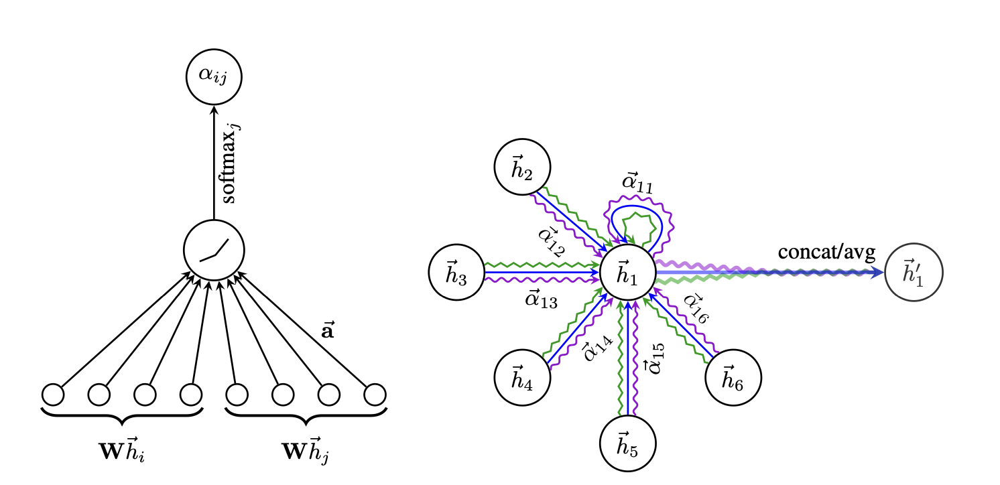
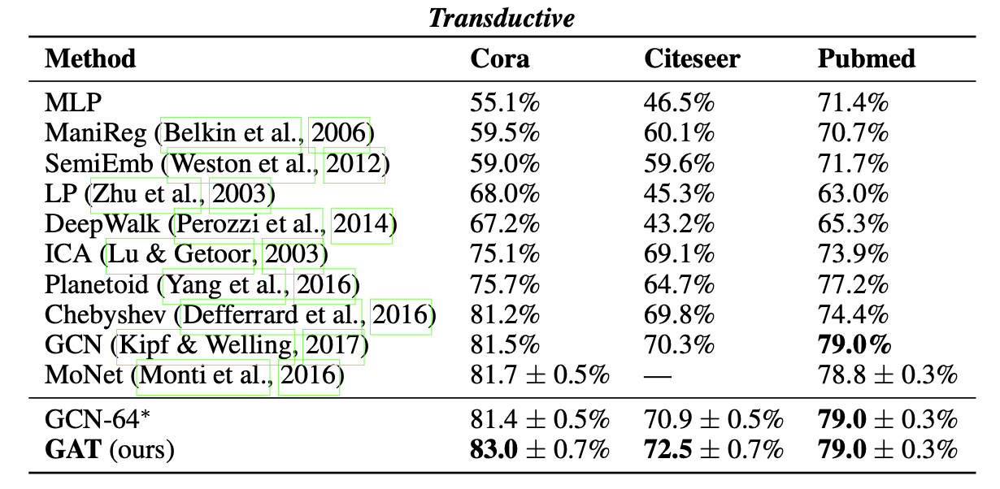
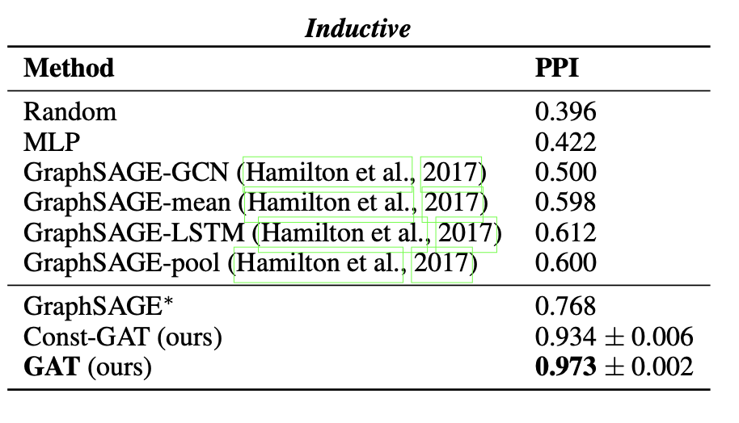

# GRAPH ATTENTION NETWORKS
Petar Velickovic ́,Guillem Cucurull,Arantxa Casanova,Adriana Romero,Pietro Lio`,
Yoshua Bengio,**ICLR** **2018**

## Summary

The paper introduces a novel, efficient, and parallelizable architecture based on spatial methods, termed the Graph Attention Network (GAT). This architecture draws significant inspiration from the seminal work "Attention is All You Need" by Vaswani et al. The central concept of GAT is to compute the hidden representations of each node in the graph by attending to its neighbors through a self-attention mechanism. This approach highlights the importance of attention weights, in contrast to previous spatial methods such as GCN and GraphSAGE, which assign constant weights to all neighbors. Additionally, the model adeptly addresses inductive learning problems and demonstrates robust generalization to entirely unseen graphs.

## Contributions

These are the major contributions of this paper:

1.)It introduces the attention mechanism to Graph Neural Networks. This mechanism emphasizes the importance of attention weights, allowing each node to weigh the influence of its neighbors differently, thereby capturing more complex relationships within the graph.

2.)To stabilize the learning process and improve performance, the Graph Attention Network (GAT) employs multi-head attention. Multiple attention mechanisms are applied independently, and their outputs are either concatenated or averaged to form the final node representations. Consequently, this parallelizable model is both efficient and scalable to large graphs.

## Working

1.)Encoding Features: In the paper, a single linear transformation is used to encode the feature vector of nodes into a low-dimensional vector space without any activation function. Generally, a feed-forward neural network might be used for this purpose.

2.)Attention Coefficient: For each node and its one-hop neighbors, attention coefficients are calculated using a shared attention mechanism that considers the linear transformations of the node features. The attention mechanism employed in the paper differs significantly from the originally proposed method. The details are provided clearly in the paper, which I will summarize later. 

3.)Softmax Normalization: The attention coefficients are normalized using the softmax function to ensure they sum to one.

4.)Feature Aggregation: Each node's new feature representation is computed as a weighted sum of its neighbors' transformed low-dimensional feature vectors, using the attention coefficients as weights.

5.)Non-Linearity: A non-linear activation function, such as ReLU, is applied to the aggregated features to obtain the final representation of each node. This process is recursively applied, typically for two or three layers, and is bounded above by the network's depth.

Important details:->

The paper focuses on the node classification task. Consequently, a head size of 8 is used, resulting in 8 learnable shared weight matrices to generate 8 aggregated feature representations of a node before step 5, along with Leaky ReLU as the activation function. These representations are averaged to maintain the same dimension as before. Additionally, the paper does not utilize two learnable weight matrices, namely query and key, for obtaining the attention coefficients.

## Results

The exact training setup is clearly given in the paper, including parameters such as dropout probability, strength of L2 regularization, number of layers, and the patience value for early stopping. The key takeaways are as follows:

1.)The proposed GAT model achieved state-of-the-art performance, surpassing all previous models and benchmarks. It significantly outperformed a recent model named SageGraph and was on par with the GCN model.

2.)The results also underscored the importance of attention weights, demonstrating an improvement in model accuracy compared to a similar architecture that assigned constant and equal attention weights to all neighbors.

## Two-cents

The paper is not heavily mathematical and is written in simple, easy-to-understand language.The implementation details are presented straightforwardly, and the approach can be viewed as a combination of GCN and attention mechanisms.

The paper also discusses possible future work, with the most significant suggestion being the incorporation of edge features along with node-level features into the model. This enhancement could result in a more powerful model, as current models like GAT, SageGraph, and GCN do not utilize edge features beyond their binary presence or absence.

## Resources

Paper link: https://arxiv.org/pdf/1609.02907

Video link: https://youtu.be/VyIOfIglrUM?si=o4NHnET8-zbQGkA1