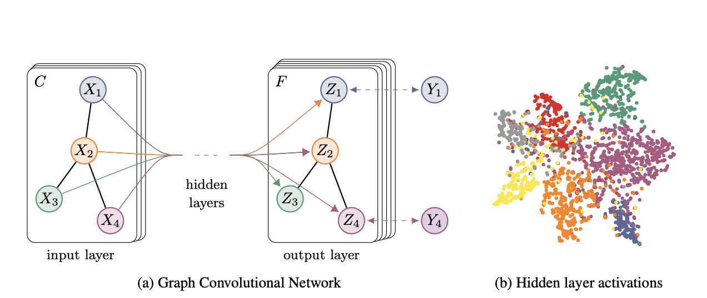
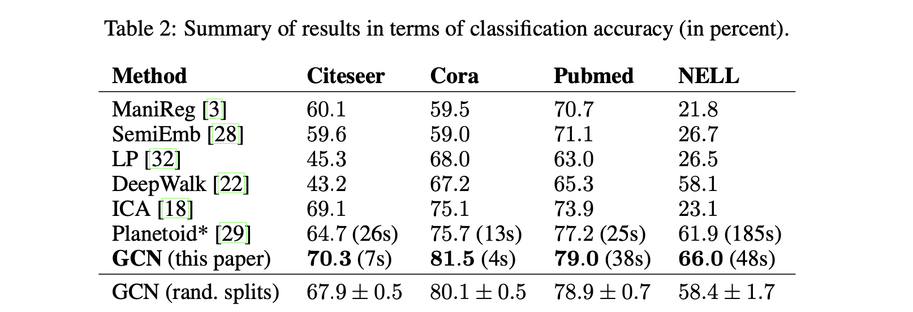
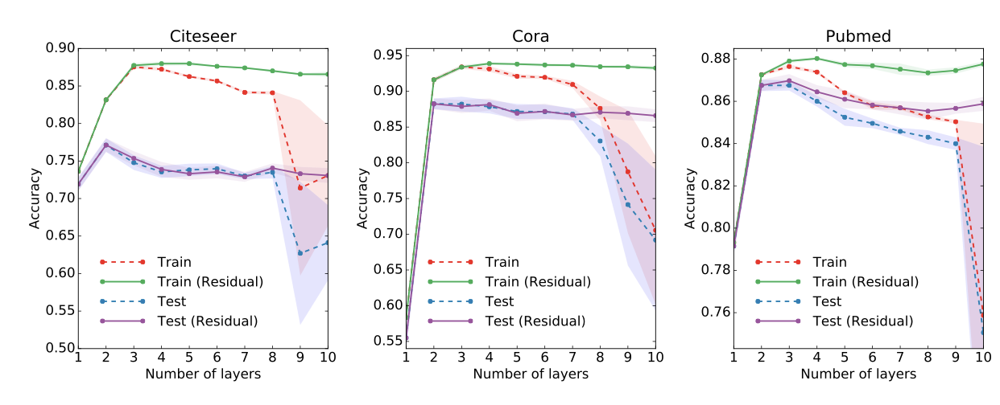
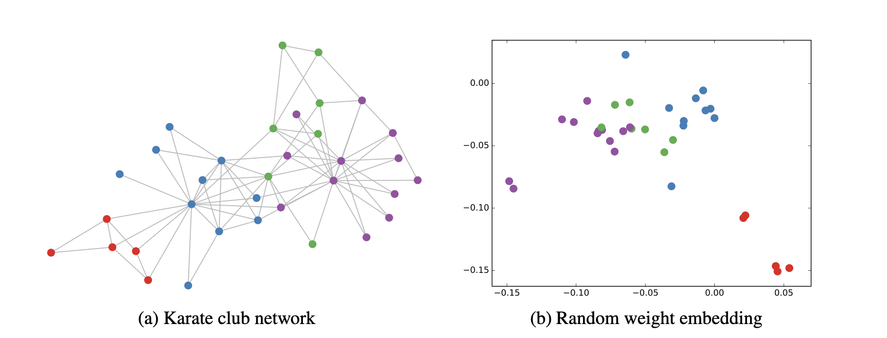

# SEMI-SUPERVISED CLASSIFICATION WITH GRAPH CONVOLUTIONAL NETWORKS
Thomas N. Kipf,Max Welling ,**ICLR** **2017**

## Summary

The paper introduces a new architecture, namely the Graph Convolutional Network (GCN). It's a scalable approach for semi-supervised learning on graph-structured data. It is essentially an efficient variant of convolutional neural networks that operate directly on graphs. The paper is motivated by the node-level classification task and justifies its architecture as a localized first-order approximation of spectral graph convolutions. Furthermore, their model is computationally very cheap compared to traditional spectral methods. The paper is highly mathematical and provides a theoretical explanation for the results.There are 3 prespective in which you could understand this paper 

a) You could see it as an novel architecture which is simple and scalable for large scale graphs.
b) The analogy between the model and Weisfeiler-Lehman algorithm related to graph isomorphism.
c) How it can be derived/motivated from traditional spectral methods.

## Contributions

The main contribution of the paper is that it introduces a simplified and computationally efficient variant of Graph Convolutional Networks (GCNs) for semi-supervised learning on graph-structured data.

It is the most cited paper in the field of Graph Neural Networks (GNNs). It has inspired a wide range of subsequent research and applications in this domain, leading to the development of more advanced GCN variants and other types of graph neural networks like GAT and GraphSage

## Working

1.) Encoding Features: The graph encodes the feature vector of nodes to a low-dimensional vector space. This is usually done with a simple feedforward neural network without any activation function.

2.)A CNN inspired aggregation and update:

Aggregation: Aggregate the encoded feature vector of all 1-hop neighbors of the target node and the node itself.
         
Update: Pass this aggregated feature vector through an activation function like ReLU.

3.) Recursion: Recursively repeat this process for all the 1-hop neighbors of the target node and stack the GNN layers.

4.) Final Representation: Finally, we get an encoded feature vector representation of each node which can be used for classification or regression tasks.

Important details regarding the working of the architecture:->

a) Various types of aggregation functions have been proposed since this paper, such as max-pooling and LSTM. This paper simply adds up the hidden vector with normalization. The first part of step 2 in this paper is simply the sum operation.

b) The mathematical equation of the update function includes the matrix A+I and sqrtD inverse matrix to include the target node itself for the aggregation step. Also, the sqrtD inverse is a diagonal matrix for normalizing the encoded vector representation of each node.

c)The loss function used in the paper is cross-entropy loss. The paper employs a semi-supervised learning setup due to transductive learning, which means it also uses unlabeled nodes for training the model on labeled nodes to incorporate the structural details of the graph.

d) Differences between GCN and CNN:

1)The unlabeled nodes might include nodes that would be used at test time, which is very different from computer vision tasks where the test dataset is not used during the training process.

2)Unlike CNNs, we don't have very deep models for GCNs. Most models stack only 2 layers, meaning their receptive field is very small compared to modern CNN architectures and includes at most 2-hop neighbors.

e) The model doesn't uses minibatch idea that is the batch size in each epoch is the entire training dataset.Also it uses dropout . Both of this methods have been outdated and are not used in current architectures.

## Results

The key takeaways are :->

1.) The proposed architecture outperforms all previous methods and is now the baseline for modern GNN models. It also proves to be more efficient computationally while being a more complex network.

2.) They used dropout in both layers but L2 regularization in the 2nd layer only. The exact details of dropout probability and regularization strength are given in the paper.

3.) In the appendix section they showed that deeper models perform poorly. A depth of 2 or 3 layers is optimal, and depths greater than 7 work only with skip connections. Therefore, in most GNN models, we only have matrices associated with two GNN layers.

4.) Another important result discussed in the appendix is the analogy of the architecture with the Weisfeiler-Lehman algorithm. The main outcome of this analogy is that the model is a powerful feature extractor even without any training. The results of this are discussed in great detail in the appendix section. 

## Two-cents

The appendix of the paper is very insightful and discusses a third perspective in which you could view the paper, as mentioned in the summary section. Though it is very mathematical and involves a deeper understanding of the Weisfeiler-Lehman test and graph isomorphism, which I have not covered in the summary.

The paper overall is highly mathematical but provides a clear implementation method and code. Therefore, it's good for both theoretical work, as it provides every mathematical detail, and is also quick to use for applications related to node classification due to the clear implementation given in the paper.

## Resources

Paper link: https://arxiv.org/pdf/1710.10903

Video link: https://youtu.be/uFLeKkXWq2c?si=03-MxYlP00qOcXLk

