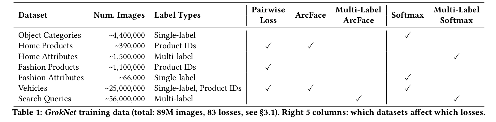
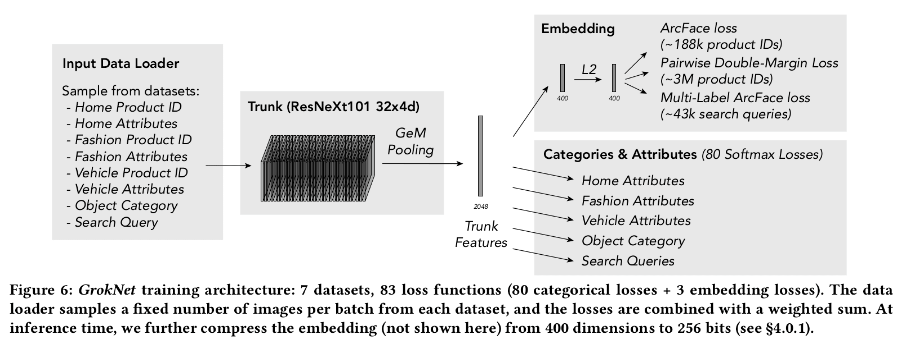

# GrokNet: Unified Computer Vision Model Trunk and Embeddings For Commerce

Sean Bell, Yiqun Liu, Sami Alsheikh, Yina Tang, Ed Pizzi, M. Henning, Karun Singh, Omkar Parkhi, Fedor Borisyuk, KDD 2020

## Summary

The paper presents **GrokNet**, *a unified computer vision model*, which incorporates a diverse set of loss functions, optimizing jointly for exact product recognition accuracy and various classification tasks. GrokNet predicts a wide variety of properties for an image, such as its category, attributes, and likely search queries.  It also predicts an embedding (like a “fingerprint”) that can be used to perform tasks like product recognition, visual search, visually similar product recommendations, ranking, personalization, price suggestions, and canonicalization.

**GrokNet is a single unified model with full coverage across all products.**

## Main contributions

- GrokNet can detect exact, similar, and co-occurring products across billions of photos, performs searches and filtering on Marketplace at least twice as accurately than the algorithm it replaced([MSURU](https://research.fb.com/publications/msuru-large-scale-e-commerce-image-classification-with-weakly-supervised-search-data/)). 

- For instance, it’s able to identify 90% of home and garden listings compared with Facebook’s text-based attribution systems, which can only identify 33%. 

- In addition to generating tags for colors and materials from images before Marketplace sellers list an item, as part of a limited test, it’s tagging products on Facebook Pages when Page admins upload a photo.

- Presented innovative ideas for handling large weakly-supervised training data using cleaning and how to improve accuracy by model results post processing, and provided practical advice on how to develop, deploy, and integrate modern state-of-the-art image product recognition system to applications operating at Facebook scale.

## Model

- GrokNet is a large-scale unification of several datasets and machine learning tasks – in total: **7 datasets** and **83 different loss functions**.
 

- The disparate large datasets with different data types and different loss functions with multi-task learning required a special architecture which has been called the **Trunk architecture**.

- The trunk model for GrokNet uses [ResNeXt](https://arxiv.org/abs/1611.05431) -101 32×4d, which has 101 layers, 32 groups, and group width 4 (8B multiply-add FLOPs, 43M parameters).

- *GeM Pooling*: At the top of the trunk, generalized mean (GeM) pooling is used, which is a parameterized pooling operation that is equivalent to average pooling for p = 1, and max pooling for p = ∞. The pooling parameter p is learned for the experiments. After training, the final model converges to a value p ≈ 3.

The model is trained with SGD for 100,000 iterations on 96 NVIDIA V100 GPUs with a batch size of 46 per GPU, learning rate 0.012 × 12 = 0.0144, momentum 0.9, and weight decay 1e-4.

## Methodology

### Training data collection

GrokNet requires almost 100 million images as training data, so data collection is a major task. 

- **Object Categories**: object categories from an internal human-annotated dataset of Marketplace images.

- **Attributes (Fashion, Home, and Vehicles)**: multi-label annotations for attributes on home and fashion products, and public post metadata for vehicles.

- **Product Identities (Fashion, Home, and Vehicles)**: leveraging product identity(ID) datasets for each of the fashion, home, and vehicle verticals. Products in different images will have the same ID if they are the exact same variation of the same product.

- **Weakly supervised data augmentation**: Product IDs are the most difficult data to collect. A large collection of unlabeled photos is gathered and then detecting the object boxes in each photo, embedding features are computed for each box. The closest match (least distance below a threshold) becomes additional data to augment the training set.

- **Marketplace Search Queries**: a dataset of image-query pairs from search logs.

### Trunk Architecture

**Training data is given as input and losses are calculated with the Trunk architecture based model.**

### Loss Functions

GrokNet unifies several distinct tasks into a single architecture combining several loss functions and loss function types in a weighted sum. 

- **Softmax loss**: categorical labels to our model using softmax with cross-entropy Loss

- **Multi-label Softmax loss**

- **Multi-Label ArcFace Loss**: ArcFace loss is a modified classification objective originally introduced for face recognition. Multi-Label ArcFace uses cosine similarity between embeddings xi and “class center” vectors wj for each class, where each image is pulled towards multiple class centers (vs. a single center in ArcFace).

- **Pairwise Double-Margin Loss**: ArcFace has very high accuracy for exact product recognition on the data. However it limits the number of products we can include in the training set, since each product requires its own class vector. To resolve this, all products are included using a pairwise loss.

## Our two cents

- GrokNet is a great step towards making e-shopping easy and comfortable for the user.

- With AI-powered product tagging, businesses will be able to more easily showcase entire catalogues of products to billions of people worldwide within seconds.

- GrokNet could be used to help customers easily find exactly what they're looking for, receive personalized suggestions from storefronts on what products are most relevant to them, which products are compatible, how they’re being worn, and then click through to purchase when they find things they like in their feeds.

## Resources

- [Powered by AI: Advancing product understanding and building new shopping experiences](https://ai.facebook.com/blog/powered-by-ai-advancing-product-understanding-and-building-new-shopping-experiences)
