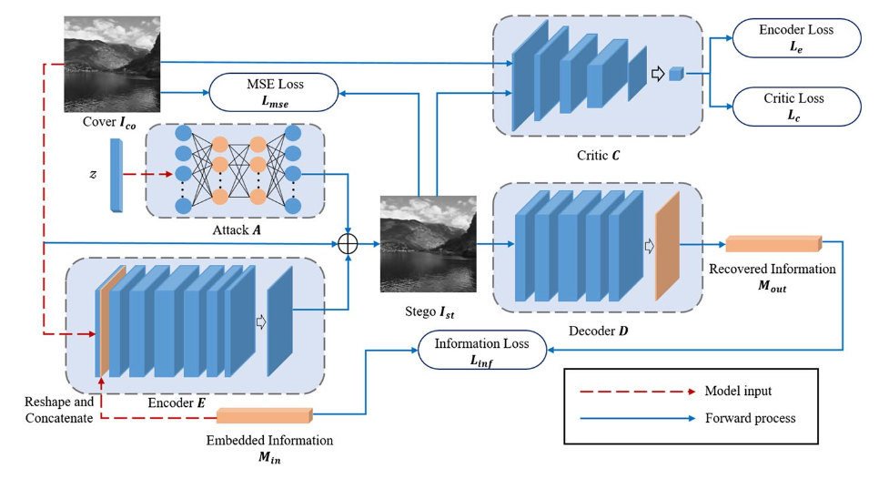

# GAN-based image steganography for enhancing security via adversarial attack and pixel-wise deep fusion
Chao Yuan, Hongxia Wang,  Peisong He, Jie Luo, Bin Li

**Springer Multimedia tools and applications** **2022**

## Summary
This paper proposes an advanced image steganographic scheme using generative adversarial networks (GANs) which includes adversarial attack and pixel-wise deep fusion techniques to fool detection systems and effectively embed and recover hidden information, achieving higher security and better performance compared to CNN based steganalyzers.

## Contributions
- This paper presents a novel method called ADF-IS that uses GANs for better security and efficiency of hiding information within images. The scheme is designed to embed secret information in a way that is hard to detect and visually imperceptible.

- This introduces a technique called UAN which introduces small, targeted changes to images to make it harder and mislead steganalysers to identify hidden data.

- It involves pixel-wise deep fusion strategy which involves embedding hidden information in complex image areas to maintain high visual quality and make the hidden data harder to detect. 

## Methodology 
The architecture of the ADF-IS model is composed of four main modules: Attack, Encoder, Decoder, and Critic. The embedding process begins with the Encoder module, where a cover image and secret information​ are input to generate a stego mask. Then, a vector sampled from a normal distribution is input into the Attack module which utilizes a generative network UAN to produce an adversarial perturbation. This perturbation is combined with the stego mask and added to the cover image​, resulting in the creation of the stego image.

The Critic module then evaluates this stego image by distinguishing it from the original cover image and providing a score based on the differences. Finally, the stego image is sent to the Decoder module, which recovers the secret information. The method incorporates multiple loss functions and the Wasserstein GAN strategy to improve stability and effectiveness.

## Results
The proposed method (ADF-IS) achieved high visual quality for stego images. Metrics like PSNR, PSNR-HVS, and PSNR-HVSm values were consistently high, indicating good imperceptibility. The inclusion of the Critic module in adversarial training improved the stability and quality of training, resulting in better overall performance.

## Two-Cents
- The integration of adversarial attacks with GAN-based steganography represents a significant advancement in the field, enhancing both security and imperceptibility.

- Developing user-friendly tools and interfaces based on this method can help in practical adoption.

## Resources 
- Link to [Paper](https://link.springer.com/article/10.1007/s11042-021-11778-z)