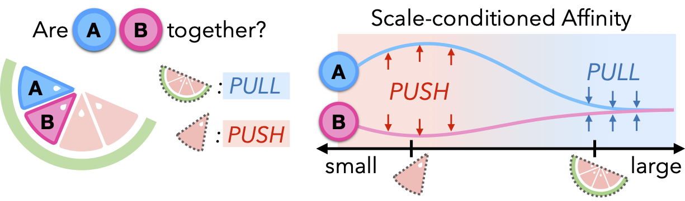

# LLM-Pruner: On the Structural Pruning of Large Language Models

Xinyin Ma, Gongfan Fang, Xinchao Wang **NeurIPS 2023**

## Summary

This paper introduces a method named "LLM-Pruner", this aims to ensure LLM's retain their multi-task solving and language generation abilities. This is done via removing coupled structures( based on connections between neurons) using gradient information, then the pruned LLM is trained on a limited dataset to help recover it's original abilities.  

## Contributions

The main contributions of this paper are:

* Even with removal of 20% of parameters, model shows 94.97% of the original performance of the model

* Only 50k publicly available samples are needed for compression, significantly reducing the budget for acquiring the training data

* The compression process only takes 3 hours

*  The dependent structures are grouped without the need for any manual design 

## Method

1. **Discovery Stage**: This step focuses on identifying groups of interdependent structures within the LLM, this ensures coupled strcutures are pruned in unison, as partial pruning leads to increase in parameter size and misaligned respresentations

 Considering any neuron within the LLM as the initial trigger, it possesses the capability to activate neurons that depend on it. Subsequently, these newly triggered neurons can serve as the subsequent triggers to identify the dependency and activate their respective dependent neurons. This iterative process continues until no new neurons are detected.

2. **Estimation Stage**: In this satge, we estimate the importance of each group, to assign such a score to each group, the model is given access to a limited external datastet. Later, all groups are ranked according to their importance and pruned as per a pre-defined pruning ratio, group importance can be computed via two methods:
  * **Vector-wise Importance**:

$$
I_{W_i} = |\Delta \mathcal{L}(\mathcal{D})| = |\mathcal{L}_{W_i}(\mathcal{D}) - \mathcal{L}_{W_i = 0}(\mathcal{D})| = \left| \frac{\partial \mathcal{L}^{\top}(\mathcal{D})}{\partial W_i} W_i - \frac{1}{2} W_i^{\top} H W_i + \mathcal{O}(\|W_i\|^3) \right|
$$

Note: A group is represented as $\mathcal{G} = \{W_i\}_{i=1}^{M}$, where $M$ is the number of coupled structures in one group and $W_i$ is the weight for each structure.

where $H$ is the Hessian matrix. Here, $\mathcal{L}$ represents the next-token prediction loss. The first term is typically neglected as the model has converged on the training dataset, where $\frac{\partial \mathcal{L}^{\top}}{\partial W_i} \approx 0$. However, since $\mathcal{D}$(limited external datset) here is not extracted from the original training data, which means that $\frac{\partial \mathcal{L}^{\top}}{\partial W_i} \not\approx 0$. This presents a desirable property for determining the importance since compuatation of second term is impractical due to complexity.

  * **Element-wise Importance**: If we want an even finer and precise ranking we can opt for computing the importance of each element of $W_i$, instead of the appromixation we derived above. The mathematical formulation for this is-

$$
I_{W_i^k} = |\mathcal{L}_{W_i^k}(\mathcal{D}) - \mathcal{L}_{W_i^k = 0}(\mathcal{D})| \approx \left| \frac{\partial \mathcal{L}(\mathcal{D})}{\partial W_i^k} W_i^k - \frac{1}{2} \sum_{j=1}^{N} \left( \frac{\partial \mathcal{L}(\mathcal{D}_j)}{\partial W_i^k} W_i^k \right)^2 + \mathcal{O}(\|W_i^k\|^3) \right|
$$

  After the above computations, group importance can be calculted by any of the following four operations
  1. Summation
  2. Production (Product of all elements)
  3. Max
  4. Last Only (Assigning importance score of last executing structure in group as group importance)

3. **Recover Stage**: Since we are working limited data while trying to recover original performance of model, it is necessary to minimize number of learnable parameters. To perform this LoRa is employed in the post-training process, the mathematical formulation of this method ensures no ectra parameters are introduced in this process. 

## Results

---

### 📊 Experimental Setup

- **Tested on**:
  - **LLaMA-7B**
  - **Vicuna-7B**
  - **ChatGLM-6B**
- **Evaluated on 9 datasets**:
  - **Zero-shot classification**: BoolQ, PIQA, HellaSwag, WinoGrande, ARC-e, ARC-c, OBQA
  - **Language modeling**: WikiText2 and PTB (perplexity)

---

### ✅ Key Results

- **20% pruning** of LLaMA-7B:
  - Retains **~95%** of original zero-shot performance after LoRA tuning.
  - Reduces **latency by ~15%**, **memory usage by ~20%**.
- Outperforms pruning baselines:
  - **L2 norm**, **random**, and **channel-only pruning**.
- **Best performance** from:
  - **Second-order importance estimation**
  - **Block pruning strategy** (MLP + attention heads)
- **Dependency-based pruning** is critical:
  - Without it, model performance collapses even after tuning.

---

### 📉 Limitations and Observations

- **>50% pruning** results in **significant performance drop**.
- **Poor importance estimation** or **ignoring dependencies** leads to failure in zero-shot tasks.
- Pruned models can occasionally generate **incoherent or repetitive long-form text**.

---

## Two-Cents

LLM-Pruner presents an efficient, task-agnostic pruning method for large language models that preserves performance with minimal data and compute, making it highly practical. However even with these advancements there scope for further improvement like employing low-rank hessian approximations, adapative pruning across layers as uniform pruning might lead to significant compression to critical layers.

## Resources

[Paper](https://arxiv.org/abs/2305.11627)
