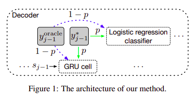
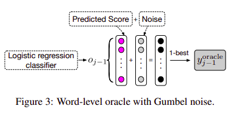

# Bridging the Gap between Training and Inference for Neural Machine Translation
 
Wen Zhang, Yang Feng, Fandong Meng, Di You, Qun Liu
 
## Summary
 
This paper proposes a method to improve the task of Neural Machine Translation by sampling for context words.....predicted words along with ground truth words, choosing the predicted words on either a word-based level or at a sentence level. **This paper also got the best Long paper award at ACL 2019**
 
## Model and Concepts
 
- The paper works on a problem called exposure bias which means that while training the model gets context from the ground truth words ...while during inference it has to predict everything by itself, This creates a gap between the distribution predicted words during training and inference.
 
- The main motive of the paper was to fix the Overcorrection Phenomenon where if a model predicts a word different from the ground truth...the cross-entropy loss forces it to match the ground truth on the next word ...which causes a problem cause there might be multiple translations of the sentence and so strongly following the ground truth can cause overcorrection.
 
- To fix this problem, while training the model ...we sample context words from either the ground truths or the predicted words so that the conditions at training start to match that of inference.
 
- The words that are sampled from predictions are called oracle words ....there are two methods for getting oracles ....one is Word-Level Oracle ...other is Sentence Level Oracle.
 
- Initially, the context words are chosen from the ground truths to give the model some supervision and to converge better ...after some time the context words get chosen from the oracle words more often to expose the model to the situations encountered during inference. They use a decaying sample rate for this per epoch.
 
- For the word level oracle, they take the predicted logits of the previous step ...and something called Gumbel noise to it (for regularization) ..do soft-max and take the maximum probability word.
 
- For the sentence level oracle, they perform beam search using the predicted probabilities and restrict it artificially to the size of the ground truth sequence and then select the one with the maximum BLEU score to form the oracle sentence ..and then take its words as oracles for the respective steps.
 
- We can also add Gumbel noise during the beam search to further improve performance.
 
 

 
## Main Conclusions and Results
 
- Overcorrection Recovery (This model)  outperforms other recent approaches to fix exposure bias.
- Adding Gumbel noise improves performance in both sentence and word level oracles as it serves as a sort of regularizer.
- Sentence level oracle performs better than the word-level oracle.
 
- The model takes more time to converge then other models ...The authors say that this is because the other models overfit ...while their model does not and hence takes more time to converge.
 
- The model works much better than other models in the case of long and super-long sentences ...this may be because the sentence level oracle can help the model to take care of the problems faced due to length.
 
- They conducted an experiment to validate that the increase in BLEU score is actually observed due to addressing the exposure bias problem...they did this by counting the ground truth words whose probabilities in the predicted distributions produced by our model are greater than those produced by the baseline model. This came out to be quite high ...around 65% thus validating the claim.
 
## Our Two Cents
 
- The method introduced is quite versatile as it can be readily applied to other methods as well ...so it feels like an important contribution to the research society.
 
- One weakness that I feel is that the introduction of beam search would lead to a considerable increase in the time taken ...about which no comments are made in the paper, also constraining the size of the beam search to match the ground truth exactly goes against the author's intuition that a sentence can have multiple possible translations.
 
 

