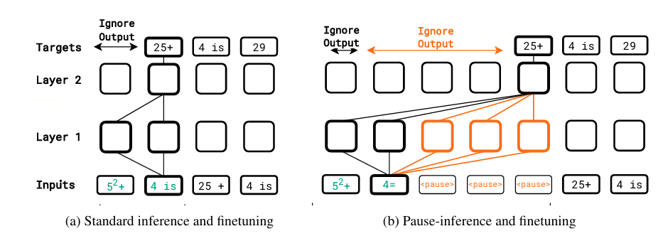
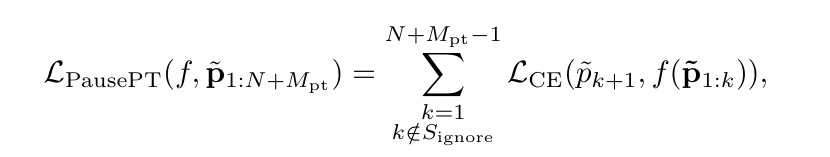
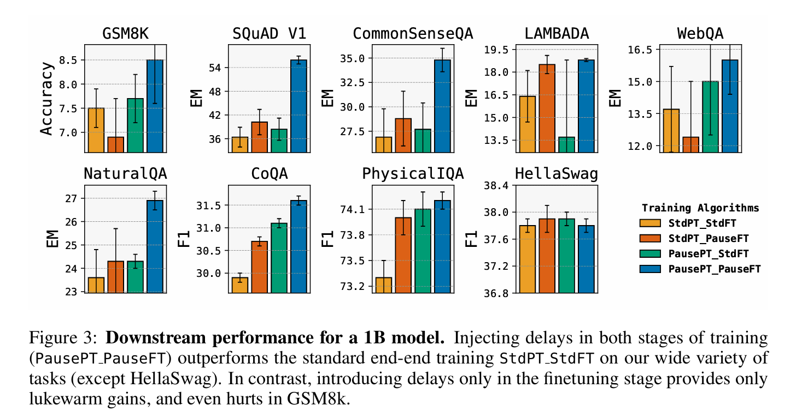

# THINK BEFORE YOU SPEAK: Training Language Models With Pause Tokens

Sachin Goyal, Ziwei Ji, Ankit Rawat, Aditya Menon, Sanjiv Kumar, Vaishnavh Nagarajan, **<ICLR>** **2024**

## Summary

Transformer-based language models produce tokens sequentially, with each token influenced by preceding hidden states. Introducing <pause> tokens, which delay token generation, allows the model to process additional hidden states. This paper demonstrates that incorporating these delays during both pretraining and finetuning shows improved performance on various datasets.

## Contributions

- **Pause Token Mechanism:** Introduces the concept of a <pause> token that delays next-token generation, allowing the model to manipulate more hidden vectors.
- **Pause-Pretraining and Finetuning:** Demonstrates the importance of incorporating the pause token during both pretraining and finetuning to realize performance benefits.
- **Selecting Optimal Number of tokens:** Studies in depth to determine the optimal number of <pause> tokens for different tasks, ensuring practical applicability of the approach.

## Method

*(a) In standard inference (finetuning), the model’s output is generated immediately after the last prefix token. (b) In pause-inference (and pause-finetuning), output generation starts only after adding a specified number of `<pause>` tokens.*

To enhance input sequence length, $M$ dummy tokens are appended, delaying the model’s response by $M$ tokens. This $M$-token delay allows the model to manipulate $M$ intermediate vectors $v_{K+1}, \ldots, v_{K+M}$ before producing the next token $p_{K+1}$, potentially resulting in a richer input representation and better next token generation.

### Pretraining with the `<pause>` token

For a given pretraining sequence $p_{1:N}$, we insert multiple `<pause>` tokens (say $M_{pt}$ many) at uniformly random locations to obtain a pause-injected sequence, $\tilde{p_{1:N+M_{pt}}}$. We then train the model with the standard next-token prediction loss on this pause-injected sequence, while ignoring any loss term that corresponds to predicting the pause tokens themselves. Formally, let $S_{\text{ignore}} =$ \{ $k : \tilde{p}_{k+1} = pause $\}  denote the positions where the next token is a `<pause>` token. Then, for the decoder-only language model $f$, the pause-training loss is given by:

where $\mathcal{L_{CE}}$ denotes the cross-entropy loss. Observe that the loss is skipped over indices in $S_{\text{ignore}}$. The rationale is that, we only want to use the <pause> tokens as a way of enforcing a delay in the model’s computation; demanding that the model itself produce these tokens, would only be a pointless distraction.

### Finetuning with the `<pause>` token
In downstream finetuning, we are given a prefix $p_{1:N}$ annotated with a target $t_{1:T}$. Here, we append $M_{\text{ft}}$ copies of the `<pause>` token to $p_{1:N}$, to create our new prefix, $p_{1:N+M_{\text{ft}}}$. As before, we ignore the model's outputs until the last `<pause>` token is seen. We apply the standard next-token prediction loss on the target with the new prefix, thus minimizing 

$$\sum_{k=0}^{T-1} \mathcal{L_{\text{CE}}}(t_{k+1}, f([p_{1:N+M_{\text{ft}}}, t_{1:k}]))$$ 

where $[\cdot]$ denotes the concatenation operation. Note that for any given downstream task, we fix $M_{\text{ft}}$ to be the same across all inputs for that task. We again update both the parameters of the model, and that of the whole vocabulary, including the `<pause>` token, as is standard. We term this pause-finetuning.

## Results

*Standard Pretraining and Standard Finetuning (StdPT_StdFT), Standard Pretraining and Pause-Finetuning (StdPT_PauseFT), Pause-Pretraining and Standard Finetuning (PausePT_StdFT) and Pause-Pretraining and Pause-Finetuning (PausePT_PauseFT)*

We consider decoder-only models of sizes 1B and 130M for our main experiments. For ablations, we focus on the 1B model. Both standard and pause models are pretrained on the C4 English mixture [(Raffel et al., 2020)](https://arxiv.org/abs/1910.10683), using the causal next token prediction objective over $200$ B tokens (slightly more than 1 epoch on C4). For pause-pretraining, we randomly insert the `<pause>` token at 10\% of sequence length ($2048$ positions) and trim the sequence back to its original length. Both pause-pretraining and standard pretraining involve $200$ B total tokens. We employ a single `<pause>` token embedding, adding $1024$ parameters (equal to the token embedding size), a minute fraction ($10^{-6}$) of the $1$ billion total model parameters.

## TWO CENTS
- There is no claim of pause tokens being helpful for all the downstream tasks
- The most pressing next step would be to find ways to make delays helpful directly on a
 standard pretrained model