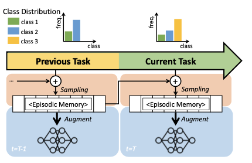
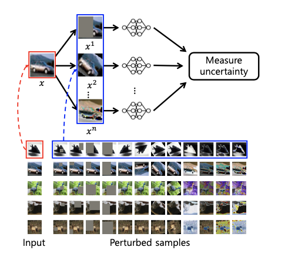
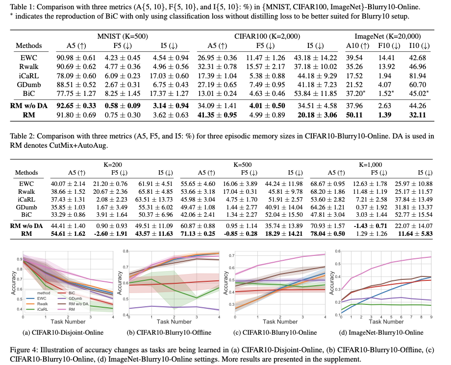
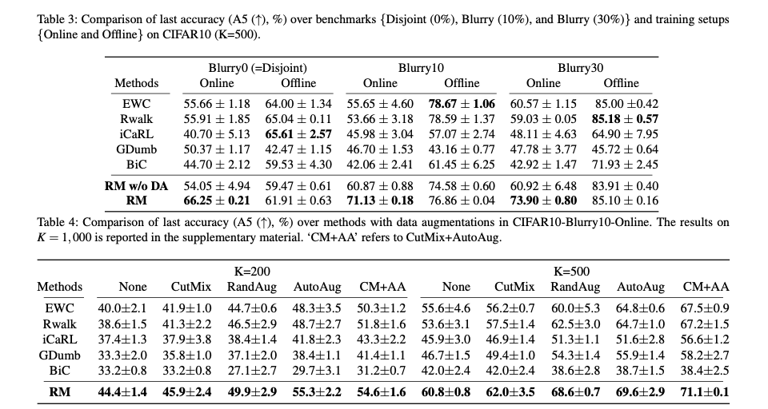
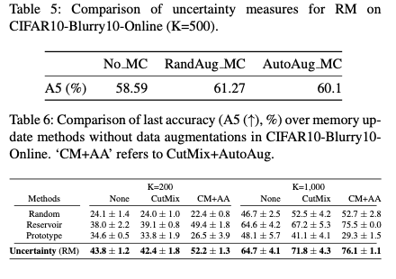

# Rainbow Memory : Continual Learning with a Memory of Diverse Samples

Jihwan Bang, Heesu Kim, YoungJoon Yoo, Jung-Woo Ha, Jonghyun Choi, **CVPR** **2021**

## Summary

This paper introduces a new memory management stratergy called Rainbow Memory to improve Continual learning, particularly Class Incremental Learning(CIL) with tasks which share classes(Blurry-CIL). It involves two steps, first is ensuring that sampling from stored memory is diverse enough, where diversity is looked at in context of classification uncertainity of sample when distorted by various Data Augmentation methods. Second is ensuring diversity in samples by Data Augmentation(DA) primarily, Mixed-Label DA and Automated DA.

## Contributions

- effective memory management stratergy which allows storing old samples to alleviate catastrophic forgetting in CIL.
- Diversity aware sampling method for effectively managing memory with limited capacity by leveraging classification uncertaininty.
- Use of Data Augmentation techniques to enhance diversity of samples, also helps alleviate problem caused by continously changing class distribution of each task given a task stream.

## Method
- Memory Update :
    - We measure uncertainity by measuring variance of model output in all of the samples slightly modified by data augmentation techniques like color jitter, shear and cutout.

        

    - We approximate uncertainity by Monte Carlo method of the distribution p(y=c|x), when given prior of perturbed sample $$\tilde{x} $$ as p($$\tilde{x} $|x). Perturbation prior is a uniform mixture of all perturbations as shown above.
                      
         $$p(y=c|x) = \int_{\tilde{D}} p(y=c|\tilde{x}_{t})p(\tilde{x}_t|x)\, d\tilde{x}_t \approx \frac{1}{A}\sum_{t=1}^A p(y=c|\tilde{x}_{t})$$
    - x, $\tilde{x}$, y,A,$\tilde{D}$ denote a sample, perturbed sample, label of sample, number of perturbation methods and data distribution defined by perturbed samples respectively.
    - the perturbed sample $$\tilde{x} $$ is drawn from a random function $f_r(.)$, where $\theta_r$ is a hyper parameter which denotes random factor of the r-th perturbation, as:         
        $$\tilde{x} =f_r(x|\theta_r), r=1,2,...,R $$
    - the prior $p(\tilde{x}|x)$ is defined as:
        $$\tilde{x} \sim \sum_{r=1}^R w_r *f_r(x|\theta_r) $$
        where the random variable $w_r$, r={1,...,R} is drawn from a categorical binary distribution.
    
    - if u(x) is uncertainity of sample with respect to perturbation:
        $$u(x)=1 - \frac{1}{T} \max\limits_c S_c $$
        $$S_c =\sum\limits_{t=1}^T 1_c \argmax\limits_{\tilde{c}}p(y=\tilde{c}|\tilde{x}_t) $$
        $S_c$ is the number of times class c is predicted the most likely class, $1_c$ denotes binary class indexing vector.
    - so if we have k memory slots , and our stored samples from previous task and fresh samples from current task add upto m samples, we first arrange them according to u(x) then pick a sample at interval of $\frac{m}{k}$ thus forming a new set of stored samples for the next task.

- Data Augmentation(DA) :
    - In mixed-label DA we mix images of new task and old task and their labels in same proportion, this helps alleviate side effects caused by change of class distribution over tasks and improves performance.
    - Automated DA : composes multiple DA's on model performance under CIL(Class Incremental Learning).

## Results

- This method outperforms all other methods and baselines in blurry CIL and online(buffer unavailable) setups, which are more realistic and practical.
- Even in Disjoint and offline(buffer available) setups it either outperforms or shows comparable performance to other methods.
- performace gap decreases as memory size increases as impact of effective sampling decreases.

    

- enhancement provided by CutMix and AutoAug is the most effective among all DAs.

    
    

## Two-Cents

- This paper proposes a novel idea which helps deal with many realistic issues of Class Incremental Learning and helps make it more useful in real world.

## Resources

- [ Paper on Rainbow Memory](https://arxiv.org/pdf/2103.17230.pdf)
- [Code and Data Splits](https://github.com/clovaai/rainbow-memory)
