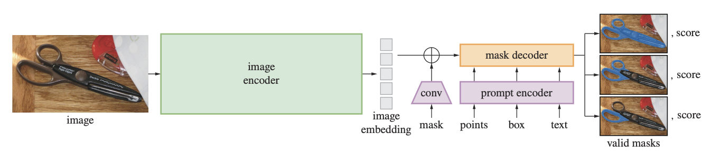
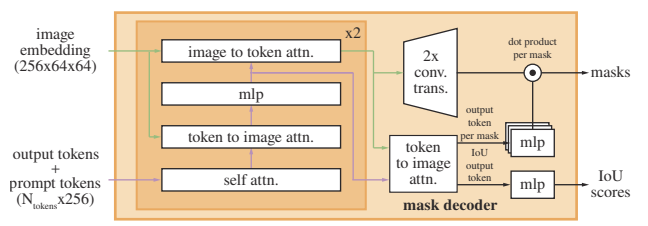
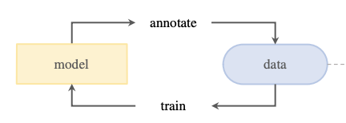

# Segment Anything

Alexander Kirillov, Eric Mintun, Nikhila Ravi, Hanzi Mao, Chloe Rolland, Laura Gustafson, Tete Xao, Spencer Whitehead, Alexander C. Berg, Wan-Yen Lo, Piotr Dollar, Ross Girshick, **ICCV** **2023**

## Summary

This paper proposes a foundation model for computer vision. The model is trained on **promptable segmentation task** i.e. returns a valid segmentation mask for any prompt. This paper uses a data engine to iterate through the model and dataset. As a result, it introduces the largest segmentation dataset ( at the time of writing ) SA-1B with over 1B masks.

## Contributions

- **The Segment Anything Model:** It is a foundation model pretrained to return a valid segmentation mask for any prompt. It supports diverse prompts, i.e. bounding box, mask, point and text. 
- **SA-1B dataset:** It includes 11M images and 1B masks from the fully automatic stage of the data engine. It has 11x more images and 400x more masks than the second largest dataset, i.e. Open Images.

## Method
- **Task:** It is pretrained on promptable segmentation task as this pretraining objective is general enough to enable zero-shot generalization to novel downstream tasks and data distributions by composing it as a part of a larger system and prompt engineering.

- **Model Architecture:**

    -   A MAE pretrained Vision transformer is adapted and used as an image encoder. It runs only once per image, enabling amortized real-time performance for mask prediction.
    - A combination of positional and learned embedding encodes point and box prompts. Mask prompts are downscaled using convolutions before adding elementwise to image embeddings. Text prompts are encoded using an off-the-shelf encoder from CLIP.

    - The decoder is a modification of the transformer decoder block. It involves self attention on tokens and cross attention in two directions. The image embeddings are upsampled using transposed convolutions, and tokens are mapped to an embedding using MLP, multiplied elementwise at each position of image embedding to calculate mask foreground probability for each pixel. We predict 3 masks for each prompt to resolve ambiguity, and another MLP head is added to predict IoU scores for each mask.
    
- **Model Training:**
    - Loss: Focal and dice losses are used in a 20:1 ratio. IoU prediction head is trained with MSE loss and added with a constant scaling factor of 1.0 to mask loss. We backpropagate the minimum loss over the three mask predictions.
    - We initially prompt with points sampled from ground truth mask or box prompts with little noise added to coordinates.
    - In subsequent iterations, iteratively sample points from the error region and provide unthresholded logits of the most confident prediction from previous iterations to provide maximal information. We do 8 such iterations.
    - We do 2 more iterations with no additional point prompts to benefit from the supplied mask.

- **Data Engine:** No public segmentation dataset that was large enough to train SAM was available, so a model-in-loop data engine was used.
    - Model-assisted manual stage: Human annotators used the model to label masks as in classic interactive segmentation. Initially, the model was trained on publicly available segmentation datasets and then retrained using only new annotations. The model was retrained 6 times in this stage, and the image encoder was scaled from ViT-B to ViT-H.
    - Semi-automatic stage: Human annotators focussed on labeling less prominent objects to improve mask diversity. The model was retrained 5 times in this stage.
    - Fully automatic stage: SAM was prompted with a regular grid of 32x32 masks. Only confident and stable masks were selected. Duplicates were removed using non-maximal suppression.

## Results
SAM is extensively evaluated on a suite of 23 datasets with diverse image distributions to verify if it has generalized beyond its training dataset.
- SAM performs better than the strongest baseline, i.e. RITM, for single point valid mask prediction task on most datasets when we select the most confident masks and on all datasets when the prediction most similar to ground truth is compared. In human studies, SAM gets consistently higher ratings than RITM. Though the ambiguity-unaware version of SAM is rated lower than the ambiguity-aware version, it is still rated higher than RITM.
- Though SAM is not trained for edge detection when combined with Sobel filtering and NMS, it produces reasonable edge maps, which are even more extensive than ground truth. It outperforms various methods, though it naturally lags behind state-of-the-art methods trained on the same dataset and learning its biases.
- For the object proposal generation task, though SAM performs worse than the baseline overall, it performs better for medium and large objects, along with common and rare objects. It only underperforms on small and frequent objects for which the baseline model trained on the same dataset could easily learn dataset-specific biases.
- SAM is evaluated, for instance, segmentation on COCO and LVIS by composing it with an object detector. Though it performs worse than ViTDet-H on automatic metrics, it consistently performs better in human study. Low ground truth quality and learning of dataset-specific biases by ViTDet seem to explain this.
- SAM is not robust enough for text prompts yet, but preliminary results are encouraging. 

## Two-Cents

Foundation models pre-trained on large-scale datasets seem like the way forward for high performance on many downstream tasks, and SAM is a key development in this direction. The concept of a data engine could be a possible solution for the lack of annotated data in various domains.

## Resources

- [ Paper ](https://arxiv.org/pdf/2304.02643.pdf)
- [ Website ](https://segment-anything.com/)
