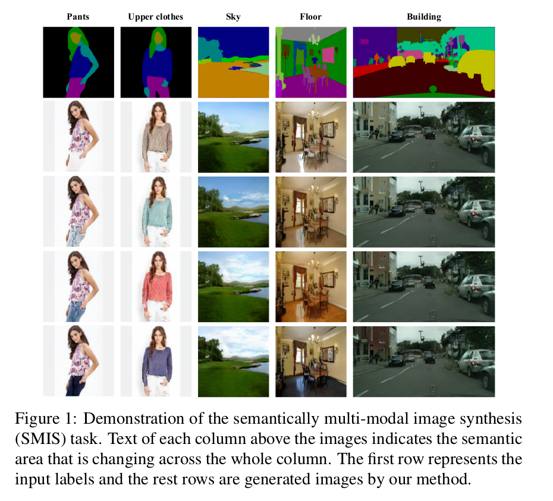
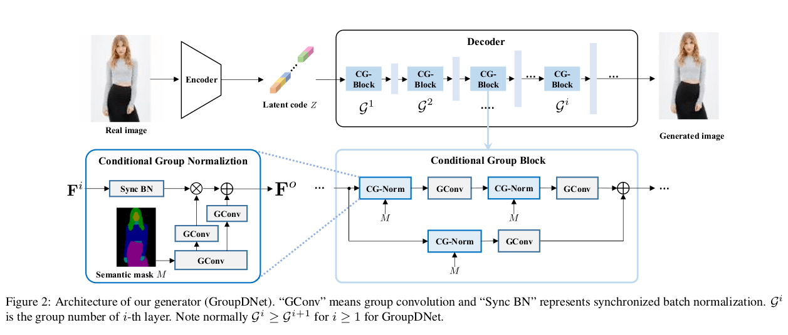
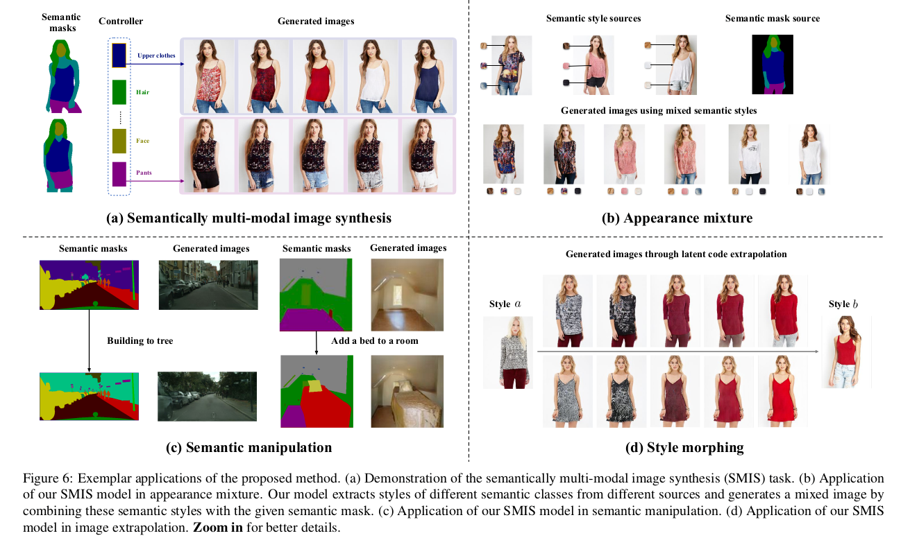

# Semantically multi-modal image synthesis

Zhen Zhu, Zhiliang Xu, Ansheng You, Xiang Bai, **CVPR 2020**

## Summary

The paper focuses on *semantically multi-modal image synthesis(SMIS)* task, namely, generating multi-modal images at the semantic level. It proposes a novel network for semantically multi-modal synthesis task, called **GroupDNet (Group Decreasing Network)**. The network unconventionally adopts all group convolutions and modifies the group numbers of the convolutions to decrease in the decoder, considerably improving the training efficiency over other possible solutions like multiple generators.

For each semantics, there is a specific controller. By adjusting the controller of a specific class, only the corresponding areas are changed accordingly.

**Notation**

- `M`: semantic segmentation mask
- `C`: number of semantic classes in the dataset
- `H`: image height
- `W`: image width
- `G`: generator
- `Z`: latent code

For conducting label-to-image translation,`G` requires `M` as conditional input to generate images. However, in order to support multi-modal generation, another input source to control generation diversity. Normally, an encoder is applied to extract `Z` as the controller. Upon receiving these two inputs, the image output `O` can be yielded through `O = G(Z, M )`. However, in the SMIS task, we aim to produce semantically diverse images by perturbing the class-specific latent code which independently controls the diversity of its corresponding class.

For the SMIS task, the key is to divide `Z` into a series of class-specific latent codes each of which controls only a specific semantic class generation. The traditional convolutional encoder is not an optimal choice because the feature representations of all classes are internally entangled inside the latent code. This phenomenon inspired some architecture modifications in both the encoder and decoder to accomplish the task more effectively.

## GroupDNet 

- The main architecture of GroupDNet takes design inspirations from [SPADE](https://arxiv.org/abs/1903.07291).

- A major modification of GroupDNet is the replacement of typical convolutions to group convolutions to achieve class-specific controllability.

- GroupDNet contains one encoder and one decoder: 
    - **Encoder**: Let *Mc* denote the binary mask for class c, *X ∈ RH×W* be the input image, then first the operation: *Xc = Mc . X*, performs feature disentanglement. The input to the encoder is the concatenation of all the *Xc* produced. All convolutions inside the encoder have C groups. The encoded Z is comprised of the class-specific Zc of all classes which serve as the controllers for their corresponding class *c* in the decoding phase.
    - **Decoder**: Following the general idea of using all group convolutions in the generator,the convolutional layers in SPADE generator module are replaced with group convolutions resulting in the new module **Conditional Group Normalization (CG-Norm)**. A Conditional Group Block(CG-Block) is made by dynamically merging CG-Norm and group convolutions.

## Main Contributions

- **Appearance mixture**: We can gather the distinct styles of a person’s different body parts. Every combination of these styles presents a distinct person image, given a human parsing mask. In this way, we can create thousands of diverse and realistic person images given a person image gallery.

- **Semantic manipulation**: For eg., inserting a bed in the room or replace the building with trees.

- **Style morphing**: Feeding two real images to the encoder generates two style codes of these images. By extrapolating between these two codes, we can generate a sequence of images(which are very clear and meaningful) that progressively vary from image a to image b.

## Our two cents

- Parameter sharing among classes greatly reduces the required computational power for image generation.

- Generated images are highly defined because of efficient parameter sharing among classes. So a change in a feature of one class changes other classes accordingly which is really a great step ahead for better image generation. 

## Resources

- [Can We Make An Image Synthesis AI Controllable? (Youtube Video)](https://youtu.be/qk4cz0B5kK0)
