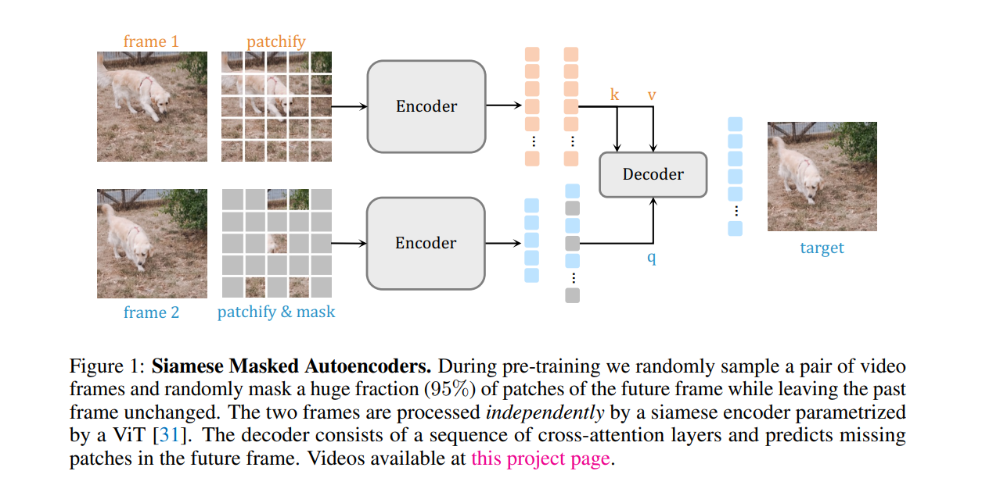
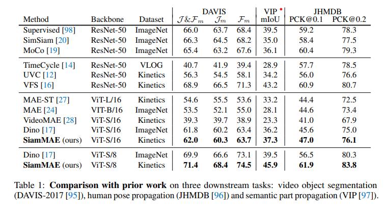
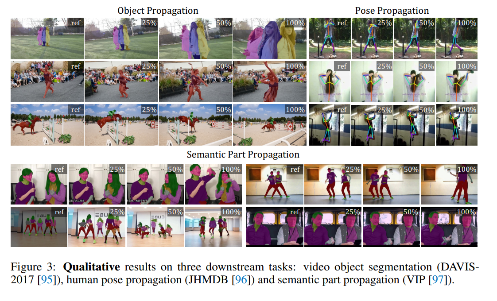

# Siamese Masked Autoencoders
 
**Authors:** Agrim Gupta, Jiajun Wu, Jia Deng, Li Fei-Fei
 
**NeurIPS 2023**

 ## Summary 

This paper introduces a neural network architecture called SiamMAE Network, which is a simple extension of Masked Autoencoders (MAE) for learning visual correspondence from videos. Here, the asymmetric masking approach is explored, which encourages the network to model object motion, or in other words, to understand what *went where* 

## Contributions

- Asymmetric masking approach is introduced, it creates a challenging self-supervised learning task while encouraging the network to learn temporal correlations (mask a very high ratio, (95% of patches in f2 and 0% in f1)).
- It outperforms many networks when it comes to the task of Video Object Segmentation, Video Part Segmentation, and Pose Tracking without the need for data augmentation, handcrafted tracking-based pretext tasks, or other techniques to prevent representational collapse. 

## Methodology

- They utilize Self-supervised visual representation learning as a way to learn generalizable visual representations. Contrastive methods in the image domain encourage models to learn representations by modeling image similarity and dissimilarity or only similarity.
- Here, we use **Masked Autencoders**, which are a type of denoising autoencoder that learns representations by reconstructing the original input from corrupted (i.e., masked) inputs. They have had a transformative impact in masked language modeling and even learning image representations.
- And **Siamese Networks** which are weight-sharing neural networks used to compare entities, have been extensively used in modern contrastive learning approaches.

#### Key Components 
- The Siamese encoders are used to process the two frames independently and the asymmetric masking serves as an information bottleneck. Siamese networks have been used for correspondence learning and often require some information bottleneck to prevent the network from learning trivial solutions
- The output from the encoder is projected using a linear layer and MASK tokens with position embeddings are added to generate the full set of tokens corresponding to the input frame.
- To further increase the difficulty of the task, the two frames are sampled with a larger temporal gap and a small number of patches as input for the second frame resulting in a challenging yet tractable self-supervised learning task. 

#### Working
 

## Results

Here, The comparison against prior work is done and shows better performance.

 
General Qualitative Results are shown here concerning Object propagation, Pose propagation, and Semantic Propagation.

## Our Two Cents

- The paper introduces how the asymmetric masking strategy is an effective strategy for learning correspondence, and it achieves these competitive results without the need for data augmentation, handcrafted tracking-based pretext tasks, or other techniques to prevent representational collapse. 
- Here, the network relies on learning correspondences by operating on pairs of video frames, so adapting it for multiple frames can be a challenge and looked into for its scalability. 

## Resources

Project Page: https://siam-mae-video.github.io/
