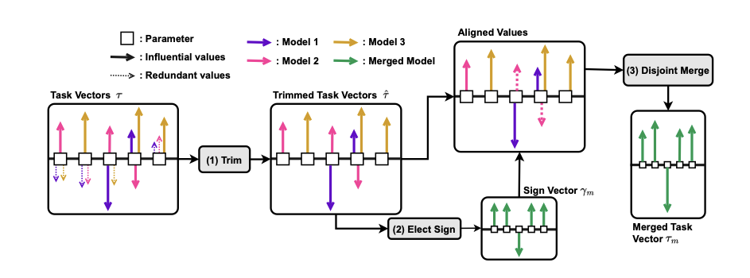
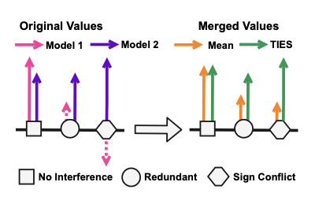
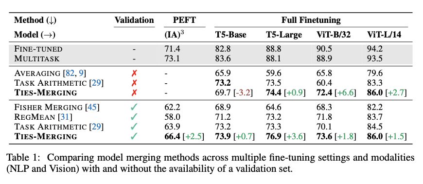
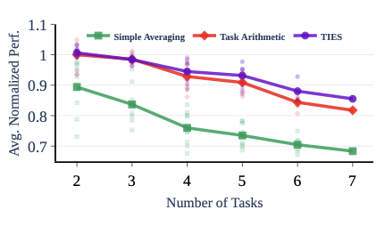
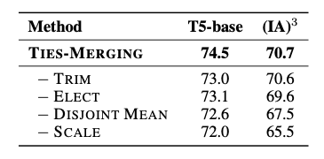

# TIES-MERGING: Resolving Interference When Merging Models

Prateek Yadav, Derek Tam, Leshem Choshen, Colin Raffel, Mohit Bansal, NeurIPS, 2023

## Summary

This paper addresses the challenge of combining multiple fine-tuned models into a single multitask model without additional training. Traditional model merging techniques often suffer from performance degradation due to parameter interference. The authors identify two primary sources of this interference: redundant parameter updates and sign conflicts across models. To mitigate these issues, they propose TIES-MERGING, a method that systematically resolves such interferences, leading to more effective model merging.

## Contributions

- Identification of Interference Sources: The paper highlights two main interference types in model merging:
    - Redundant Parameter Updates: Parameters that have negligible changes during fine-tuning.
    - Sign Conflicts: Parameters updated in opposite directions across different models.

- Introduction of TIES-MERGING: A method of merging that prevents interference.

## Method

- The TIES-MERGING approach involves the following steps:

    ### 1. Trim

    Let $\tau_t$ be the task vector, where task vector represents the updates to be made to the pre-trained model to attain values of the finetuned model. The top k% of values of $\tau_t$ are retained, while the others are deemed redundant and set to zero. This reduces noise and makes only meaningful updates.
    ### 2. Elect Sign

    We create an aggregate elected sign vector $\gamma_m$ for the merged model that resolves the disagreements in the sign for each parameter pacross different models. For each parameter, separate the values in task vector based on sign and take their sum. The sign with the largest sum is the elected sign.

    ### 3. Disjoint Merge
    
    Merge only those parameter updates that align with the elected sign. Compute the average of these aligned updates to obtain the final parameter value.

- Scale the merged task vectors and add them to the original parameter values.

## Results

- The authors test TIES-MERGING on three major tasks: (1) Task Arithmetic using GPT-2 on NLP tasks, (2) LoRAHub using LLaMA-Adapter-v2 across multilingual and multi-domain NLP tasks, and (3) TIES-MoE using ResNet-50 for vision tasks across disjoint image classification datasets.

- Performance: TIES-MERGING outperforms averaging, Fisher Merging, RegMean, and Task Arithmetic. The improvement in performance increases as the number of merged models increases.

- Robustness: The method shows consistent improvements across diverse settings, including different tasks, domains, and model architectures. It also scales well as the number of tasks increases. The design of the merging mechanism inherently scales well because it reduces interference and leverages aligned signal.

- Ablation Studies: 
    - Trim Step: Removing this step leads to increased noise from parameters that did not meaningfully change during fine-tuning.
    - Elect Sign Step: Omitting this causes performance to drop sharply, especially when sign conflicts are prevalent — validating this as a core strength of the method.
    - Disjoint Merge: Ensures cleaner parameter integration — performing better than simple averaging or majority vote across entire parameter vectors.

## Two-Cents

TIES-MERGING presents a thoughtful approach to a nuanced problem in model merging. By dissecting the sources of interference and addressing them systematically, the authors provide a practical solution that enhances multitask learning without additional training overhead. Future research could explore extending the method to other model types beyond transformers.

## Resources

Paper: [TIES-MERGING: Resolving Interference When Merging Models](https://proceedings.neurips.cc/paper_files/paper/2023/file/1644c9af28ab7916874f6fd6228a9bcf-Paper-Conference.pdf)
Code Repository: [GitHub - prateeky2806/ties-merging](https://github.com/prateeky2806/ties-merging)