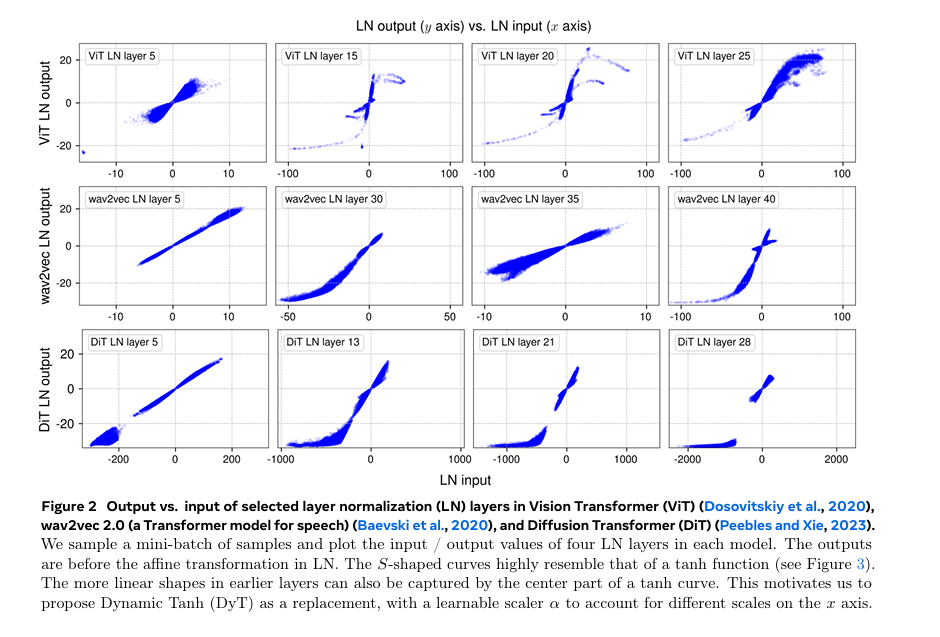
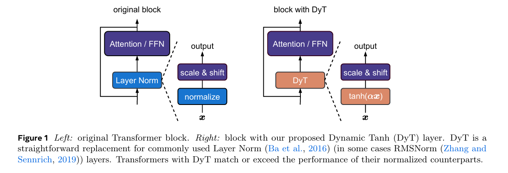
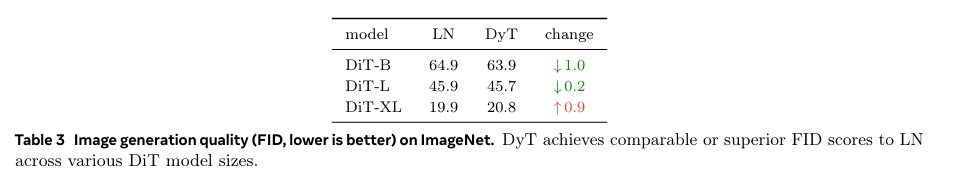
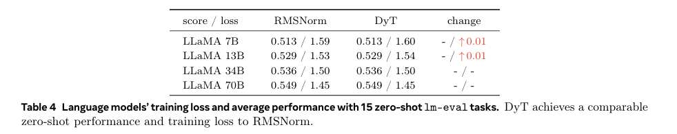
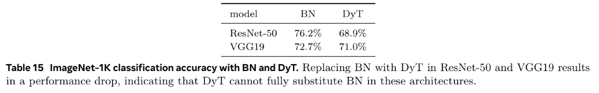

# Transformers without Normalization

Jiachen Zhu, Xinlei Chen, Kaiming He, Yann LeCun1, Zhuang Liu

## Summary

Normalization layers, since their introduction have been widely regarded as crucial, if not indispensable, for the effective training of deep networks. This belief is subtly evidenced by the fact that, in recent years, novel architectures often seek to replace attention or convolution layers, but almost always retain the normalization layers. This paper introduces a surprisingly simple alternative to normalization layers: the scaled tanh function, which they call Dynamic Tanh, or DyT. They get this from a very simple observation, LayerNorm transforms its input to output with an S-shaped curve that's similar to tanh. It squashes extreme values while keeping a linear shape at the center. Therefore, they replace norm layers with the proposed Dynamic Tanh (DyT) layer, and it is really simple:

$$ \mathrm{DyT}(x) = \gamma * \tanh(\alpha x) + \beta $$

## Method

They begin by reviewing the normalization layers. Most normalization layers share a common formulation. Given an input $x$ with shape $(B,T,C)$, where $B$ is the batch size, $T$ is the number of tokens, and $C$ is the embedding dimension per token, the output is generally computed as:

$$\text{normalization}(x) = \gamma \ast \left( \frac{x - \mu}{\sqrt{\sigma^2 + \epsilon}} \right) + \beta
$$

where $\epsilon$ is a small constant, and $\gamma$ and $\beta$ are learnable vector parameters of shape. They empirically study the behaviors of normalization layers in trained networks. For this analysis, they take a ViT-B trained on ImageNet-1K, a wav2vec 2.0 Large Transformer model trained on LibriSpeech, and DiT-XL trained on ImageNet-1K. For all three trained networks, we sample a mini-batch of samples and do a forward pass through the network. They then measure the input and output for the normalization layers, i.e., tensors immediately before and after the normalization operation, before the learnable affine transformation. For all three models, in earlier LN layers (1st column of Figure 2), we find this input-output relationship to be mostly linear, resembling a straight line in an x-y plot. However, the deeper LN layers are places where we make more intriguing observations.  A striking observation from these deeper layers is that most of these curves’ shapes highly resemble full or partial S-shaped curves represented by a tanh function .

 <i> Input-Output Relationship between the layers of Transformer architechtures </i>

LN normalizes in a per-token manner, only linearly transforming each token’s activations. As tokens have different mean and standard deviation values, the linearity does not hold collectively on all activations of the input tensor.  Inspired by the similarity between the shapes of normalization layers and a scaled tanh function, they propose Dynamic Tanh (DyT) as a drop-in replacement for normalization layers. Given an input tensor x, a DyT layer is defined as follows:
$$ \mathrm{DyT}(x) = \gamma * \tanh(\alpha x) + \beta $$
where α is a learnable scalar parameter that allows scaling the input differently based on its range, accounting for varying x scales (Figure 2). This is also why we name the whole operation “Dynamic” Tanh. γ and β are learnable, per-channel vector parameters, the same as those used in all normalization layers—they allow the output to scale back to any scales. Integrating DyT layers into an existing architecture is straightforward: one DyT layer replaces one normalization layer. This applies to normalization layers within attention blocks, FFN blocks, and the final normalization layer.

 <i> Working of DyT </i>

## Results

The results demonstrate that DyT performs competitively with or better than LayerNorm (LN) and RMSNorm across various tasks. For self-supervised ViT models on ImageNet-1K, DyT achieves similar or slightly improved accuracy. In image generation with DiT models, DyT shows lower or comparable FID scores, indicating better visual quality. For LLaMA language models, DyT matches RMSNorm in zero-shot performance and training loss, with negligible differences. Overall, DyT provides an effective alternative normalization method across vision and language domains without sacrificing performance.

 <i> Results of ViT using DyT </i>

 <i> Results of DiT using DyT </i>

 <i> Results of LLaMa using DyT </i>

The results show that DyT significantly improves efficiency for LLMs: on LLaMA 7B, it reduces inference latency by up to 52.4% and training latency by 42.2% at the layer level, compared to RMSNorm. However, DyT struggles as a drop-in replacement for BatchNorm (BN); on ImageNet-1K, it leads to a notable accuracy drop in ResNet-50 (from 76.2% to 68.9%) and VGG19 (from 72.7% to 71.0%). This indicates that while DyT offers latency advantages for transformer-based models, it cannot fully replace BN in convolutional architectures without performance degradation.

 <i> Results of efficiency on llms using DyT </i>

 <i> Results of replacing BatchNorm using DyT </i>

## Two-Cents

Dynamic Tanh (DyT) proves to be a simple replacement for traditional normalization layers by adjusting the input activation range via a learnable scaling factor α. It challenges the conventional understanding of the necessity of normalization layers in training modern neural networks. Although, Preliminary experiments in Appendix indicate that DyT struggles to replace BN directly in classic networks like ResNets, which remains an open problem to look into.

## Resources

- https://jiachenzhu.github.io/DyT/
- https://arxiv.org/pdf/2503.10622
- https://x.com/liuzhuang1234/status/1900370738588135805
