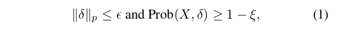

# Universal Adversarial Training
Ali Shafahi ∗ , Mahyar Najibi ∗ , Zheng Xu ∗ , John Dickerson, Larry S. Davis, Tom Goldstein,
University of Maryland

## Introduction
Universal Adversarial Perturbations are image-agnostic perturbation vectors, that can be directly added to any image from a dataset, which is crafted with a malicious intention to fool Deep Neural Networks, thus creating several threat issues as Deep Learning Models are widely used everywhere!

## Contribution
**First** poses a simple and efficient optimization-based universal attack that can be solved using stochastic gradient methods, learning pertubations 13× faster than the standard method.
**Second**, then to defend these attacks, it proposes universal adversarial training, which models the problem of robust classifier generation as a two-player min-max game, and produces robust models with only 2× the cost of natural training.It further improves the defense efficiency by providing another “low-cost” algorithm for defending against universal perturbations, with a slight decrease in robustness , but cut the training time by half compared to the previous one.

## Optimization for universal perturbation:
Moosavi-Dezfooli et al.(2017b) proposes to find universal perturbations that satisfy,
    

where Prob(X, δ) represents the “fooling ratio,” which is the fraction of images x 
whose perturbed class label f (w, x + δ)  differs from the original label f (w, x). 
The parameter controls the p diameter of the bounded perturbation, and ξ is a small tolerance hyperparameter to keep perturbations imperceptible to humans.
    
This is solved by the iterative method in algorithm 1, which relies on an inner loop to apply DeepFool to each training instance, which makes the solver slow, with no guarantee for convergence due to outer loop.

Different from Moosavi-Dezfooli et al.(2017b), this paper proposed an stochastic gradient based optimization for a β-clipped loss function that comes with convergence guarantee when decreasing learning rate is used.
Clipping is used to force the optimizer to find a perturbation that fools many instances, otherwise, a single misclassification can lead to cross-entropy loss to be arbitrarily large.

Also, each iteration is based on a minibatch of samples instead of one instance, which accelerates computation on a GPU, and requires a simple gradient update instead of the complex DeepFool inner loop, resulting to fast convergence and good performance of the proposed method.

## Universal adversarial training:
Formulates the problem of training robust classifier as a min-max optimization problem.
    

where w represents the neural network weights, X ={x i , i = 1, . . . , N } represents training samples, δ represents
universal perturbation noise, and l(·) is the loss function.

Previously, solving this optimization problem directly was deemed computationally infeasible due to the large cost
associated with generating a universal perturbation (Perolat et al., 2018), but they show that unlike Madry et al. (2018), updating the universal perturbation only using a simple step is enough for building universally hardened networks.
 

As in above algorithm, each iteration alternatively updates the neural network weights w using gradient descent, and then updates the universal perturbation $\delta$ using ascent, only once per step, and these updates accumulate for both w and δ through training.

## Low-cost Universal adversarial training:
As UAPs are universal, results shouldn't vary to the order of updates. Thus it proposes simultaneous update for network weights and the universal perturbation in algorithm 10, which backprops only once per iteration and produces approximately universally robust models at almost no cost in comparison to natural training, with only slight decrease in robustness as compared to original algorithm.

