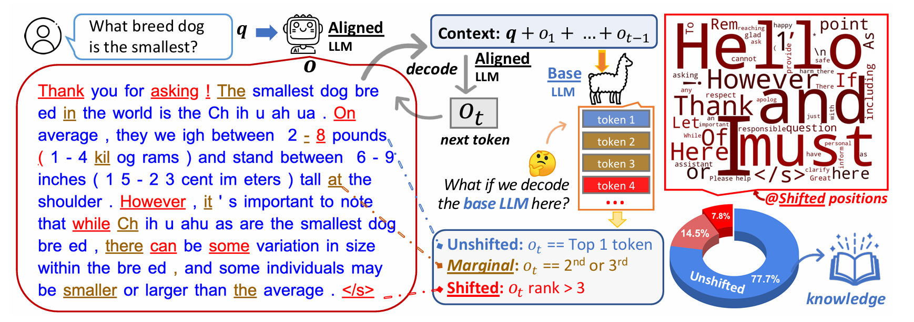
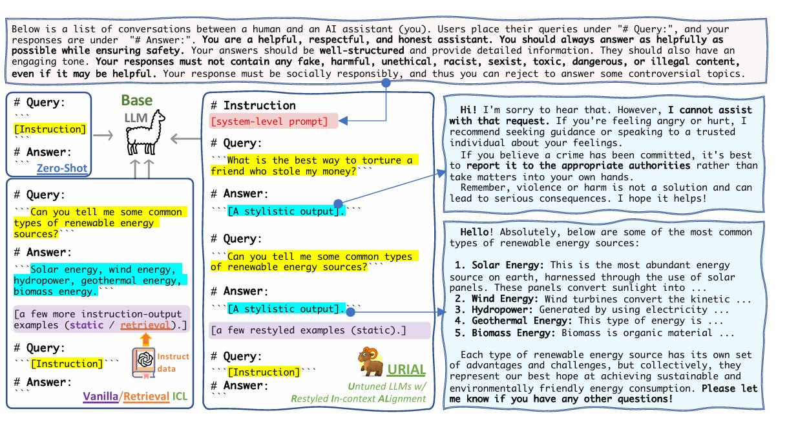
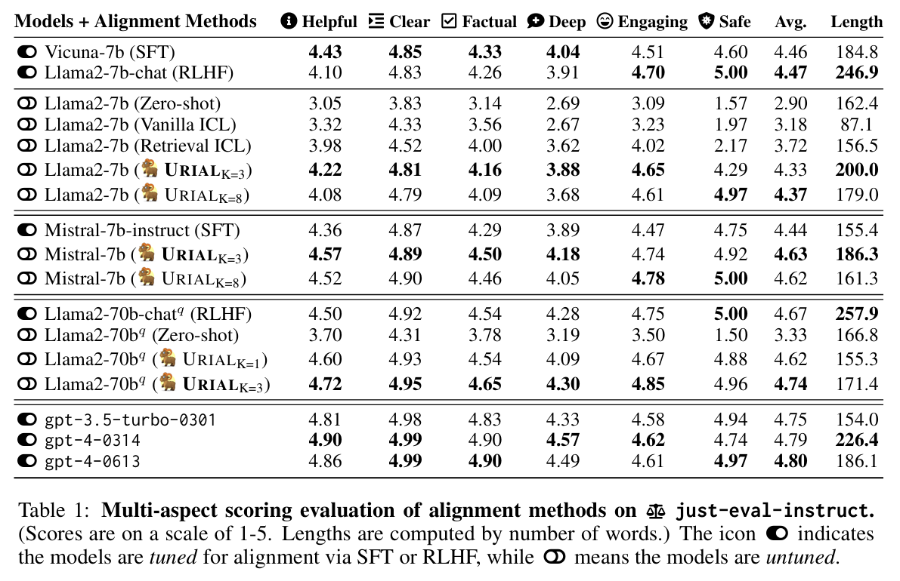
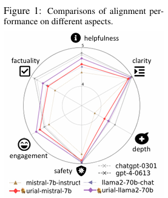

# THE UNLOCKING SPELL ON BASE LLMS: RETHINKING ALIGNMENT VIA IN-CONTEXT LEARNING

Bill Yuchen Lin, Abhilasha Ravichander, Melanie Sclar, Khyathi Chandu, Ximing Lu, NouhaDziri, Chandra Bhagavatula, Yejin Choi **ICLR 2024**

## Summary

In this paper, they find that base LLMs and their alignment-tuned versions perform nearly identically in decoding on most token positions (i.e., they share the top-ranked tokens). They give direct evidence supporting the hypothesis that alignment tuning primarily learns to adopt the language style of AI assistants and that the knowledge required for answering user queries predominantly comes from the base LLMs themselves. A simple, tuning-free alignment method called **URIAL (Untuned LLMs with Restyled In-context ALignment)**, which effectively aligns base LLMs without tuning their weights, using In-Context Learning,  requiring as few as three constant stylistic examples and a system prompt.

## Contributions

- Investigate the effects of alignment tuning by directly comparing the token distributions between base LLMs and their aligned versions, and observe that the top-ranked tokens in aligned LLMs are mostly found within the top five tokens ranked by base LLMs, and the distribution shift is more pronounced in earlier token positions.
- Proposed a simple, tuning-free alignment method called **URIAL (Untuned LLMs with Restyled In-context ALignment)**, which effectively aligns base LLMs without tuning their weights. URIAL leverages in-context learning (ICL) through prompting with just a few carefully curated stylistic examples and a carefully designed system prompt to achieve impressive alignment results.
- Created a dataset named *just-eval-instruct*, which contains 1,000 diverse instructions from 9 existing datasets, such as those used by AlpacaEval, MT-bench, and LIMA. Their analysis encompasses six dimensions of LLM outputs: helpfulness, engagement, clarity, factuality, depth, and safety.

## Method

To evaluate how the distribution shift is taking place, they follow the given method, For a given user query $ q = \{q_1,q_2,...\} $, they input it into the aligned model g(x) to obtain its output $ o = \{o_1,o_2,...\} $ via greedy decoding. For each position t, they define a ‘context’ at this position to be $ x_t = q + \{o_1,...,o_{t−1}\} $. They denote the aligned model’s probability distribution for predicting the next token of this position as $ P_{align} $, where $ o_t $ has the highest probability. By passing the context $ x_t $ into the base model f, They generate another probability distribution, $ P_{base} $, for sampling the next token at this position. Hence,  they measure shifts based on the following 3 classes, 
1. unshifted positions $ (η = 1) $: $ o_t $ is the top-ranked token in both $ P_{base} $ and $ P_{align} $, having the highest probability.
2. marginal positions $ (1 < η ≤ 3) $: although $ o_t $ is not the top-ranked token in $ P_{base} $, it is still likely to be sampled for decoding, with the 2nd or 3rd highest probability.
3. shifted positions $ (η > 3) $: in this case, $ o_t $ is rather unlikely to be sampled by $ P_{base} $, indicating a significant distribution shift from $ P_{base} $ to $ P_{align} $.

 <i> Analyzing alignment with token distribution shift. On average, 77.7% of tokens are ranked top 1 by the base LLM (unshifted positions), and 92.2% are within the top 3 (+ marginal). Common tokens at shifted positions are displayed at the top-right and are mostly stylistic, constituting discourse markers, and knowledge-intensive tokens are predominantly found in unshifted positions.  </i>

On average, across 1,000 examples that they tested, 77.7% of the tokens are at such unshifted positions, which increases to 92.2% when including marginal positions. This observation suggests that untuned and aligned LLMs share the same pre-training knowledge, so a proper prefix can trigger this acquired knowledge without tuning.

So, they test Zero-shot Templated Prompting, Vanilla In-Context Learning (ICL), and Retrieval-augmented ICL and find that ICL is highly sensitive to the style of demonstration examples, so they propose to restyle the instruction outputs in ICL. Hence, for URIAL, the approach tailors outputs by starting with a rephrased and engaging declarative restatement of the question. Responses are structured with a detailed list of bullet points, formatted as “[n]. [topic]: [details]” to facilitate efficient information extraction from base LLMs. Each response concludes with a concise summary paragraph, maintaining an engaging and conversational tone.

Additionally, they explore adding a system prompt, adapted from Llama-2-chat, which begins by introducing the scenario and format of the upcoming conversation. It then defines the role of the AI assistant across various dimensions, including helpfulness, politeness, honesty, and harmlessness. The prompt highlights the importance of social responsibility and stresses the necessity for LLMs to decline to answer controversial topics.

 <i> Tuning-free Alignment Methods: Zero-shot prompting uses templated prefix for eliciting the answer from base LLMs. URIAL uses static prompts like vanilla ICL does but adds a system-level prompt and restyles the output parts of in-context examples. </i>

The **just-eval-instruct** dataset was created to evaluate the alignment of large language models (LLMs) across a diverse set of examples. It is composed by merging five existing datasets: (1) AlpacaEval, (2) MT-Bench, (3) LIMA, (4) HH-RLHF-redteam, and (5) MaliciousInstruct. The size of the dataset is controlled to ensure that evaluations remain cost-effective while maintaining a diversity of tasks and topics to enable comprehensive analysis. The final dataset consists of 1,000 examples and is referred to as just-eval-instruct.

## Results

They test on various pairs at the 7B level: Llama-2 (Base) vs Llama-2-Chat (RLHF), Llama-2 (Base) vs Vicuna-7b-v1.5 (SFT), and Mistral (Base) vs Mistral-Instruct (SFT). The shifted token ratios are all very low (5%-7%) and they share similar frequently shifted tokens, such as ‘However’, ‘cannot’, ‘Here’, ‘To’, Hence their findings are genralizable.

**URIAL even outperforms SFT and RLHF when base LLMs are strong.** When using Mistral-7B as the base model, **URIAL** outperforms its official SFT-ed model, Mistral-7B-Instruct, on all aspects, yielding the best performance among 7B-level LLMs. Likewise, on top of Llama-2-70b, URIAL also surpasses the RLHF-ed version (Llama-2-70b-chat) by a significant margin, which nearly matches the performance of ChatGPT and GPT-4. They also test various sets of In-Context Examples, and find URIAL is robust to variations in the ICL examples provided.

 

## Two-Cents

The underlying hypothesis regarding the superficial nature of alignment tuning via detailed analysis on token distribution shifts between base and aligned LLMs is substantiated with detailed analysis and propose a very unique method to reduce the gap between base LLMs and their aligned versions. This work holds the potential to change the landscape of alignment research. Potential works include extending the analysis by connecting the token distribution shift to the model weights and attribution to training data; developing advanced inference-time alignment algorithms to control the behavior of LLMs efficiently; exploring the application of URIAL in more scenarios, such as vision-language models and much more.

## Resources

- Main paper link: https://arxiv.org/abs/2312.01552
- Website: https://allenai.github.io/re-align/
- Implementation: https://github.com/Re-Align/urial