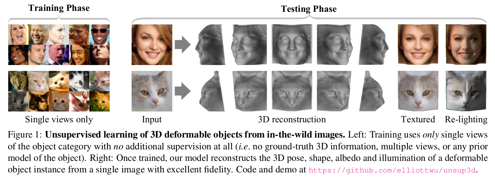
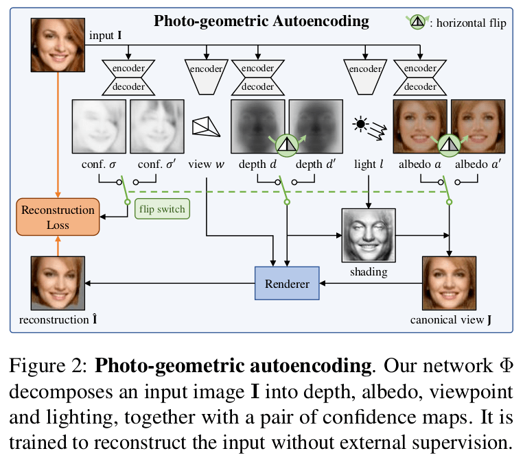
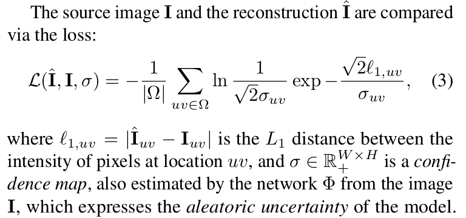
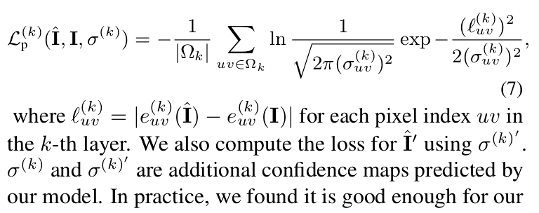

## Unsupervised Learning of Probably Symmetric Deformable 3D Objects from Images in the Wild

Shangzhe Wu, Christian Rupprecht, Andrea Vedaldi, **CVPR 2020**

## Summary

The paper proposes a method to learn 3D deformable object categories (eg. human faces, cat faces, cars etc.) from raw single-view images, **without external supervision**. At the core of the method is an autoencoder that internally decomposes the image each input image into **depth, albedo (reflective power), viewpoint (position relative to the camera) and illumination**, without direct supervision (thus unsupervised learning) for any of these factors. These four components are later combined to reconstruct the input image. In order to effectively decompose the image into these 4 factors, the authors make use the fact that many object categories have a symmetric structure. In order to account for the objects that are asymmetrical to an extent, they include **symmetry probability maps** in the model which are learned end-to-end with the other components of the model. This helps us to effectively generate two images(original and its flipped version) from a single datapoint and thus the losses can be minimized more efficiently. 

This paper received the **Best Paper Award** at CVPR 2020. 

## Assumptions

The authors make a strong assumption about the images' symmetry. They propose that using the symmetrical properties of images, the decomposition can be carried out relatively easily and accurately. However, we know that the world is not fully symmetrical and to counter this fact, the authors propose two solutions:

- **Illumination**: By exlicitly modelling illumination of an object instance, we can get extra information for recovering the 3D shape of the object. 

- **Confidence in Symmetry**: To give the model extra information for the symmetry assumption taken before, the model is designed to output dense "confidence" maps containing the probabilties of a given pixel having a symmetric counterpart in the image. These maps are then used while reconstructing the image to mollify the discrepancies which could arise using the symmetry assumtion.

## Methodology    

- Given an unconstrained collection of images (with no image annotations) of an object category, such as human faces, the aim is to learn a model *Φ* that receives as input a **single** image of an object instance and produces as output a decomposition of it into depth(3D shape), albedo, illumination and viewpoint, which are then combined to get the 3D reconstrunction. 

- We often observe that objects such as human faces, cat faces, cars etc. have bilateral symmetry. This fact can be used for a more effective decomposition. 

- However, the appearance of object instances is never perfectly symmetric. We take two measures to account for these asymmetries: explicitly modelling asymmetric illumination and estimating a confidence score that explains the probability of the pixel having a symmetric counterpart in the image, for each pixel in the input image. (see conf σ, σ' in the image below).

### Photo-Geometric Autoencoding

We can assume with no loss in generality that an RGB image *I* is a function *Ω → R3* defined on a grid *Ω = {0, . . . , W − 1} × {0, . . . , H − 1}*, or, equivalently, a tensor in *R3×W×H*. The goal is to learn a function or rather a mapping *Φ* (implemented as a neural network) that maps (or decomposes) the image *I* to four factors *(d, a, w, l)* comprising a depth (3D shape) map *d : Ω → R+* , an albedo image *a : Ω → R3*, a global light (illumination) direction *l ∈ S2*, and a viewpoint *w ∈ R6* so that the image can be reconstructed from them.

The image I is reconstructed from the four factors in two steps, lighting Λ (gives us a canonical view of our image) and reprojection Π, as follows:
        
        Î = Π (Λ(a, d, l), d, w) -(1)

The lighting function Λ generates a version of the object based on the depth map *d*, the light direction *l* and the albedo *a* as seen from a canonical viewpoint *w = 0*. The viewpoint *w* represents the transformation between the canonical view and the viewpoint of the actual input image *I*. Then, the reprojection function *Π* simulates the effect of a viewpoint change and generates the image *Î* given the canonical depth *d* and the shaded canonical image *Λ(a, d, l)*. We define a reconstruction loss such that *I ≈ Î*.

### Probably Symmetric Objects

As discussed in a previous section, decomposition requires detecting symmetrical properties in the image. Here we do so implicitly, assuming that depth and albedo, which are reconstructed in a canonical frame (see in the figure above), are symmetric about a fixed vertical plane. An important beneficial side effect of this choice is that it helps the model discover a ‘canonical view’ for the object, which is important for reconstruction. To do this, we consider the operator that flips a map *a ∈ RC×W×H* along the horizontal axis: *[flip a]c,u,v* = *ac,W −1−u,v*. We then require *d ≈ flip d'* and *a ≈ flip a'*. An additional loss is calculated for the second reconstruction *Î'* by replacing *a* and *d* in `Eq. (1)` with *flip a* and *flip d* respectively.

For each reconstruction, we calculate a confidence map to model the uncertainty in our predictions due to asymmetry in the images. This confidence map allows the model to learn which portions of the input image might not be symmetric.

Overall, the learning objective is given by the combination of the two reconstruction errors:
        
        E(Φ; I) = L( Î, I, σ) + λ*L( Î', I, σ') ; where λ = 0.5. - (4)

### Image Formation Model

The image is formed by a camera looking at a 3D object. If we denote with *P* = *(Px ,Py ,Pz) ∈ R3* a 3D point expressed in the reference frame of the camera, this is mapped to pixel *p* = *(u, v, 1)* (for mathematical details about how this transformation happens, look at the paper).

### Perceptual Loss

The *L1* loss function Eq. (3) is sensitive to small geometric imperfections and tends to result in blurry reconstructions. We add a perceptual loss term to mitigate this problem:

With this, the loss function *L* in `Eq. (4)` is replaced by *L + λpLp* with *λp* = 1.

## Main Contributions

- The paper presented a method that can learn a 3D model of a deformable object category from an unconstrained collection of single-view images of the object category.

- The model is able to obtain high-fidelity monocular 3D reconstructions of individual object instances.

- Introduces **Photo-Geometric Autoencoding**: an autoencoding pipeline where the factors have, due to the way they are recomposed, an explicit photo-geometric meaning.

## Our two cents

Currently, the model works mostly for images which are symmetric to a high extent. It would be interesting to see how the future work tackles the asymmetries in extreme images with the help of additional constraints or innovations.

## Resources

- [Visual Geometry Group blog (You can try out the model on different images here!)](http://www.robots.ox.ac.uk/~vgg/blog/unsupervised-learning-of-probably-symmetric-deformable-3d-objects-from-images-in-the-wild.html?image=021_paint&type=human)

- [Project website](https://elliottwu.com/projects/unsup3d/)

- [Implementation](https://github.com/elliottwu/unsup3d)
