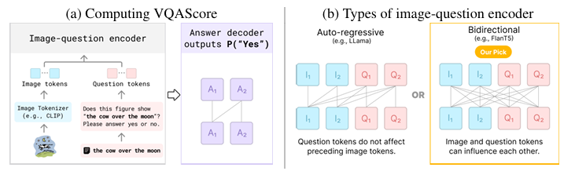

# Evaluating Text-to-Visual Generation with Image-to-Text Generation

Zhiqiu Lin, Deepak Pathak, Baiqi Li, Jiayao Li, Xide Xia, Graham Neubig, Pengchuan Zhang, Deva Ramanan  
**ECCV 2024** 

## Summary

This paper introduces a new metric for evaluating text-to-visual generation models using a novel metric called VQAScore. There are many challenges in assessing the alignment between generated images and complex text prompts, which existing metrics like CLIPScore struggle with due to their "bag of words" approach. VQAScore utilizes a visual-question-answering (VQA) model to score the alignment probability by answering a simple "Does this figure show {text}?" question. They also introduce VQA model, CLIP-FlanT5, which outperforms existing models, including those using proprietary GPT-4V.

## Contributions

- They propose VQAScore, a simple metric that outperforms prior art without making use of expensive human feedback or proprietary models such as ChatGPT and GPT4-Vision.
- CLIP-FlanT5 is their VQA model achieves the best possible VQAScore for text-to-image/video/3D evaluation, offering a strong alternative to CLIPScore.
- GenAI-Bench, a text-to-visual benchmark with real-world compositional prompts to evaluate generative models and automated metrics, surpassing the difficulty of existing benchmarks.

## Method

There are many challenges in assessing the alignment between generated images and complex text prompts, which existing metrics like CLIPScore struggle with due to their "bag of words" approach. VQAScore utilizes a visual-question-answering (VQA) model to score the alignment probability by answering a simple "Does this figure show {text}?" question. People have tried to tackle compositional reasoning through a divide-and-conquer approach, i.e., decomposing complex prompts into modular components. But these approaches often lead to irrelevant and absurd questions, so they use an end-to-end approach that computes the generative likelihood of an answer to a simple question. The image and question (after tokenization) are then fed into an image-question encoder, followed by an answer decoder that outputs the probability of “Yes”. They point out that image-text alignment requires models to expose answer likelihoods rather than simply generate answer tokens (as most of past work does). 

P ("Yes"| Image, "Does this figure show '{text}'? Please answer yes or no")

They also introduce an in-house model, CLIP-FlanT5, which outperforms existing benchmarks and even models using proprietary GPT-4V. The crucial architectural choice is the type of image-question encoder. These are often known as uni-directional “decoder-only” architectures, but they find it beneficial to allow visual embeddings to be influenced by the question being asked (and vice versa). They develop their own model, by finetuning on public VQA datasets, CLIP-FlanT5. They use a bidirectional “encoder-decoder” language model, FlanT5 and combine it with CLIP vision encoder for encoding image and question embeddings bidirectionally but generates answers autoregressively.

 <i> The VQAscore methodology and CLIP-FlanT5 architecture </i>

They also present GenAI-Bench, a comprehensive benchmark with 1,600 compositional text prompts that require parsing scenes, objects, attributes, relationships, and high-order reasoning. This benchmark includes over 15,000 human ratings for various image and video generation models. GenAI-Bench provides fine-grained tags for both basic (attribute/scene/relation) and advanced (counting/differentiation/comparison/logic) compositional reasoning skills. Used alongside VQAScore, GenAI-Bench enables reproducible evaluation of generative models.

 <i> GenAI-Bench Examples and leaderboard </i>

## Results

VQAScore sets a new state of-the-art on various benchmarks. Compared to baselines (e.g., CLIPScore and PickScore) that perform at chance-level, VQAScore achieves 2x to 5x higher scores. VQAScore based CLIP-FlanT5 model surpasses all prior art, including recent methods that use the proprietary GPT4-Vision to score image-text alignment. For a fair comparison, they apply both VQAScore and other divide-and-conquer methods to the same underlying VQA architectures (InstructBLIP, LLaVA-1.5, and CLIP-FlanT5). Still the model performs much better in the case of their method. 

 <i> SOTA performance on challenging image-text matching benchmarks </i>

VQAScore excels across all skills –5x better than CLIPScore on "basic skills" and 10x better on "advanced skills". They do this by analyzing on Winoground, it has prompts like "six people wear blue shirts and no people wear white shirts", which requires higher-order reasoning (e.g., "counting" and "negation") along with other basic skills. It also outperforms methods that finetune using costly human feedback or rely on proprietary models.

 <i> VQAscore VS CLIPscore on prompts with certain attributes</i>

 <i> Some examples to show better alignment with human preferences </i>

It also achieves SOTA on video/3D-text alignment, it uniformly samples frames from videos and rendered views from 3D assets to calculate the average VQAScore (and other metrics). VQAScore achieves the state-of the-art correlation with human judgments on GenAI-Bench as well.

## Two-Cents

VQAScore shows how their simple method surpasses current alignment metrics in evaluating text-to-image models. VQAScore based on the CLIP-FlanT5 model works with real-world compositional text prompts really well. Their insight on how image-text alignment requires models to expose answer likelihoods rather than simply generate answer tokens is really crucial for future works. VQAScore excels in vision-language alignment, it currently does not evaluate other critical aspects of generative models, such as toxicity, bias, aesthetics, etc. One can also look into better methods of capturing the attributes and object relations of a scene instead of only relying on the VLM for that sort of a reasoning.

## Resources

- https://linzhiqiu.github.io/papers/vqascore/
- https://arxiv.org/pdf/2404.01291
- https://huggingface.co/datasets/BaiqiL/GenAI-Bench