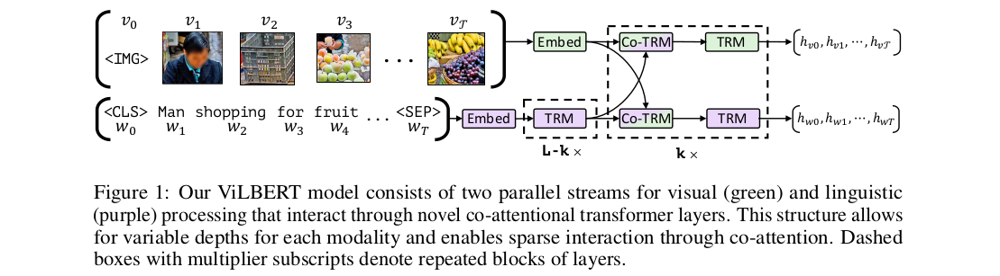
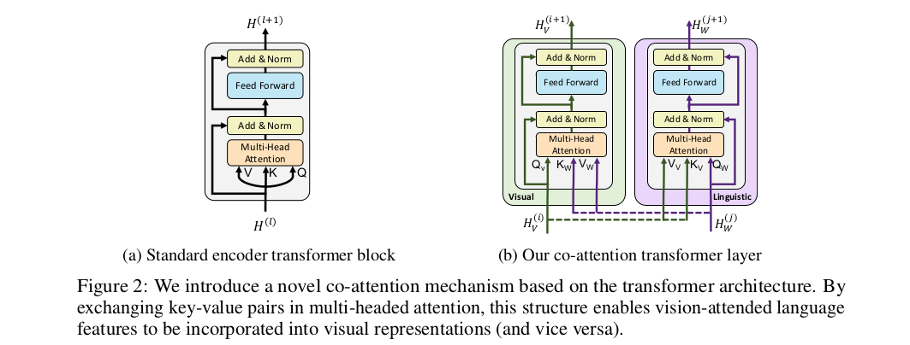
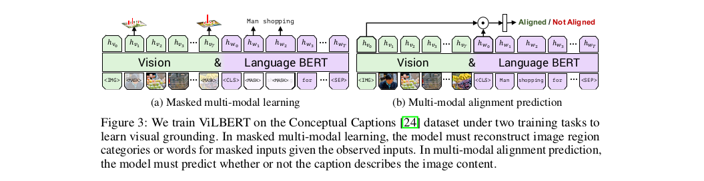

# ViLBERT: Pretraining Task-Agnostic Visiolinguistic Representations for Vision-and-Language Tasks

Jiasen Lu, Dhruv Batra, Devi Parikh, Stefan Lee 
Georgia Institute of Technology, Oregon State University, Facebook AI Research

## Summary
The paper proposes a model for learning task-agnostic joint representation of image content and natural language.It introduces a novel two-stream architecture with co-attentional transformer blocks that outperforms sensible ablations and exceeds state-of-the-art when transferred to multiple established vision-and-language tasks.

## Model
ViLBERT model consists of two parallel BERT architechtures style models, processing visual and textual inputs. 
Each stream is a series of standard encoder transformer blocks(TRM) and novel co-attentional transformer layers(Co-TRM) which is introduced to enable information exchange between the two modalities.

## Pre-train then transfer
The model is pre-trained using **Conceptual Caption** Dataset on two proxy tasks : 
<ol>
<li>masked multimodal modelling, and</li>
<li>multimodal alignment task.</li>
</ol>

and then transfer the pretrained ViLBERT model to a set of four established vision-and-language tasks and one diagnostic task.: 
<ul>
<li>VQA(Visual Question Answering),</li>
<li>VCR(Visual Commonsense Reasoning)</li>
<li>Grounding Referring Expressions</li>
<li>Caption-Based Image Retrieval</li>
<li>‘Zero-shot’ Caption-Based Image Retrieval</li>
</ul>
Furthermore, transferring our model to these tasks is simple and easy to implement – requiring only the addition of a classifier for each task we examined here.

## Implementation Detail
Initialize the linguistic stream of our ViLBERT model with pre-trained BERT.
Uses pretrained Faster R-CNN (with ResNet-101 backbone) to extract region features.Then, select regions where class detection probability exceeds a confidence threshold and keep between 10 to 36 high-scoring boxes. For each selected region i, vi is defined as the mean-pooled convolutional feature from that region.

## Our Two Cents

- The model is setting state-of-the-art results in variours visiolinguistic tasks, and still paper's explanation is extremely lucid and clear ...which makes the paper an easy and intuitive read.
- The paper explores the joint representation for image and text, and reasoning between them.Although we have made much progress progress in visual and linguistic understanding, but there is still much room for progress in relating these modalities.
 
## Implementation
- https://github.com/jiasenlu/vilbert_beta