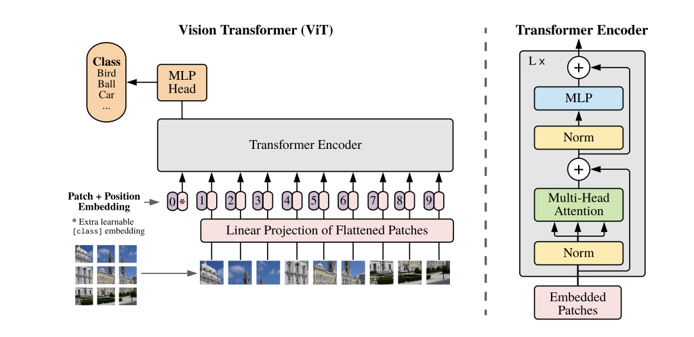

## Summary
This paper explores the application of attention-based transformer architecture in computer vision. It divides images in patches, flattens them, adds positional embedding and feeds them into the transformer block. It is pretrained on the image classification task, and better performance at lesser compute is observed.

## Contributions

- Successful application of the transformer architecture for vision-related tasks.
- Improving on previous CNN-based SOTA with a fully attention-based architecture that takes lesser computational resources.

## Method
- An image of dimensions CxHXW is divided into N patches of dimension CxPxP. This is reshaped into a tensor of dimension NxP^2C. 
- Positional embedding is added to all 1D tensors of dimension P^2C and fed into the encoder-only transformer block along with a learnable embedding.
- An MLP classification head containing one hidden layer at pre-training and one layer during finetuning is attached to the learnable token.
- It is pretrained on image classification tasks using datasets of varying sizes, including ImageNet and JFT 300M. 
- Layer norm is used before multi-head self-attention block and MLP block, unlike  [ Vaswani et al. ](https://arxiv.org/abs/1706.03762), and MLP contains two layers with GELU non-linearity.
- Finetuning is performed on higher resolution images, resulting in larger sequence length. Hence, we perform 2D interpolation of pre-trained positional embeddings.
- Results on downstream tasks are reported either through few shot or finetuning accuracy.
## Results
- ViT-L outperforms previous SOTA, i.e. Big Transfer (BiT) and Noisy Student with similar parameter count with much less compute. ViT-H further improves performance.
- Larger ViT models perform worse than smaller ones if pretrained on smaller datasets despite moderate regularization, but as dataset size increases, larger models perform better.
- ViT overfit more than ResNets of comparable computational cost on smaller datasets but performs better on larger dataset sizes, reinforcing the usefulness of convolutional inductive bias for smaller datasets.
- Hybrids (ViT on convolutional feature maps) perform slightly better than ViT on small computational budgets but the difference vansihes for larger models.
- Learned positional embedding in the same row/column is similar, explaining why hand-crafted 2D aware embedding does not yield a performance boost.
- Some attention heads in lower layers have global attention, while some have highly localized attention that might serve a purpose similar to early convolutional layers. 

## Two-Cents

The transformer-based architecture was very successful in NLP and, based on the results of this paper, performs exceptionally well with images, too, with a lower computational budget. A common architecture for handling different modalities of data is very promising.

## Resources
- [Paper](https://arxiv.org/abs/2010.11929)