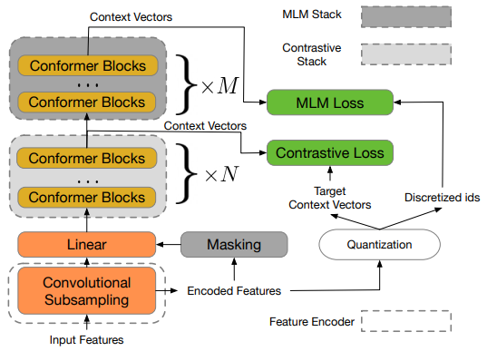

# w2v-BERT: Combining Contrastive Learning and Masked Language Modelling for Self-Supervised Speech Pre-Training

Yu-An Chung, Yu Zhang, Wei Han, Chung-Cheng Chiu, James Qin, Ruoming Pang, Yonghui Wu

## Abstract

The Authors introduce a framework called w2v-BERT for self-supervised speech representation learning. The framework is based on self-supervised learning methods like Contrastive Learning and Masked Language Modelling. Unlike its predecessors, which concatenate separately trained modules, w2v-BERT is optimized using end-to-end training of all its sub-modules. The model is first pre-trained on unlabeled data, followed by fine-tuning on labelled data.

## Architecture

The framework consists of three sub-modules: 

1. **Feature Encoder** : The feature encoder acts as a convolutional subsampling block that consists of two 2D-convolution layers and generates speech representation feature vectors used by the contrastive module.
2. **Contrastive module** : This module discretizes the feature encoder output into a finite set of context vectors used by the Masked Prediction module. The feature vector outputs are fed into a linear layer after masking, followed by a stack of conformer blocks, to generate the context vectors. The masked vectors are just replaced with random vectors. The feature vectors are also fed into a quantizer without masking that generates target context vectors (quantized) and corresponding token IDs. These are then used by the Contrastive and Masked Prediction losses, respectively. 
3. **Masked Prediction module** : This module is a stack of conformer blocks that converts the input context vectors into high-level contextualized speech representations.

 <i>The w2v-BERT pre-training framework</i>   

## Pre-training Loss Functions

1. **Contrastive loss** : It simultaneously trains the contrastive module and the quantizer. The model identifies the true quantized vector for every context vector from a set of K distractor quantized vectors. This generates the contrastive loss along with the codebook diversity loss to encourage uniform usage of codes. 
2. **Masked Prediction loss**: A SoftMax layer at the end of the model tries to predict the corresponding Token ID for every representation vector generated by the Masked Prediction module using cross-entropy loss.

## Fine-tuning

The pre-trained model is further fine-tuned on labelled data using a decoder stack of Swish activation, Batch Norm and 2-layer LSTM. The authors also use self-training (pseudo-labelling), SpecAugment for data augmentation and Language Model (LM) fusion.

## Results and Discussion

Some primary results of the paper are: 

1.	Without self-training and LM, w2v-BERT is already better than models with LM.
2.	Models like w2v-Conformer that only use contrastive loss perform poorer than w2v-BERT, which also uses Masked Prediction loss.
3.	The Contrastive module is necessary. Otherwise, the quantizer and Masked Prediction module can converge to a trivial solution of generating identical token IDs every time.
4.	On fixing the total number of conformer blocks in the model and altering the number of blocks in the contrastive module, there is a performance sweet spot in between where both contrastive and masked prediction modules have optimal capacity for quantized representation learning. 

## Two-cents
1.	Methods like SimCLR, MoCo, MoCo v2, and BYOL have been proposed for contrastive learning. One could utilize these methods to gain further performance boosts.
2.	Further developments in MLM, like ideas from RoBERTa, AlBERT, ELECTRA, and Llama, can also be used.
3.	The decoder for fine-tuning can also be made using the latest transformer architectures rather than LSTMs.
