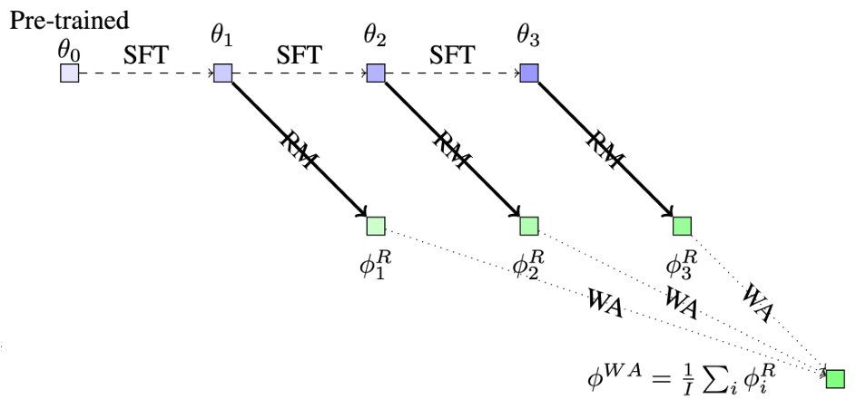

# WARM: On the Benefits of Weight Averaged Rewarded Model

**Authors:** Alexandre Ramé, Nino Vieillard, Léonard Hussenot, Robert Dadashi, Geoffrey Cideron, Olivier Bachem, Johan Ferret  
**ICML May 2024**
## Summary

Weight Averaged Reward Models (WARM), introduces a novel approach to mitigate reward hacking in large language models (LLMs) trained with reinforcement learning from human feedback (RLHF). Reward hacking occurs when LLMs exploit loopholes in the reward model (RM) to achieve high rewards without meeting the intended objectives. The authors identify two main challenges in designing RMs: distribution shifts during the RL process and inconsistencies in human preferences.

WARM addresses these challenges by fine-tuning multiple RMs and averaging their weights in the weight space, leveraging the linear mode connectivity observed in models with shared pre-training. The authors demonstrate that WARM outperforms traditional ensembling methods by providing a scalable approximation without the associated memory and inference costs. WARM improves efficiency compared to the traditional ensembling of predictions, while improving reliability under distribution shifts and robustness to preference inconsistencies.

## Contributions

- They introduce a new method called WARM (Weight Averaged Reward Models) method proposed to address challenges in reward modeling for reinforcement learning from human feedback (RLHF).
- WA acts as a regularization, improving robustness under label corruption by tackling run-specific mechanisms favoring memorization, and improving reliability under distribution shifts by preserving run-invariant mechanisms favoring generalization.
- The authors introduce a new diversity technique called Baklava, which uses different checkpoints from a single supervised fine-tuning (SFT) trajectory to initialize RMs
-  WA consistently matches or beats ensembling (except when no linear probing), In first order analysis, weight averaging (WA) approximates prediction ensembling (ENS) and in second order analysis, WA generalizes while ENS memorizes.

## Method

In RLHF, reward hacking issue (a.k.a. reward overoptimization) is a major issue, arising from reward misspecification between the proxy RM and actual human preferences. Two primary challenges underlie reward hacking. The first major issue are the *distribution shifts* encountered by the RM. Second, preferences are inconsistent: the binary labels in the preference dataset are noisy.  
In this paper,they propose weight averaged reward models (WARM), a simple and efficient strategy for obtaining reliable and robust RM by combining multiple RMs.  A key contribution is how the different RMs are merged: by linear interpolation in the weight space. Here, under shared pre-training, the different weights of multiple reward models can be linearly interpolated despite the non-linearities in the architecture.

 <i>WARM procedure with 𝑀=3</i>   

**Linear mode connectivity**:  Given two fine-tuned weights $𝜙_1$ and $𝜙_2$ with a shared pre-training and a test dataset $D_{𝑡𝑒𝑠𝑡}$, then for all 𝜆 ∈ [0,1]

 

When fine-tuned from a shared pre-trained initialization, weights remain linearly connected and thus can be interpolated despite the non-linearities in the architecture. Weight averaging is possible only because of the shared pre-training which constrains the divergence during fine-tunings, such that weights remain in convex regions of the loss valley.

 <i>Weight Averaging techniques</i>   

In order to introduce diversity in models despite the same architecture and pre-training of the featurizer and linear probing of the classifier:

- Different data orders
- Different SFT initializations
- Different hyperparameters

For their experimental setup, they train PaLM-XXSRMson the TL;DR summarization benchmark where preference labels are generated by a PaLM-Lmodel prompted with chain-of-thought. They use AI labeling approach (RLAIF), increasingly common in recent research as an efficient alternative to human assessments. Critically, it provides an automatic pairwise oracle preference metric to evaluate reward hacking.

## Results

Empirical results from summarization tasks demonstrate WARM's effectiveness, showing a 79.4% win rate against policies trained with a single RM. Specifically, WARM with M=6 (where M likely refers to the number of models or datasets averaged) shows a significant win ratio versus other models, including those trained with individual reward models and ensembles (ENS M=2).
In reward hacking; as the policy moves away from its SFT initialization, the control reward collapses. For policies trained with ENS are still susceptible to early reward hacking, while reaching absolute control rewards significantly worse than with WARM.

 <i>Shows how control rewards improve with KL</i>   

 <i>Win rate comparisons with individual models, ENS, WARM</i>   

## Two-Cents

In summary, WARM is an innovative approach to reward modeling in RLHF, addressing the problem of reward hacking and improving the alignment of LLMs with human preferences. The authors provide both theoretical and empirical evidence for the benefits of WARM, which include efficiency, reliability, and robustness, making it a promising method for the deployment of LLMs in real-world applications. 
BUT WARM does face some limitations, notably prediction ensembling can benefit from the diversity brought by combining RMs from various architectures and pre-trainings and can incorporate prediction disagreement into the reward to provide uncertainty estimation and limit model drift. Also WARM doesn't eliminate memorization completely, like in the case of text length limitation in a dataset and also it doesn't deal with  larger context of responsible AI and mitigate safety risks.
A possible extension of WARM can be combining RMs trained on different datasets, for example, coming from different (clusters of) labelers.

## Resources

- https://alexrame.github.io/publication/warm/warm-slides.pdf
- https://arxiv.org/abs/2401.12187