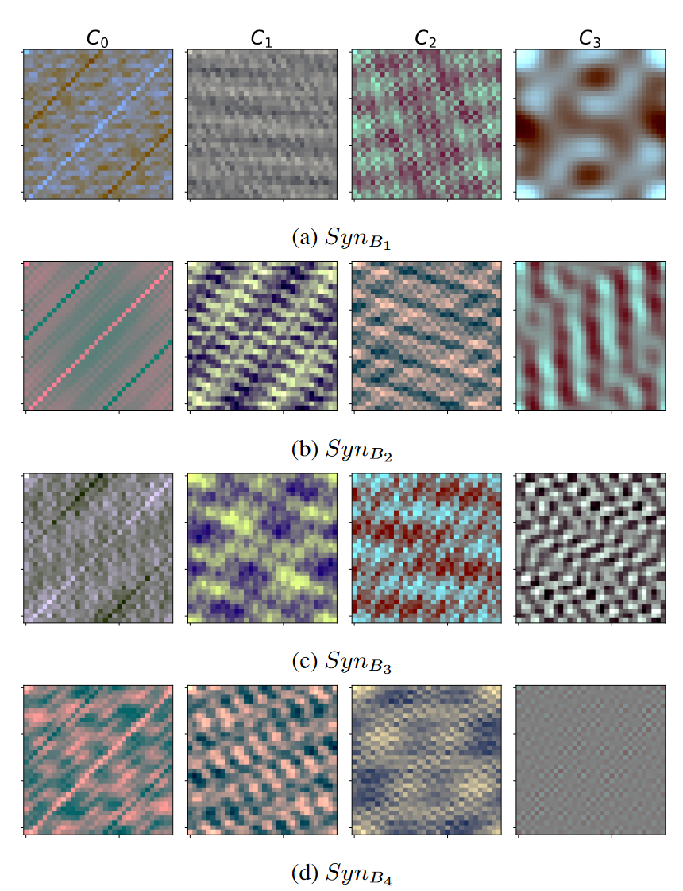
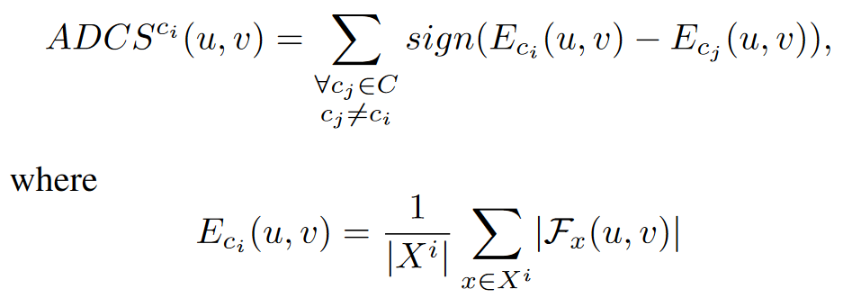
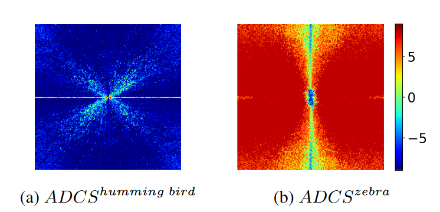
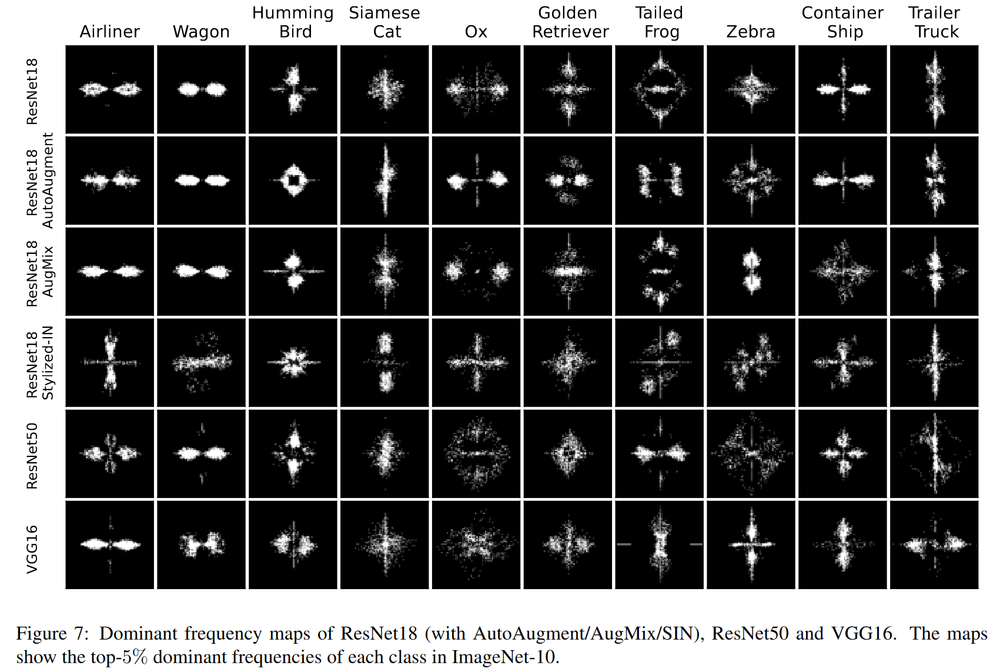

# What do Neural Networks Learn in Image Classification? A Frequency Shortcut Perspective

Shunxin Wang  ,  Raymond Veldhuis  ,  Christoph Brune   ,  Nicola Strisciuglio | University of Twente, The Netherlands | ICCV'23 

## Summary

This paper investigates the learning dynamics of NNs in classification tasks, focusing on learned frequency shortcuts and proposes a metric to measure class-wise frequency characteristics and a method to identify frequency shortcuts.

To study the impact of data characteristics on the spectral bias of NNs,and frequency shortcut learning, authors generate four synthetic datasets {B1,B2,B3,B4}, each with a frequency bias in a different band, from low to high. Control frequency bands and special characterstic frequencies are introduced, demonstrating that the NNs can recognize samples of a given class when only part of the frequencies (shortcuts) associated with the special patterns are present in the test data.To summarize, the NNs trained on the four synthetic datasets use frequency differently, but they all adopt frequency shortcuts depending on the data characteristics.

The paper next introduces a metric called Accumulative Difference of Class-wise average Spectrum (ADCS), to compare the average frequency distributions of individual classes within a dataset. This facilitates the identification of discriminative and simple class-specific frequency characteristics to learn early in training.
This metric considers that NNs are amplitude-dependent for classification and computes the average amplitude spectrum difference per channel for each class within a set $C=\{c_0, c_1, \ldots, c_n\}$ and average it into a one-channel ADCS. The ADCS for class ci at a frequency (u, v) is calculated as:

is the average Fourier spectrum for class $c_i$, x is an image from the set $X_i$ of images contained in that class, and $\mathcal{F}_x(u, v)$ is its Fourier transform. 
$ADCS^{c_i}$ (u, v) ranges from 1 − |C| to |C| − 1. A higher value indicates that a certain class has more energy at a specific frequency than other classes.

Examples of ADCS for two classes; Humming Bird & Zebra

To identify frequency shortcuts, the authors propose a method based on culling irrelevant frequencies. The relevancy of each frequency to classification by recording the change in loss value when testing a model on images of a certain class with the concerned frequency removed from all channels. The increment in loss value is used as a score to rank the importance of frequencies for classification.

On testing the influence of shortcuts on OOD generalization, authors found that frequency shortcuts can be transferred to another dataset.

## Contributions

- The paper proposes a method to identify frequency shortcuts, based on culling frequencies that contribute less to classification.

- The paper examines the influence of frequency shortcuts on the generalization of NNs, especially on Out Of Distribution(OOD) test sets.

- The paper proposes a metric to measure class-wise frequency characteristics and a method to identify frequency shortcuts.

## Results

- NNs learn frequency shortcuts during training to simplify classification tasks, driven by frequency characteristics of data and simplicity-bias.

- Frequency shortcuts can be transferred o another dataset, in some cases, giving an illusion of improved generalization.

- Larger model capacity and data augmentation techniques do not necessarily mitigate frequency shortcut learning.

## Two-Cents

- The study expands previous works on the learning dynamics of NNs for regression tasks, broadens the understanding of frequency shortcuts (which can be either texture-based orshape-based), and provides a more systematic analysis of OOD generalization. 

- Enhancing the identification of frequency shortcuts and applying proper training schemes that avoid frequency shortcut learning may hold promise in improving generalization.

## Resources

Paper:- https://arxiv.org/pdf/2307.09829.pdf
