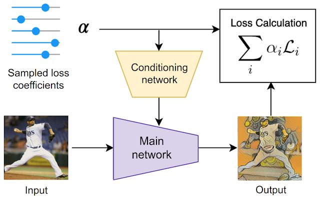

# YOU ONLY TRAIN ONCE : LOSS-CONDITIONAL TRAINING OF DEEP NETWORKS

Alexey Dosovitskiy & Josip Djolonga

Google Research, Brain Team

(Published as a conference paper at ICLR 2020)

## Summary

The paper proposes a simple and broadly applicable approach that efficiently deals with multi-term
loss functions and, more generally, arbitrarily parameterized loss functions.

It suggests a method to train a single model simultaneously minimizing a family of loss functions 
instead of training a set of per-loss models.

## Concept

The main concept is to **train a single model that covers all choices of coefficients of the loss terms, 
instead of training a model for each set of coefficients**. This is achieved by:
 - **First:** training the model on a distribution of losses instead of a single loss function 
 - **Second:** conditioning the model outputs on the vector of coefficients of the loss terms. 

This way, at inference time the conditioning vector can be varied, allowing us to traverse the space of models corresponding to loss functions with different coefficients.

## Method

- Instead of a single fixed loss function L(·, ·), assume that we are interested in a family of losses
L(·, ·, λ), parameterized by a vector λ ∈ Λ ⊂ R d λ .

- The most common case of such a family of losses is a weighted sum of several loss terms with 
weight λi corresponding to loss Li.

- In practice, one then typically minimizes the loss independently for each choice of the parameter
vector λ.

- Instead of fixing λ, the paper proposes an optimization problem where the parameters λ are sampled from 
a distribution Pλ (log-uniform distribution in this paper's experiments) .

- Hence, during training time the model observes many losses, and can learn to utilize the relationships between them to 
optimize all of them simultaneously. The distribution Pλ can be seen as a prior over the losses.

- At inference time, the joint model can be conditioned on an arbitrary desired parameter value λ,
yielding the corresponding predictions.

This training procedure is illustrated in the diagram below for the style transfer task:

- For each training example, first the loss coefficients are randomly sampled. 
- Then they are used both to condition the main network via the conditioning network 
and to compute the loss. 

## Main contribution

- In many ML problems, multiple loss functions have to be minimized simultaneously, each of them modelling a different facet of the considered problem.

- Typically, it is not possible to simultaneously optimize all these losses — either due to limited model capacity, or because some of the losses may be fundamentally in conflict (for instance, image quality and the compression ratio in image compression)

- Intuitively, the models trained for different loss variants are related and could share a large fraction of computation

- The YOTO method helps us to exploit the above fact and train a single model that simultaneously solves several learning tasks.

- The conceptual simplicity of this approach makes it applicable to many problem domains, with only minimal changes to existing code bases.

- The experiments have been carried out on three problems: Beta-VAE, Style Transfer and Learned Image Compression. The results showed close similarity with fixed-weight models trained for each of the parameter configurations.  

## Opinion

- YOTO could reduce the effort spend in training models with fixed parameters separately.

- YOTO could turn out to be beneficial for many generative models where we have to keep in mind many different factors while training.

- Studying the nature of Pλ distribution could help us in better understanding the relation between different losses of a model.

## Resources

- [YOU ONLY TRAIN ONCE (Paper)](https://openreview.net/pdf?id=HyxY6JHKwr)
- [YOU ONLY TRAIN ONCE (Blog)](https://ai.googleblog.com/2020/04/optimizing-multiple-loss-functions-with.html)