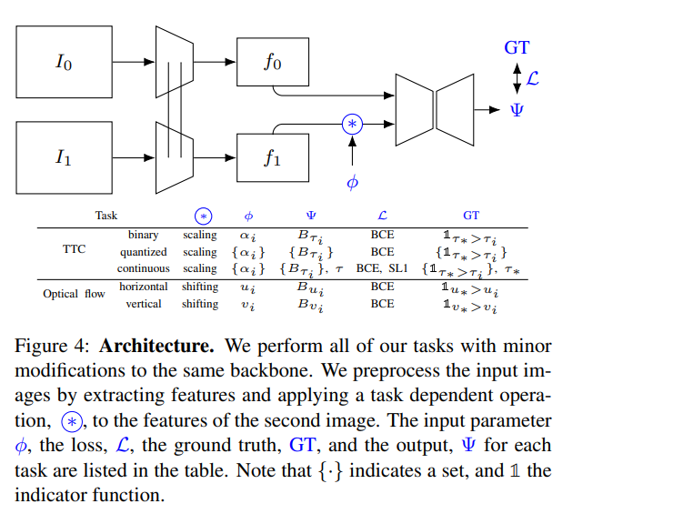

# Binary TTC: A Temporal Geofence for Autonomous Navigation
Abhishek Badki, Orazio Gallo, Jan Kautz, Pradeep Sen, CVPR 2021

## Summary
This paper shows a technique to get pixelwise Time To Collision from two given images taken within a short duration of time. This paper proposes to use the
relative size of an object in the latter image with respect to the initial image to get the TTC for that object and its corresponding pixels.

## Overview

-It compares two images that are taken a short amount of time apart, then scales the later image with a scaling factor corresponding to a particular TTC
so that the objects that would collide with the plane of camera would appear bigger with respect to the initial image and vice versa.
-Each TTC would have a corresponding scaling factor with which we can scale the later image to determine which objects would collide on or before and after 
the specified TTC, hence dividing all the objects into two classes hence the name binary and with this we can create a binary tree with respect to each
object's Time To Contact.
-We can also use this approach to obtain a quantized TTC for each pixel by taking the scaling factors to the correspondingly quantized TTCs.

## Implementation Details

-The architecture used has been shown as following:
 

## Strengths

-Capable of providing TTC in a reasonable amount of time with just normal camera video feed of 150 frames per second.
-The system is simpler than some others where people attempt to find relative position and velocity and then use them to calculate the TTC.
-Unlike some other papers, it doesn't make over-simplifyng assumptions like constant brightness, objects being non-deformable etc.

## Weaknesses

-We have to calculate scaling factors for given TTCs beforehand, it might have been better if the network itself could get the scaling factor as it might
be the case that the scaling factors for same TTC can vary for different positions of camera and enviornments.

## Implementation
[https://github.com/NVlabs/BiTTC](https://github.com/NVlabs/BiTTC)