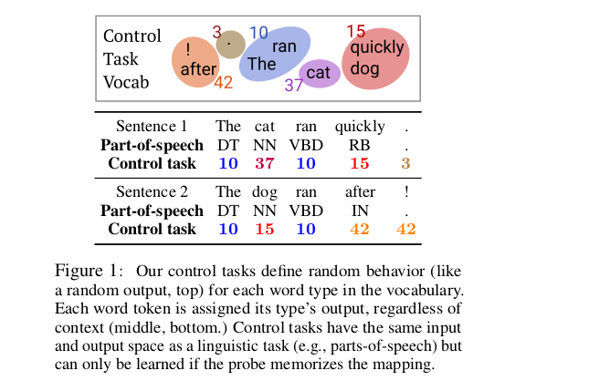

# Designing and Interpreting Probes with Control Tasks
 
John Hewitt, Percy Liang
 
## Summary
 
This paper proposes control tasks which help to identify whether probes which are commonly used to predict the linguistic properties of word representations actually are useful in this ...or do they themselves learn how to perform well on linguistic tasks. **This paper also got the Best Paper Runner Up Award at EMNLP 2019**
 
## Main Idea - Control Tasks
 
- Let V be the vocabulary containing all word types in a corpus, what happens in a control task is that we independently sample a **Control behaviour** `C(v)` for all v in V (**randomness**). This control behaviour deterministically determines the output y (**structure**), which belongs to the same space Y as the output of the Linguistic task. So all word tokens are assigned its word type output regardless of its context
 
- The randomness in the choice on control behaviour makes the properties of the hidden representations useless and leave the probe all for itself.C(v) must be memorized independently for each word type, and a probe taking vectors h 1:T as input must identify for each hi its corresponding xi, and output the element of Y specified by C(xi).
 
- They define a new metric selectivity as ` selectivity =  linguistic task accuracy - control task accuracy `, so a good probe will be one with high selectivity ie. it will have high linguistic task accuracy while having low control task accuracy ..so it means that the probe by itself can't do anything (low control task accuracy)...its actually some linguistic properties of the hidden representations that help in the linguistic task (high linguistic task accuracy).
 
 
 

 
## Main Contributions
 
- They find that current probes are all over-parameterized cause even when they used rank-decomposition to critically reduce dimensions .. there is not much loss inaccuracy
 
- They find that the most selective probes of those tested, even after careful complexity control, are linear or bilinear models. They also have the advantage that they exhibit high selectivity without the need to search over complexity control methods and also have similar accuracy.
 
- Dropout seems to have actually hurt selectivity, while other regularization methods like L2 weight decay, constraining the number of training examples,  constraining the hidden state dimensionality via rank-decomposition or critically constraining the hidden layer seems to have improved selectivity.
 
- They find probes on ELMo2 to be strikingly more selective than those on ELMo1, consistent across all probes, this shows that probes use word identity as a feature to predict part-of-speech, and that feature is less easily available in ELMo2 than ELMo1, though it has a little bit less accuracy.
 
- They introduce two control tasks 1.) Part-of-speech tagging control task and 2.)Dependency edge prediction control task, the details might be read from the paper itself.
 
## Our two cents
 
- The new feature introduced ..namely, selectivity can be a new standard  benchmark parameter in future NLP
 - It might lead to future research in improving the quality of inference of linguistic properties of hidden representations like ELMo and BERT
 
## Implementations and References
 
- [Code](https://worksheets.codalab.org/worksheets/0xb0c351d6f1ac4c51b54f1023786bf6b2)
- [Blog](https://nlp.stanford.edu/~johnhew/interpreting-probes.html)
 

