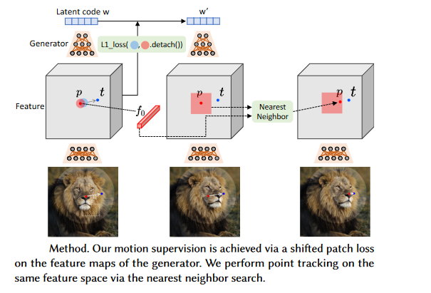

# DRAG YOUR GAN: INTERACTIVE POINT-BASED MANIPULATION ON THE GENERATIVE IMAGE MANIFOLD
XINGANG PAN,AYUSH TEWARITHOMAS LEIMKÜHLER,ABHIMITRA MEKA,CHRISTIAN THEOBALT,SIGGRAPH ’23 Conference 
### SUMMARY
The research paper introduces DragGAN, an interactive point-based manipulation approach for generative adversarial networks (GANs). The goal is to enable users to control spatial attributes in synthesized images by defining handle points and their corresponding target points. DragGAN addresses two sub-problems: supervising the movement of handle points towards targets and tracking the handle points during the editing process.

### METHOD AND MAIN POINTS OF PAPER
- The paper compares DragGAN with existing methods, including UserControllableLT, RAFT, and PIPs, for point-based editing and tracking.
- Extensive qualitative and quantitative evaluations are conducted on various datasets, such as FFHQ, AFHQCat, SHHQ, LSUN Car, LSUN Cat, Landscapes HQ, and self-distilled datasets of Lion, Dog, and Elephant.
- Motion supervision is achieved via a shifted patch loss on the feature maps of the generator. We perform point tracking on the same feature space via the nearest neighbor search.

- DragGAN effectively achieves diverse and natural image manipulations, allowing for the control of spatial attributes such as pose, shape, and layout. It outperforms UserControllableLT in terms of accuracy and image quality preservation. Real image editing is also showcased using GAN inversion techniques.

### RESULTS
- DragGAN effectively achieves diverse and natural image manipulations, allowing for the control of spatial attributes such as pose, shape, and layout. It outperforms UserControllableLT in terms of accuracy and image quality preservation. Real image editing is also showcased using GAN inversion techniques.

### OUR TWO CENTS
- Overall, DragGAN offers an interactive and powerful tool for controllable image synthesis and editing in GANs, paving the way for more advanced and intuitive content creation applications.

### Refererences
- https://arxiv.org/pdf/2305.10973v1.pdf
- https://vcai.mpi-inf.mpg.de/projects/DragGAN/