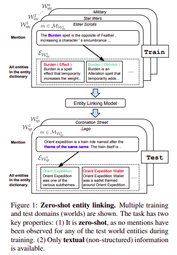

# Zero-Shot Entity Linking by Reading Entity Descriptions
 
Lajanugen Logeswaran, Ming-Wei Chang, Kenton Lee, Kristina Toutanova, Jacob Devlin, Honglak Lee
 
## Summary
 
This paper presents a new task called zero-shot entity linking where mentions must be linked to unseen entities without in-domain labelled data, they also propose an adaptive pre-training strategy called domain adaptive pre-training (DAP), to address the domain shift problem associated with linking
unseen entities in a new domain. **This paper also got the Outstanding paper award at ACL-2019**
 
 
## Introduction
 
- Previous work on entity linking typically use powerful resources such as a high-coverage alias table, structured data, and linking frequency statistics, and also focus on linking to general entity databases. The paper uses no such resources and also focuses to generalize on unseen specialized entities.
 
- The paper just makes one weak assumption, that there exist **entity dictionaries** which contains the entities `e` and their text descriptions `d`.
 
- Their goal is to build entity linking systems that can generalize to new domains and entity dictionaries, which they term worlds, each world contains its own set of distributions of mentions `m` , documents `u`
 
 
- They construct a new dataset for the zero-shot entity linking task using wikias, since, in wikias, mentions and context have rich document context that can be exploited by reading comprehension approaches.
 
- They assume that the target entity exists in the entity dictionary and leave NIL recognition or clustering (NIL recognition means predicting new entities, which are absent in the entity dictionary )
 

 
 
## Model
 
- They adopt a two-step model for entity linking ...first is a fast candidate generation stage ..which uses BM25, a variant of TF-IDF to measure the similarity between mention string and candidate documents and takes the top-k entities for further tasks.
 
- The second step is ranking these entities, we basically compare the mention in context and candidate entity description using models strong in reading comprehension and natural language inference tasks ie. Transformers.
 
- They use a variant called **Full Transformer** in which the mention in context `m` and candidate entity description `e` are concatenated and input to the model. Mention words are signalled by a special embedding vector that is added to the mention word embeddings. By jointly encoding the entity description and the mention in context with a Transformer, they can attend to each other at every layer.
 
- They show that such deep cross-attention helps the model outperform the previous transformer based approaches namely **Pool-Transformer** and  **Cand-Pool-Transformer** which didn't use cross-attention in a similar manner.
 
 
## Domain-adaptive pre-training (DAP)
 
- They also pretrain the model in an unsupervised fashion on different sets of data to improve further downstream tasks. They review two previous approaches and also propose a new approach DAP.
 
- First is **Task-adaptive pre-training** in which model is pre-trained on the source and target domain unlabeled data jointly with the goal of discovering features that generalize across domains.
 
- Second is **Open-corpus pre-training** in which model is pre-trained on large corpora in hope to partially capture the target-domain distribution along with it.
 
- The third is a new method suggested by them called **Domain-adaptive pre-training** (DAP) which only pretrains on the target-domain data. The intuition for DAP is that representational capacity is limited, so models should prioritize the quality of target domain representations above all else.
 
- In all the three approaches the model is fine-tuned on the source-domain labelled data at the end .....they also combine these approaches together to further improve performance.
 
 
## Our two cents
 
- The paper introduces a new task called zero-shot entity linking, and also introduces a new dataset for it ....thus they made way for new research to occur in this field and is thus research provoking.
 
- They admit that there is much scope for improvement in the candidate generation step  ....so it admits its own faults and hopes to work on them in the future.
 
## Implementation and References
 
- https://github.com/lajanugen/zeshel
 

