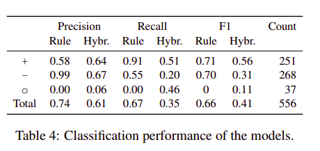

# Do you know that Florence is packed with visitors? Evaluating state-of-the-art models of speaker commitment
 
Nanjiang Jiang and Marie-Catherine de Marneffe
 
## Summary
 
- This paper evaluates two state-of-the-art speaker commitment models on CommitmentBank, an English dataset of naturally occurring discourses. They propose that linguistically informed model outperforms an LSTM-based one, suggesting that linguistic knowledge is needed to capture such challenging naturalistic data. **This paper also got the Best Short Paper Award at ACL 2019**
 
## Main Contributions and Results
 
- The paper focuses on the task of speaker commitment which hopes to determine how much is a speaker committed to an event, like does the speaker believe the event is true, false or is uncertain about it.
 
- They perform the evaluation on CommitmentBank, which has linguistically diverse naturally occurring sentences, making the task even more difficult,  whereas previous works focused on constructed or news-wire examples, which may simplify the task by failing to reflect the lexical and syntactic diversity of naturally occurring utterances.
 
- Each item in the dataset consists of up to two context sentences and one target sentence, Participants judged whether or not the speaker is certain that the content of the complement in the target sentence is true.
 
- They evaluated two models  on this dataset 1.)Rule-based model  - It’s a rule-based algo, which uses a top-down approach on a dependency tree and predicts speaker commitment. It is kind of based on the implicative nature of the predicates and also whether they are under the scope of some modifier to change the factuality signs.
 
- Second is a neural-based approach, for which three models, a linear biLSTM, a dependency tree biLSTM, a hybrid model that ensembles the two.
 
- They observed that the rule-based model outperforms the biLSTM models, but both of these SOA models don't perform very well on the CommitmentBank.
 
- This shows that a linguistically-informed model scales more successfully to challenging naturalistic data
 
- They also observed that the rule-based approaches predictions are clustered at +3(strong positive commitment) and -3(strong negative commitment), whereas that of the hybrid neural approaches are at +3 ....this means that these SOA models fail to capture the in-between cases very well.
 

 
 
## Our Two Cents
 
- The paper could have proposed a new approach for the commitment bank dataset, instead of using the previous SOTA model.
 
- The paper proposes that we need to add more linguistic features to the current models to improve performance ...and is thus research promoting.
 
 

