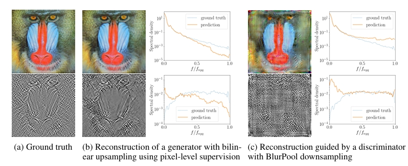
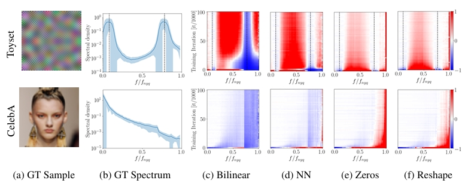

# On The Frequency Bias of Generative Models
 Katja Schwarz, 
 Yiyi Liao,
 Andreas Geiger,
 NeurIPS 2021

 ## Summary
 The paper discusses the problem of a bias shown towards high frequencies in existing GAN models thus making it pretty straightforward to detect real and fake images using a simple classifier . Any image can be viewed in the frequency domain as well by taking a discrete 2D fourier transform of the image . We can view it in the reduced spectrum by taking the azimuthal average over the spectrum in normalized polar coordinates.

 

 ## Contributions
 * To detect the fake images, they fit a power law function to the tail of the reduced spectrum for frequencies above a given threshold rc=0.75 and train a binary classifier on the fit parameters of each spectrum as proposed by Dzanic et al. 
 * The paper then investigates the causes of this bias by assessing the generator and discriminator architectures independently. It looks at how the various upsampling operations in the generator and downsampling in the discriminator might lead to the high-frequency artifacts

 ## Method
 * The paper first looks at the PGAN  generator independently. The generator is trained by pairing images from a dataset with latent codes and using a pixel-wise MSE loss. The training dataset is a 100-image Toyset and CelebA is used for testing.
 * Upsampling operations like bilinear  and nearest neighbour upsampling force the generator to produce low high-frequency content. On the other hand, zero insertion and reshaping produce checkerboard artifacts which can be reduced by the learnable parameters in the further layers by introducing an L-2 loss on the logarithm of the reduced spectrum,  which is more sensitive to errors at low magnitudes. 
 * The training signal of the PGAN discriminator is then analysed . The discriminator is trained by pairing 10 images with 10 labels and optimize 10 learnable tensors and discriminator weights using the GAN 2 player setting
 * The downsampling operations don't have a bias towards high frequencies in general but struggle to learn frequencies having low magnitude in the spectrum (which are high frequencies in natural images).
* They finally test StyleGan2 and observe a peak at high frequencies in the generated images.
  

  

## Conclusion
We find that while bilinear and nearest neighbour upsampling produce low magnitude high-frequency content , zero insertion and reshaping produce checkerboard artifacts in the reduced spectrum. The discriminator is not generally biased towards high frequencies but struggles with low magnitudes. The quality of the training signal of discriminator is worsened due to downsampling operations . The error is reduced with a spectral discriminator and training on wavelet space but a lot of improvement is still required.

## Two Cents
* A lot of scope is still left in improving the characteristics of the reduced spectrum of generated images. More focus should be put on improving the architecture of the discriminator as the generator alone isn't the sole cause of such artifacts.
* Other generative models like Stable Diffusion should also be tested for any such frequency bias

## Resources
- https://arxiv.org/pdf/2111.02447 

 
 