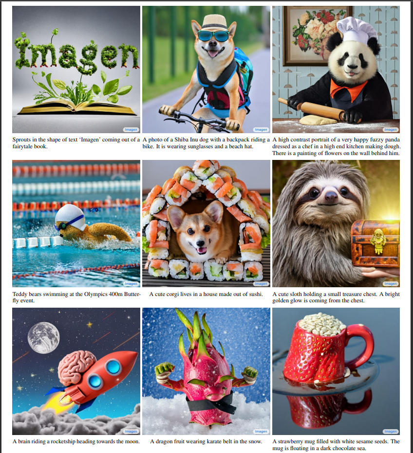
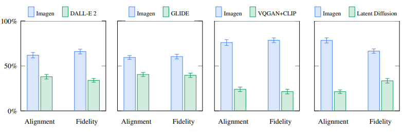

# Photorealistic Text-to-Image Diffusion Models with Deep Language Understanding
 
Google Research Brain Team(Ontario, Canada), Chitwan Saharia, William Chan, Saurabh Saxena, Lala Li, Jay Whang, Emily Denton, Seyed Kamyar Seyed Ghasemipour, Burcu Karagol Ayan, S. Sara Mahdavi, Rapha Gontijo Lopes, Tim Salimans, Jonathan Ho, David J Fleet, Mohammad Norouzi, May 2022
 
## Summary
 

 
 
Among a lot of text-to-image models that surfaced in 2022, google also introduced its respective version named Imagen. The model has a typical text-to-image model pipeline comprising an encoder and then a diffusion model which is then followed by an arrangement to upsample the image from _64*64_ to _1024*1024_. One of the main findings of the research team was that using a large generic language model such as T5 or BERT pretrained only on text-only corpora is more effective than increasing the size of the diffusion model. The model has been trained on a combination of an internal dataset having 460M text-image pairs and the Laion dataset having 400M text-image pairs. The diffusion model has around 2B parameters!!
 
## Contributions
 
- Large frozen Language models trained only on text data are very effective encoders for text-to-image generation and scaling their size improves sample quality significantly
 
- Proposed Efficient U-Net, a new architectural variant that is simple, fast, and memory efficient.
 
- Introduced dynamic thresholding, a new diffusion sampling technique generating more photorealistic images.
 
- Achieved a new state-of-the-art COCO FID at 7.27 and challenged itself on a new challenging benchmark, DrawBench.
 
## Method
 
The model uses T5(Text-to-text transfer transformer) as the encoder. The main intuition is that because of its sheer size it'll learn useful representations. For the 64*64 image diffusion model, U-Net architecture is employed. The network is then conditioned on text embeddings via a pooled embedding vector added to the diffusion timestamp. Further model is conditioned on the entire sequence of text embeddings by adding cross attention at multiple resolutions. Finally, super-resolution models adapted from some previous works with slight modifications are used to upscale the image.
 
 
## Results
 
The model, when evaluated on the COCO validation set, achieves a zero-shot FID score at 7.27 outperforming DALL-E 2. The images generated by the model were preferred 0.395 times out of 1 to be more photorealistic than the original COCO dataset images when asked to people.
 
Imagen is also compared on a newly introduced benchmark,*Drawbench*. Drawbench is a collection of 200 prompts that challenge model on different capabilities such as ability to faithfully render different colors, number of objects, spatial relations, text in the scene and many more. Human raters are then presented with images from 2 models and asked to compare the models on sample fidelity and image-text alignment. Results are shown in the image below.
 
 
 
 
 ## Two-Cents
 
Imagen's results speak for themselves and mark another great success in the area of text-to-image generation and generative modeling. Imagen also adds to the list of the great accomplishments of Diffusion Models, which have taken the Machine Learning world by storm over the past few years with a string of absurdly impressive results.
 
Another conclusion that can be drawn is that we need to keep scaling up models to achieve more fascinating results.
 
## Resources
 
Project Site: https://imagen.research.google/
