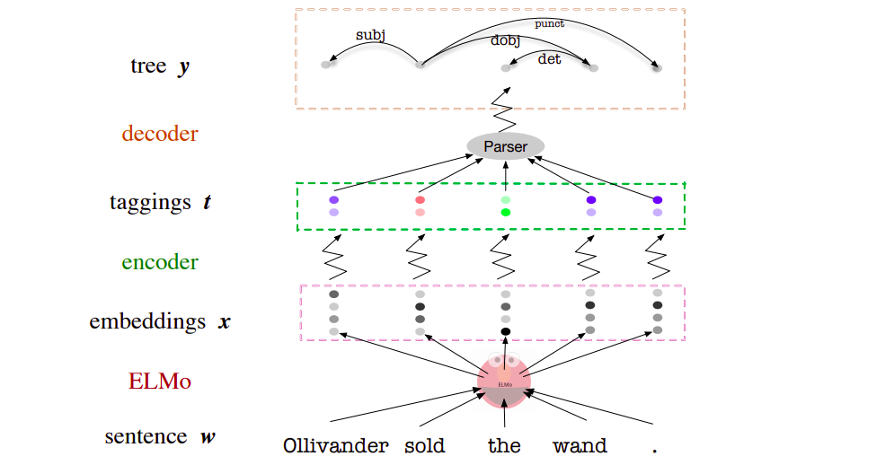
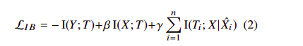
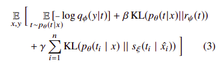

# Specializing Word Embeddings (for Parsing) by Information Bottleneck
Xiang Lisa Li, Jason Eisner
 
## Summary
 
This paper proposes a method based on Variational Information Bottleneck to compress word embeddings like BERT and Elmo into a discrete or continuous  version in a way that is very fast and also more accurate for parsing problems. **This paper also got the best paper award in EMNLP 2019**
 
## Main Contribution
 
- The method compresses the embeddings by extracting just their syntactic properties—specifically, the information needed to reconstruct parse trees, unlike other embeddings which also focus on semantic meanings.
 
- Their method, VIB, goes beyond mere dimensionality reduction, it also gives flexibility in the effective number of dimensions being used for each token by blurring unneeded complexity via randomness.
 
- This method is complementary to previous fine-tuning approaches as it learns to exploit existing info found by BERT or Elmo instead of adding new info via fine-tuning.
 
- The discrete representations are tuned explicitly for discriminative parsing, so they prove to be even more useful for summarizing the syntactic properties of a work token than the POS tags, even at the same level of granularity.
 
- The continuous representations are also more useful than the uncompressed Elmo representations when it comes to generalizing to test data.
 

 
## Loss Function
 

 
- The goal is to learn a stochastic map `p(t | x)` from X to some compressed representation T
 
- The picture on the left is the theoretical loss function proposed, while the one on the right is the variational information bottleneck (VIB) loss function achieved after applying variational inference for various probability distributions in the theoretical loss.
 
-  **I(X; T)— the Token Encoder `p(t | x)`**  - Here I is the mutual information ...so if this term is low ..then it means that the compression does not retain very much information about X  ...as it can be seen in the right picture ..the exact calculation of this term is done via variational inference ..which also produces the KL Divergence term as the upper bound.
-  **I(Ti; X|Xˆi) — the Type Encoder s(ti|xˆi)** - which measures the amount of information about Ti given by the sentence X as a whole, beyond what is given by Xˆi (Elmo’s level-0 embedding of word i, a word type embedding that does not depend on context). This is done cause Elmo's embeddings extract info from other words in the sentence also ..but we want to depend on the current word only
-  It is also modelled via an upper bound using variational inference  leading to another KLD term
 
- **I(Y; T) — the Decoder q(y | t)** - This term favours the predictive accuracy, making I(Y; T) large tries to obtain a high log-probability p(y | t) for the true parse y when reconstructing it from t alone. Again modelled via variational inference  to give a lower bound
 
- Regarding  beta and gamma as a Lagrange multiplier, we see that the goal of IB is to maximize the predictive power of T (I(Y; T)) subject to some constraint on the amount of information about X that T carries (I(X; T)) while depending on the current word only (I(Ti; X|Xˆi))
 
## Architecture & Implementaion Details
 
- For the token encoder, to obtain continuous tags, define `p(ti | xi)` such that ti is Gaussian-distributed, to obtain discrete tags follow a softmax distribution, x computed from the Elmo word vector xi via a feedforward neural network and no transfer function at the output layer.
- For the type, encoder uses the same architecture as the token encoder, except that `p` takes a token vector as input whereas `s` takes a context-independent type vector. `s` is not used at test time, but only as part of our training objective.
- For the decoder, they use the deep biaffine dependency parser and some other algorithms (Tutte’s matrix-tree theorem,  directed spanning tree algorithm )
 ## Our two cents
 
- The network seems to be very computationally efficient ...being trained on a single GPU which makes it  quite feasible
- The tags generated seem to compare well with gold  POS tags, showing clustering of similar tags together, they also conducted experiments that proved that semantic info is destroyed as compression is increased ...which is a good sign ....also the patterns revealed in the annealing of discrete tags show that the results are coherent.
- Could be applied to other model embeddings by changing the model-specific -decoder  ...makes the process quite versatile.
 

