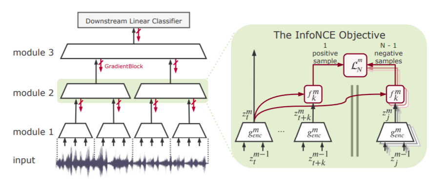

# Putting an End to End-to-End: Gradient-Isolated Learning of Representations

Sindy Lowe, Peter O' Connor, Bastiaan S. Veeling, NIPS-2019

## Summary

The paper proposes a novel self-supervised learning technique which rather than employing end-to-end training, focusses on employing isolated training of various modules of the network using greedy InfoNCE objective. This paper heavily inspires from biological phenomenons. This paper won **Honorable Mention Outstanding New Directions Paper Award** at NeurIPS 2019.

## Main Contributions

- The main contribution of this paper is its greedy InfoNCE objective that is used for training the model in modules rather than end-to-end. This could lead to huge improvement in the computation time and also lead to overcoming the memory bottleneck. The model learns in a rather self-supervised manner by using mutual information between various patches as supervision for training of patches.

- This technique has been highly inspired from various principles of neuroscience with the fact that rather than optimizing a single objective function, brain rather functions in a modular way and optimizes local information.

- The self-supervised persona of the model comes from the fact that it tries to maximize mutual information of representations of temporally nearby data. This seems to work because of the presence of *slow features* in the data that are highly effective for downstream tasks.

- As seen from the image, the work is focussed heavily on Contrastive Predictive Coding(CPC) as introduced in [Oord et al.](https://arxiv.org/abs/1807.03748). The basic principle behind CPC being maximizing mutual information between representations of temporally nearby patches.

- Elucidating on the work in CPC, a summarization of encoding until time t, *ct* is taken by employing an autoregressive model over representations of input until time t. This *ct* is then used to compute mutual information loss with future input representations *zt+k*. Also rather than doing this directly a form of negative sampling is used where a bag of future representations is taken *{zt+k, zj1 ... zjN-1}* with only one positive sample and N-1 'negative samples'

- Following this idea, the authors suggest **Greedy InfoMax** which is used to greedily train separate modules in the network. So to do so, first representations are extracted from *M-1* module to be passed onto *M* module, so ztM = GradientBlock(encoding(xtM-1)). The GradientBlock helps for the gradient to not pass backward.

- So to train each module separately, the strategy followed in CPC is directly taken up with one modification of rather not choosing autoregressive model to summarize information till time t, rather the encoding at time t is directly used to calculate mutual information between temporally nearby patches which was found as good during implementation.

## Implementation Details

- The InfoNCE objective works the better as the number of negative samples are increased for its training.
- The autoregressive model has been used for greedy infomax in certain categories of data like speech recognition where a broad spectrum of information is required to calculate a reliable mutual information.
- The autoregressive models that are being used by the authors are GRU or a Pixel-CNN type model.

## Our two cents

- This method owing to its training using modules can certainly lead to training of deeper models both faster and feasible.
- Owing to its local gradients, the problem of vanishing gradients is certainly reduced.
- While not similar the idea proposed in the Synthetic Gradients paper by Deepmind certainly lies somewhere near this one. Check it out [here](https://deepmind.com/blog/article/decoupled-neural-networks-using-synthetic-gradients)
- It takes some serious inspiration from neuroscience considering its fuctioning comes pretty close to that of brain which does process its perceptions by maximally preserving the information of the input activities in each layer.
- However, the main objective of the paper is maximally inspired from the paper by [Oord et al](https://arxiv.org/abs/1807.03748).

## Implementation

- [https://github.com/loeweX/Greedy_InfoMax](https://github.com/loeweX/Greedy_InfoMax)
- A [blog](https://yann-leguilly.gitlab.io/post/2019-09-29-representation-learning-with-contrastive-predictive-coding/) to read more about InfoNCE and Contrastive Predictive Coding.