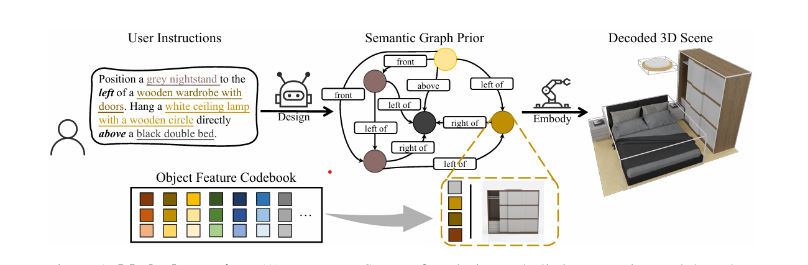

# INSTRUCTSCENE: INSTRUCTION-DRIVEN 3D INDOOR SCENE SYNTHESIS WITH SEMANTIC GRAPH PRIOR

**Authors:** Chenguo Lin & Yadong Mu
**ICLR 2024**
## Summary

The paper introduces INSTRUCTSCENE, a novel two-stage framework for 3D indoor scene synthesis driven by natural language instructions. The first stage, the semantic graph prior, transforms user instructions into a sophisticated semantic graph where each node represents an object with its category, quantized semantic features, and spatial relationships. Using a discrete diffusion model, this stage independently refines object categories, features, and relations. The second stage, the layout decoder, takes this semantic graph and generates a precise 3D scene layout by converting the graph's abstract representation into specific object attributes like location, size, and orientation. By separating the generation of discrete and continuous attributes, INSTRUCTSCENE achieves superior controllability and expressiveness compared to existing methods. The authors developed the approach using a curated dataset of scene-instruction pairs created with large language and multimodal models, and demonstrated through comprehensive experiments that their method significantly outperforms current state-of-the-art techniques in generating contextually coherent and instruction-aligned 3D indoor scenes.

## Contributions

- Proposed an instruction-driven generative framework (INSTRUCTSCENE) that integrates a semantic graph prior and a layout decoder to improve controllability and fidelity in 3D scene synthesis.
- Developed a general semantic graph prior that can jointly model appearance and layout distributions, enabling zero-shot performance across various downstream applications.
- Curated a high-quality dataset of scene-instruction pairs to promote benchmarking in instruction-driven 3D scene synthesis.
- Demonstrated significant performance improvements over existing state-of-the-art techniques through comprehensive quantitative experiments and ablation studies.

## Method

 <i>Overview of Methodolyogy</i>   

- Feature Quantization: Employs a vector-quantized variational autoencoder to compress high-dimensional semantic features of objects into a compact codebook, capturing intrinsic characteristics like color, material, and geometric shape while reducing computational complexity.
- Semantic Graph Prior: Develops a discrete diffusion model that independently diffuses object categories, semantic features, and spatial relationships, creating a probabilistic semantic graph that captures the essence of the user's instructions while maintaining flexibility in scene representation.
- Layout Decoder: Utilizes another diffusion model to convert the abstract semantic graph into precise 3D scene layouts, generating specific object attributes like location, size, and orientation while ensuring semantic consistency with the original graph.
- Transformer Architecture: Implements graph Transformers with advanced attention mechanisms, including cross-attention to incorporate text instructions, graph attention for relational reasoning, and feature-wise linear modulation to enhance the model's ability to capture complex scene semantics.
- Zero-Shot Generalization: Designs the semantic graph prior to be versatile across various downstream tasks, enabling the model to generate scenes with high controllability and fidelity even for instruction scenarios not directly seen during training.

## Results

The experimental results demonstrated that INSTRUCTSCENE significantly outperforms existing state-of-the-art methods in 3D indoor scene synthesis. By comparing against baselines like ATISS and DiffuScene, the proposed method showed marked improvements in generation controllability and fidelity. The authors conducted comprehensive quantitative evaluations that revealed their approach's ability to more accurately translate natural language instructions into semantically coherent 3D scenes. The ablation studies further confirmed the efficacy of each key design component, highlighting the method's robust performance. Additionally, the curated scene-instruction paired dataset not only supported their experimental validation but also provided a valuable resource for future research in instruction-driven scene generation. The zero-shot generalization capability of their semantic graph prior was particularly noteworthy, demonstrating the method's potential for versatile and adaptive scene synthesis across different scenarios.

## Two Cents

INSTRUCTSCENE offers an innovative approach to 3D scene synthesis by using a clever two-stage semantic graph and layout decoder method. While the approach elegantly solves key challenges in translating language instructions to scenes, it could benefit from handling more complex spatial instructions and improving computational efficiency. The paper demonstrates significant potential in bridging natural language understanding with 3D scene generation, but future work should focus on expanding the model's adaptability and robustness across diverse design contexts.

## Resources

- https://chenguolin.github.io/projects/InstructScene/
- https://github.com/chenguolin/InstructScene
- https://huggingface.co/datasets/chenguolin/InstructScene_dataset
