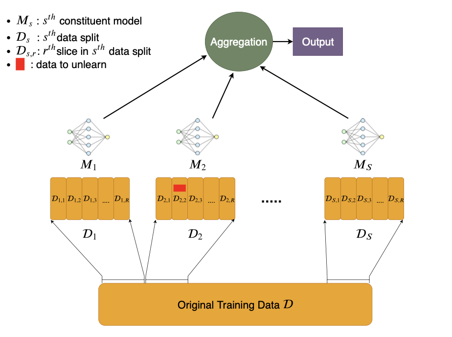

# Machine-Unlearning
Lucas Bourtoule, Varun Chandrasekaran, Christopher A. Choquette-Choo, Hengrui Jia,Adelin Travers, Baiwu Zhang, David Lie,Nicolas Papernot ,**IEEE** **2020**

## Summary:->

The paper provides a new way of training ML model named SISA(Sharded, Isolated, Sliced, and Aggregated training) training.It formalises the definition of unlearning and is primarily motivated by privacy concern and therefore also showcases some straw-man solutions.The algorithm is applicable to wide variety of models ranging from simple linear regression model to complicated deep neural network(DNN).Though it is not applicable to decision tree model.Basically it is applicable to all models that learns in iterative manner using gradient descent and not some criteria like Gini-criteria for decison tree.But it primarily focuses on DNN and gives good results for them as compare to classic ML models.It also compares it results with naive approach and highlights the lack of work in this field along with the limited knowledge of how a single datapoint influences model parameters.

## Contributions:->

The main contribution of the paper is that it provides simple strategies like SISA training which empower user to erase his/her data completely remove from a model.

The paper is primarily motivated by privacy and hopes to spur follow-up work on effective ways of machine unlearning.

## Working:->

Incase of no knowledge regarding distribution of unlearning request i.e uniform distribution:->

1.)Split the dataset into several parts known as shards.Further divide the shards into slices which are to be used for incremental learning of individual model using Stochastic Gradient Descent Algorithm.

2.)Train individual models on shards and give final prediction by aggregating prediction made by individual models.

3.)While training the models on shard save model parameter after training on 1 slice then train it on 2nd slice and so on.

4.)At the time of unlearning request first locate the shards and slices in which the datapoint that is to be erased is present.

5.)Delete the datapoint and then retrain it on those slices after deletion of the datapoint with saved model parameters till that slice in which datapoints not to be unlearned are there.

Incase of prior knowledge regarding distribution of unlearning request:->
Make shards accordingly whose detail are given in the paper except that all steps are same.

## Results:->
|Dataset      |    Dimensionality |   Size       | Number of Classes     | Model-Architecture                     |
| ------      | ------------------|--------------|-----------------------|----------------------------------------|
| MNIST       |  28 × 28          |   60000      |   10                  | 2 conv. layers followed by 2 FC layers |
|Purchase     |   600             |   250000     |    2                  | 2 FC layers                            |
| SVHN|       |  32×32×3          |   604833     |   10                  | Wide ResNet-1-1                        |
|CIFAR-100    |  32×32×3          |   60000      |   100                 | ResNet-50                              |
|Mini-Imagenet|  224 × 224 × 3    |  1281167     |   1000                | ResNet-50                              |  
|Imagenet     |  224 × 224 × 3    |  128545      |   100                 | ResNet-50                              |
With the above conditions following results were obtained:->
1.)As number of shards increased unlearning time decreased but aggregate accuracy of the model decreased as individual models were required to be trained on   even smaller dataset causing them to become weak learners.
2.)Increase in number of slices doesn’t have any effect on accuracy as long as number of epoch are recalibrate accordingly.
3.)Above a threshold of unlearning request, accuracy of SISA learning decreased below the naive approach of retraining the model from scratch. 
4.)Below the threshold SISA learning beats the naive approach in both accuracy and unlearning time.

## Two-cents:->

The paper is written in a very simple and easy to understand language.Provides a clear algorithm of how to perform SISA learning.The paper provides detail results including those where it’s fall short against simply retraining model from scratch.

The paper also gives a realistic scenario where we have some idea regarding distribution of unlearning request which could be used as a prior in our analysis using Bayesian probability so that we split our dataset in shards and slices accordingly.

## Resources

Resource to paper:->
https://www.google.com/url?sa=t&rct=j&q=&esrc=s&source=web&cd=&cad=rja&uact=8&ved=2ahUKEwjMxIrd2ueEAxV31zgGHSISDmAQFnoECBAQAQ&url=https%3A%2F%2Farxiv.org%2Fabs%2F1912.03817&usg=AOvVaw14pLgVFg_7YgfCXKBQjSKN&opi=89978449

