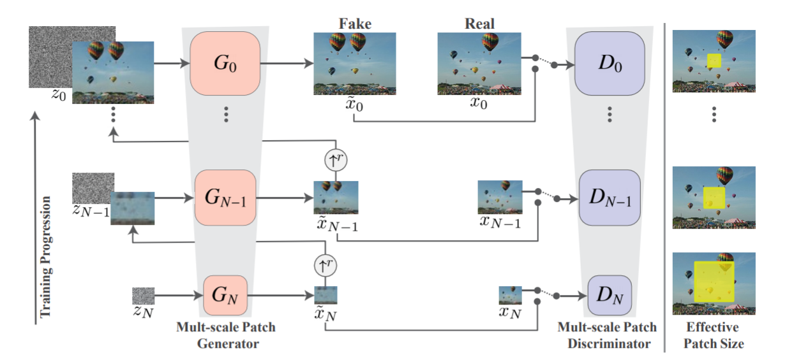

# SinGAN: Learning a Generative Model from a Single Natural Image

Tamar Rott Shaham, Tali Dekel, Tomer Michaeli, ICCV-2019

## Summary

This paper proposes a novel GAN training technique to obtain a generative model that can be learned using a *single* image. Unlike some of the previous works that used single image for training for a single task, the model can be used for unconditional generative modelling, not limited to texture images.
**This paper also got the best paper award in ICCV 2019**

## Main Contributions

- The main contribution of this paper is its training method for generative modelling by using a single training image. The said is done by using pyramid of fully convolutional GANs capturing the patch distribution at different scales.

- While the idea of using single training image has been there for quite some time(mostly being for a specific task like harmonization, style transfer, etc) the proposed procedure takes it one step forward by making the generative model unconditional(generating real-like images sampled from training distribution by passing random noise) and not limited to texture images

- As can be seen from the diagram, the model follows a pyramid structure with each level being given fed a different scale of the training image, with xn being the downsampled version of the image with factor rn (r>1). At the lowest(coarse) level, random noise is passed through the generator and the output of this(after upsampling by a factor of r) is passed onto the next level(N=n-1).

- The generation from the previous level is added to random noise and passed through the generator at this level while the generation from the previous level is also residually addded to the generation of this level. The same process keeps on continuing till the level with the original image size is reached.

- The different levels are responsible for generation of different kind of details in the image, with the lowest level able to generate coarser details and the higher levels able to manipulate more finer details.

- The training of the network takes place sequentially from coarser scale to finer scale. The loss terms can be seen as follows:
	- **Adversarial loss**: WGAN is used for a stabilized training where final discrimination score is the average over the patch discrimination map. Also the loss is defined over the whole image rather than over random crops.
	- **Reconstruction loss**: Ensures the existence of noise that can be used to generate original training image. So basically simultaneous to what we are have been doing(adding noises at various levels as we have seen till now) we try to see whether the initial noise can be used to generate origial image. So to do we are gonna take {zNrec, zN-1rec ..., z0rec} = {z\*, 0, ..., 0}. That is, we are gonna take zero noise in the later levels. So after this we just calculate the *squared difference loss* between the generations at each level(with zero noise being assigned to every level except the lowest) and the image at the size scale.
	This also serves another purpose to determine standard deviation of noise zn at each scale, as we take the std to be proportional to RMSE between one-step upsampled version of generated xn+1rec and xn, giving an indication of amount of information to be added at each scale(which is added as noise).

- For testing, the results have been shown for various cases with generation being purely unconditional, and also the same network being used for conditional generation task with input of the image to be manipulated being passed onto the later levels rather than the lowest one.

- Also the paper introduces a variant of Frechlet Inception Distance(die to the obvious reason being that the training size is just of a single image), known as Single Image Frechlet Inception Distance. For this, instead of using the activation vector after the last pooling layer in Inception Network, the internal distribution of deep features at output of convolutional layer just before the second pooling layer is used.

## Implementation Details

- The minimal dimesion at the coarsest scale is set up to 25px and the number of scales N is chosen such that the scaling factor is close to 4/3.
- The generrators are fully convolutional net of the form Conv(3\*3)-BatchNorm-LeakyReLU. There are 32 kernels per block at the coarsest scale and the number is increased by a factor of 2 every 4 scales.

## Our two cents

- The proposed technique to train unconditional generative model using a single image is undoubtedly quite astounding and there being different level of scales in the architecture just makes it easier to get representations of various patches of the image.

- The fact that a single network can be used for various tasks like harmonization, inpainting, etc with no explicit training is also great.

- However, one of the major drawback of this technique(quite visibly) is also its usage of a single training image, which leads to a bottleneck in the variability of the generations produced by the network. The purely unconditional generations being successful for varied representations of the same kind(as in the same class of data) of image, would fail to generate various different classes of data.

## Implementation

- [https://github.com/tamarott/SinGAN](https://github.com/tamarott/SinGAN)

