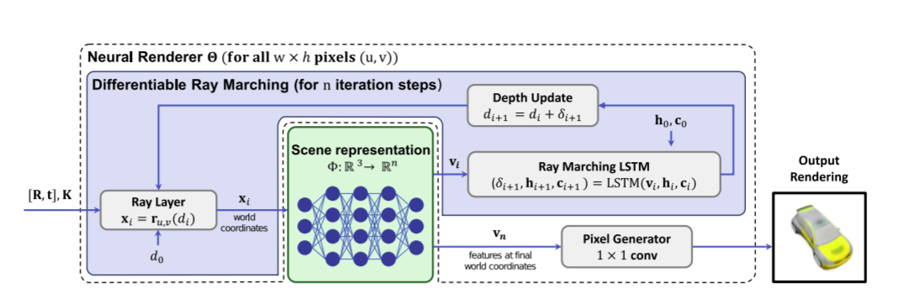

# Scene Representation Networks: Continuous 3D-Structure-Aware Neural Scene Representations

Vincent Sitzmann, Michael Zollhofer, Gordon Wetzstein, NIPS-2019

## Summary

The paper proposes a novel technique for 3D scene representations trained end-to-end from only 2D images and their camera poses, without access to depth or shape. For better results than the previous contributions in the field the authors also propose a novel ray-marching algorithm for rendering. This paper won **Honorable Mention Outstanding New Directions Paper Award** at NeurIPS 2019.

## Main Contributions

- The main contribution of this paper is its end-to-end trainable model for 3D scene representation using 3D pose images without explicitly telling the model depth or viewing angle information. The authors also suggest a novel ray marching algorithm, **Differentiable Ray Marching** to render the image.

- The problem of 3D neural scene representation has earlier also been taken up in the Deepmind paper [GQN](https://deepmind.com/blog/article/neural-scene-representation-and-rendering), however with the usage of its novel rendering mechanism, the results easily surpass the ones in GQN.

- For training of the network, N tuples of images *Ii* is taken at different angles with extrinsic *E* and instrinsic *I* parameters. As can be clearly seen the model image, we jointly train the scene representation network *phi* and also rendering network *theta*.

- For the scene representation network, the input image is passed and a new tensor of a fixed dimension *n* comes out(scene files in this case), which encodes the necessary for rendering. Compared to previous works, this network is made explicitly aware of the 3D structure of the scene by passing *world coordinates (x, y, z)* as the input.

- The rendering network(*theta*) further renders the scene files into RGB files. However, since geometry is represented implicitly by *phi*, it would lead to a problem of not being able to visualize the correct object.

- The above problem can be elucidated as: Since the same object is being seen from various angles through the images, in a way at the intersection of these images lies the object of our interest(since the images are various images at different angles of the same object). However at the line of sight of each camera lies of various other objects which need not be rendered and hence we need to be able to find the intersection point of these line of sights. Once the intersection point is found, we can then just use that world coordinates and pass them by *phi* and further getting it rendered.

- So to be able to overocome this problem and find the point of intersection there are several strategies in theory of computer graphics with one of the famous ones being [Sphere tracing algorithm](https://www.scratchapixel.com/lessons/advanced-rendering/rendering-distance-fields) which is used for rendering implicit surfaces.

- So the authors suggest an alternate version of the above algorithm using LSTM which can be seen as follows:

- Here the points along each ray are parametrized and identified with coordinates *(u, v)* of the respective pixel, with their distance *d* to the camera and the function *ru,v(d)* represents the word coordinate of a point along the ray with distance *d*. Simply put, this algorithm will be used to calculate the world coordinates that are required for rendering. Also authors have also used final *d* to calculate the depth maps(not used for rendering).

- Also for generalizing over scenes, the authors have also used latent variables and assume that scenes of same class have common shape and appearance and hence can be fully characterized by them. So basically considering *M* object instances in the dataset, we can see the set of function *phi* of *M* types for various instances, can be easily parametrized by another MLP which takes input as these latent variables *z*. This new MLP is a hypernetwork that is used to regularize the network parameters of *phi*.

- For the final optimization, the loss terms include the closeness loss for rendered image and ground truth, the depth constraint to limit the depth values from the tracing algorithm to be positive, and lastly enforcing the latent variables to be coming from a gaussian prior.

## Some other details

- For the case of rendered network, the author has used 1\*1 conv and advantages for the same are detailed in the paper.
- For few-show reconstruction case, the last point specifying the final objective function is slightly modified once the networks are trained and then an appropriate latent variable is found using the objective.
- The work done by the Deepmind(GQN) shares similar characteristics and this paper takes heavy inspiration from that paper.

## Our two cents

- The paper's results are some serious improvements over the earlier works and shows drastic improvements over few-show cases, and that too without any pretraining or any prior knowledge about the data such as depth and all.

## Implementation

- **Official Project website:** [https://vsitzmann.github.io/srns/](https://vsitzmann.github.io/srns/)
- Past work by deepmind can be seen [here](https://deepmind.com/blog/article/neural-scene-representation-and-rendering)